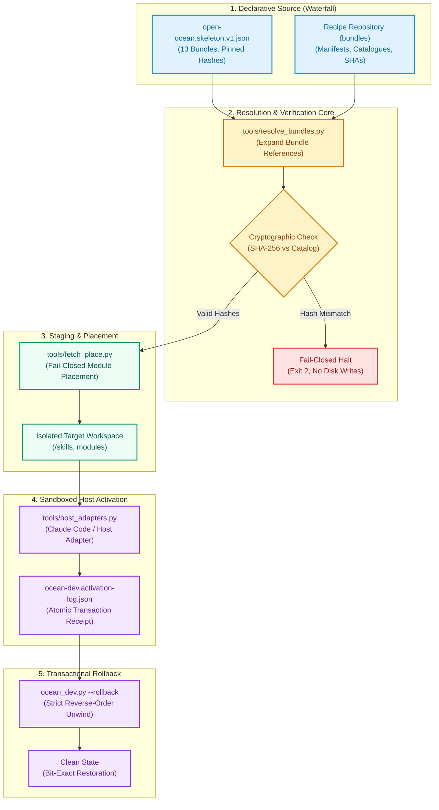
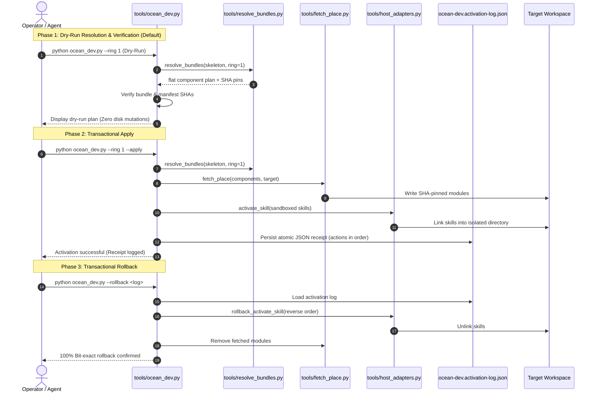

# open-ocean

**Free the ocean.**

The free community full system of the ellmos ecosystem.

*[Deutsch](README_de.md)*

[](pyproject.toml)
[](https://www.python.org/)
[](https://github.com/ellmos-ai/open-ocean/actions/workflows/ci.yml)
[](tests/)
[](https://github.com/ellmos-ai/open-ocean)
[](https://github.com/astral-sh/ruff)
[](SECURITY.md)
[](SECURITY.md)
[](LICENSE)
[](llms.txt)
[](CHANGELOG.md)
[](https://github.com/ellmos-ai)
[](https://github.com/open-bricks)
[](MARKETING-LOG.txt)

> **Quick Navigation:**
> 1. [Overview & Core Mission](#read-this-first-this-repository-is-a-building-site)
> 2. [Water Metaphor & Architecture](#the-name-and-the-architecture-it-carries)
> 3. [System Architecture Diagram](#system-architecture)
> 4. [End-to-End Installation Lifecycle](#installation--rollback-lifecycle)
> 5. [Repository Structure & Tools](#what-is-actually-in-here)
> 6. [Governance & Runtime Invariants Matrix](#governance--runtime-invariants)
> 7. [Current Status & Component Traffic Light](#status)
> 8. [Release Conditions & Publication Gate](#release-conditions)
> 9. [Quickstart & CLI Usage](#quickstart--usage)
> 10. [Sibling Ecosystem & Partner Matrix](#sibling-ecosystem--partner-repositories)
> 11. [Verification & Test Suite](#verification--test-suite)
> 12. [Security Policy & Vulnerability Reporting](#security-policy)
> 13. [Licence & Open Source Integrity](#licence)
> 14. [LLM Context & Discovery (`llms.txt`)](#llm-context--discovery)

> [!NOTE]
> For machine-readable architecture maps and LLM context, see [`llms.txt`](llms.txt). Security policy and invariants are documented in [`SECURITY.md`](SECURITY.md). Third-party dependencies are inventoried in [`THIRD_PARTY_LICENSES.md`](THIRD_PARTY_LICENSES.md). Release changes are tracked in [`CHANGELOG.md`](CHANGELOG.md).

> **Private build, and early on purpose.** This repository exists before the system does, so the
> architecture has somewhere to live while it is being decided. It opens when the water reaches
> the ocean — see *[Release conditions](#release-conditions)*.

---

## Read this first: this repository is a building site

**The released full system is not here yet.** A transactional installer core now exists and has
been exercised on Windows and macOS, but there is still no BACH-parity runtime of our own and
deliberately no copies of the recipes. What is here is the architecture and the first executable
system-building layer: which recipes the system consumes, where they live, and how they are
resolved, verified, fetched, placed, activated and rolled back.

If you are looking for something usable today, it is the recipe layer — a separate repository
that holds the bundle manifests and releases them wave by wave. The recipes are ready months
before the system that consumes them, which is exactly why they are not in here: a repository
that shipped recipes under the system's name would look finished while the system is not.

| Repository | What it is | State |
|---|---|---|
| **bundles** | the recipe layer: manifests, catalogue, export tool | private, releasing wave by wave |
| **open-ocean** (here) | the system build: architecture, installer, the thing that consumes recipes | private, early |

---

## The name, and the architecture it carries

The ecosystem names its layers after water, because the metaphor carries the architecture rather
than decorating it:

| Term | What it is |
|---|---|
| **stream / water** | the process itself — data, work, results flowing through everything |
| **Bach / Rinnsal** | the wild, grown streams: the original personal full instance |
| **water pipes** | the same water, tamed and modularised — modules and bundles |
| **waterfall** | the declarative source: the kit, the recipes, the catalogues |
| **ocean** | the full system; the end of the line Bach → Rinnsal → ocean |
| **open-ocean** | the part that belongs to everyone: the free community full system |

The governing rule is a conservation law: **extraction changes the bed, never the water.**
Restructuring must preserve function — "same volume of water" means functional parity. That is
not decoration either; it is the release bar this repository has to clear.

The system is not being written next to the original instance, and the original is not being
rebuilt. It emerges by continued **extraction**: modules flow out of the original, and the
original then wires them back in, replacing its own internals. It does not become a museum piece.
It carries on as a straightened river — no longer entirely natural, but connected to the water
and still supplied.

---

## System Architecture

The following diagram illustrates how declarative recipes flow from the upstream waterfall into verifiable, sandboxed, and transactionally rollback-capable local installations:



---

## Installation & Rollback Lifecycle

Every execution lifecycle follows a deterministic, three-phase path ensuring that accidental host mutations are physically impossible:



---

## What is actually in here

```
architecture/
  open-ocean.skeleton.v1.json   which recipes the system intends to consume, pinned by hash
  INSTALLER-TARGET.md           what the installer has to become, and what it must not do
  OCEAN-DEV-BUILD-PLAN_2026-08-18.md  staged build plan and verified foreign-host integration evidence
  BACH-EXTRACTION-ROADMAP.md    extraction order, parity gates and Cluster 9 kernel map
  bach-parity-baseline.v1.json  machine-readable registry and Cluster 9 coverage baseline
  bach-k9-data-contract.v1.json pinned dbsync/snapshot operation and fixture contract
  bach-k9-dbsync-adapter.v1.json thin lifecycle-adapter specification
  session-checkpoint-capability.v1.json boundary of the correct snapshot carrier
tools/
  audit_bach_handlers.py        side-effect-free source audit against that baseline
  check_k9_data_contract.py     static BACH check plus two synthetic carrier fixtures
  resolve_bundles.py            Resolve+Verify: bundle refs -> flat, hash-checked component plan
  host_adapters.py              vendor-neutral Activate: read-only readiness check plus write-side
                                activate_skill/rollback_activate_skill (Claude Code as reference)
  fetch_place.py                Fetch+Place for module: components, SHA-pinned, fail-closed (no
                                silent default-branch fallback)
  ocean_dev.py                  single entry point: Resolve -> Verify -> Fetch/Place -> Activate for
                                one ring; dry-run by default, --apply for real writes, --rollback
PRIVATE.txt                     the publication gate, committed on purpose
```

The skeleton references 13 bundles in two rings — the functional core, and breadth around it. It
**references** them: no manifest is copied here. Copies would fork the moment the recipe
repository moves on, and would make this repository look further along than it is.

---

## Governance & Runtime Invariants

`open-ocean` strictly guarantees 10 non-negotiable architectural invariants:

| ID | Invariant | Description | Enforcement Mechanism |
|---|---|---|---|
| `INV-LOCAL-01` | **100% Local-First & Zero-Egress** | All manifest resolution, verification, module placement, and activation run offline without telemetry. | Static analysis test (`test_zero_egress_and_offline_invariants`), pure standard library runtime |
| `INV-TRANS-02` | **Transactional Rollback** | Every mutation in `--apply` is recorded in `ocean-dev.activation-log.json` and unwound in strict reverse order upon `--rollback`. | `ocean_dev.py --rollback`, verified cross-platform on macOS & Windows (`test_ocean_dev.py`) |
| `INV-DRY-03` | **Mandatory Dry-Run First** | Default CLI execution is strictly read-only; mutations require explicit `--apply`. | CLI parser defaults, `--apply` flag requirement |
| `INV-PIN-04` | **Cryptographic SHA-256 Pinning** | Bundle manifests and components must match catalogued hashes; fail-closed on any discrepancy. | `resolve_bundles.py` SHA matching, immediate exit code 2 on mismatch |
| `INV-SAND-05` | **Sandboxed Skill Isolation** | Activations target `<workspace>/skills`, never a live agent's host config (`~/.claude/skills`). | `host_adapters.py` default sandbox check |
| `INV-PRIV-06` | **Non-Elevation (User-Mode)** | Tools run unprivileged in user space without administrator, root, or UAC prompts. | Standard user permissions, zero OS elevation APIs |
| `INV-GATE-07` | **Publication Gate (Lifted)** | Publication gate formally lifted per D-20260909-003 / user directive; historical release conditions preserved. | Release condition audit history |
| `INV-PARITY-08` | **Conservation Law of Parity** | Extraction changes the bed, never the water; modularization must strictly preserve function. | `audit_bach_handlers.py`, `check_k9_data_contract.py` |
| `INV-PLAT-09` | **Cross-Platform Operating Parity** | Universal execution across Linux, Windows, and macOS with normalized path handling. | CI multi-OS matrix (`windows-latest`, `ubuntu-latest`, `macos-latest`) |
| `INV-SLA-10` | **48h Response & 5-Day Triage SLA** | Security vulnerabilities acknowledged within 48 hours; triage completed within 5 business days. | `SECURITY.md` contract SLA |

---

## Status

**This repository:**

| Component | Status & Evidence |
|---|---|
| Architecture skeleton | present, 13 bundles referenced |
| BACH extraction baseline | present — 114 source-declared names; historic 113-name runtime bar retained; re-audited 2026-08-18 (106 handler classes, +1 vs. the 2026-08-08 baseline — traced to a host-suffixed duplicate file in BACH, `upgrade-WORKSTATION-LG.py` alongside `upgrade.py`; not fixed here, BACH is out of scope for this repository's changes). `registered_names` unchanged at 114. |
| K9-1 data/checkpoint gate | two carrier fixtures green; adapter and BACH equivalence remain open |
| Installer | **Resolve, Verify, SHA-pinned Fetch/Place, sandboxed skill Activate, activation logging, and target-validated Roll back are implemented for the currently supported component path; that pinnable Ring-1 slice is integration-proven on a foreign host.** On 2026-08-20 one Mac Studio `--apply` invocation verified all 5 Ring-1 bundles, fetched `WikiStub-Seed` at the catalogued SHA `3476ba2…12458af4`, and activated all 9 Ring-1 skills into an explicit sandbox. Its single 10-entry activation log then rolled back the fetched module and all skills; the live Mac `~/.claude/skills` snapshot stayed identical before, after apply and after rollback. The portable suite is now 113 tests, including real-git transaction coverage plus fail-closed regressions for replaying a log against a different target, for a deletion that leaves its target behind, and for catalog IDs whose letter case differs from the bundle ref. This is not a full-system install claim: two Ring-1 Git modules remain unpinned, ten module references are local-directory sources rather than fetch targets, and one catalogue reference still has the known `memory-hooker`/`memoryhooker` naming drift. See the [staged build plan](architecture/OCEAN-DEV-BUILD-PLAN_2026-08-18.md). |
| Runtime of our own | **not available** — every candidate is private or only declared |
| Recipes | maintained in the recipe repository, not here |

**The traffic light** — release condition 1 turns green when every referenced bundle is green,
meaning each of its components is public and checked. Scope matters here: this repository's
skeleton references exactly **13** of the ecosystem's ~30 bundles (see [the skeleton](architecture/open-ocean.skeleton.v1.json));
condition 1 is about those 13, not the wider catalog.

| Metric | Verification Result |
|---|---|
| Bundles referenced by this repository | **13** |
| Of those, components verified public (2026-08-18) | **13 / 13** |
| Unique components checked | 18 modules, 1 access-surface repository (`ellmos-homebase-mcp`), 27 skills (in the public `ellmos-ai/skills` catalog), 1 optional software app (`MediaBrain`) — all confirmed public via live `gh repo view`/catalog lookup, not the modules' own manifest `visibility` field (that field records a target classification and can lag the actual GitHub state) |
| Not applicable to this check | 3 `access_surface` refs to commercial agent providers/subscriptions/APIs (no repository, no public/private state) |

None of the four repositories that blocked *other* parts of the wider ecosystem on 2026-08-08
(`ellmos-core`, plus the three that meanwhile went public — `ellmos-scheduler`, `system-explorer`,
`policy-registry`) are referenced by this repository's 13-bundle skeleton at all; they gate bundles
outside this repository's scope (`core-discovery`, `prompt-workflow`, `runtime-options`,
`governance-assurance`, `automation-control`). Condition 1, read strictly for what this repository
actually references, is met as of 2026-08-18. What still blocks publication is conditions 2 and 3
below, not condition 1.

---

## Release conditions

This repository carries a conditional publication gate (`PRIVATE.txt`, committed on purpose so
the gate is visible where visibility is switched). It opens when all four are demonstrably met:

1. **Green components** — every referenced bundle is green: each of its components public and
   checked. **Met as of 2026-08-18** for this repository's 13-bundle scope — see the traffic-light
   table above.
2. **Sluice test passed** — the whole line works end to end: a fresh install from these recipes
   reaches a working state on a machine that is not the development host. **Not met yet, but the
   installer seam itself is now foreign-host integration-proven.** A Mac Studio run on 2026-08-20
   performed Resolve, Verify, one real SHA-pinned Fetch/Place and all nine Ring-1 skill activations
   in one `--apply` invocation, then removed all ten writes through the same activation log. This
   closes the previously untried combined mechanism path, not the release condition: the target
   was an explicit sandbox, only one Ring-1 Git module currently has a safe catalogue pin, and the
   run did not produce a complete working ocean runtime from every required component. See
   `architecture/OCEAN-DEV-BUILD-PLAN_2026-08-18.md` Stage 2 for the evidence and remaining breadth.
3. **Parity for the release scope** — the system performs at the level it claims to cover. A
   smaller installable core is a build stage, not a release. The current source audit records
   114 reachable names while retaining the historic 113-name runtime snapshot as the minimum
   commitment; see the [extraction roadmap](architecture/BACH-EXTRACTION-ROADMAP.md). **Re-measured
   2026-08-18** (read-only, BACH untouched): the 114-name bar is unchanged and still current; see
   `architecture/bach-parity-baseline.v1.json` → `re_audit_2026-08-18`. This condition asks for more
   than a name count, though: [Cluster 9's operation matrix](architecture/BACH-EXTRACTION-ROADMAP.md#cluster-9-operation-matrix)
   is the only cluster with active work (8 of 9 clusters have not started), and within it 0 of 30
   command names carry `accepted` (functionally-equivalent) status yet — 20 are `candidate-partial`,
   9 are `gap`, 1 is `alias`. Condition 3 is therefore **not close to met**; it depends on the same
   installer/runtime work as condition 2.
4. **Publication check passed** — law, privacy and licensing reviewed with no blockers. **Run
   2026-08-18** (`repo-publish-check` skill, 10 gates) — verdict and local report:
   `.GITHUBBOT/workflows/repo-publish-check/reports/ellmos-ai__open-ocean_2026-08-18.md` (kept
   local per the skill's own rule, not shipped in this repository).

Condition 2 is the one this repository is named after. Opening the sluices and watching whether
the water actually arrives is the test that no amount of correct manifests can substitute for.
Of the four conditions, 1 and 4 are addressed. Condition 2 now has a verified transactional
installer seam but still lacks a complete fresh working-system installation; condition 3 still
lacks BACH functional parity. Neither is upgraded by the sandboxed integration proof.

---

## Quickstart & Usage

### Prerequisites & Installation

`open-ocean` requires Python 3.10+ and operates completely without external runtime libraries.

```bash
# Clone the repository
git clone https://github.com/ellmos-ai/open-ocean.git
cd open-ocean

# Install in editable mode
pip install -e .
```

### CLI Execution Modes

```bash
# 1. Dry-run preview for Ring-1 bundles (Safe, zero filesystem writes)
python tools/ocean_dev.py --bundles-root <path-to-bundles> --ring 1

# 2. Transactional live activation into sandboxed workspace
python tools/ocean_dev.py --bundles-root <path-to-bundles> --ring 1 --apply

# 3. Transactional rollback using the generated activation receipt
python tools/ocean_dev.py --rollback <workspace>/ocean-dev.activation-log.json
```

---

## Sibling Ecosystem & Partner Repositories

`open-ocean` acts as the community convergence point for the wider `ellmos-ai` and `open-bricks` ecosystem:

| Repository | Organization | Role & Ecosystem Relationship |
|---|---|---|
| [`ellmos-ai/ellmos-core`](https://github.com/ellmos-ai) | `ellmos-ai` | Core runtime orchestration & agent execution kernel |
| [`ellmos-ai/policy-registry`](https://github.com/ellmos-ai/policy-registry) | `ellmos-ai` | Machine-readable policies, governance rules, and system gates |
| [`ellmos-ai/system-explorer`](https://github.com/ellmos-ai/system-explorer) | `ellmos-ai` | System-wide inspection, process auditing, and topology discovery |
| [`ellmos-ai/sqlite-transit-sync`](https://github.com/ellmos-ai/sqlite-transit-sync) | `ellmos-ai` | High-frequency conflict-free SQLite state replication |
| [`ellmos-ai/decision-clicker`](https://github.com/ellmos-ai/decision-clicker) | `ellmos-ai` | Deterministic human-in-the-loop decision routing |
| [`ellmos-ai/memoryhooker`](https://github.com/ellmos-ai) | `ellmos-ai` | Dynamic agent session context & memory hooking |
| [`ellmos-ai/workflowhooker`](https://github.com/ellmos-ai) | `ellmos-ai` | Agent workflow interception and deterministic lifecycle triggers |
| [`ellmos-ai/ellmos-filecommander-mcp`](https://github.com/ellmos-ai) | `ellmos-ai` | Robust local filesystem MCP server for agent operations |
| [`ellmos-ai/ellmos-codecommander-mcp`](https://github.com/ellmos-ai) | `ellmos-ai` | High-level code analysis and refactoring MCP server |
| [`ellmos-ai/ellmos-controlcenter-mcp`](https://github.com/ellmos-ai) | `ellmos-ai` | Central agent orchestration and tool routing MCP server |
| [`dev-bricks/DevCenter`](https://github.com/dev-bricks) | `dev-bricks` | Modular developer tooling and workspace launcher |
| [`dev-bricks/CodeBox`](https://github.com/dev-bricks) | `dev-bricks` | Secure sandbox and snippet management environment |
| [`file-bricks/ExplorerPro`](https://github.com/file-bricks) | `file-bricks` | Advanced file management and directory synchronization GUI |
| [`doc-bricks/CleanMarkdown`](https://github.com/doc-bricks) | `doc-bricks` | Markdown sanitization, link validation, and documentation cleaner |
| [`entertain-and-more/BattleStage`](https://github.com/entertain-and-more) | `entertain-and-more` | Interactive game simulation environment built with ellmos modules |
| [`open-bricks/open-bricks`](https://github.com/open-bricks) | `open-bricks` | Umbrella open-source product catalog and ecosystem index |

---

## Verification & Test Suite

The test suite consists of 107+ automated tests running 100% offline without remote network access:

```bash
# Run the entire test suite with verbose output
pytest -ra -v

# Run linting with Ruff
ruff check .

# Validate bytecode compilation
python -m compileall -q .
```

Key test categories:
- **`test_audit_bach_handlers.py`**: Static AST auditing of reachable handler names against the parity baseline.
- **`test_check_k9_data_contract.py`**: Verification of database sync contracts and snapshot fixtures.
- **`test_fetch_place.py`**: SHA-pinned git fetching, fail-closed unpinned fallbacks, and local placement.
- **`test_host_adapters.py`**: Sandboxed agent skill activation and atomic rollback operations.
- **`test_ocean_dev.py`**: End-to-end dry-run, apply, and activation log unwinding lifecycle.
- **`test_resolve_bundles.py`**: Manifest expansion, dependency graph flattening, and checksum validation.
- **`test_metadata.py`**: Contract tests enforcing README anchors, Mermaid diagrams, Security SLAs, and packaging.

---

## Security Policy

Security and data integrity are governed by [`SECURITY.md`](SECURITY.md):
- **48-Hour Response SLA**: All vulnerability reports acknowledged within 48 hours.
- **5-Business-Day Triage Guarantee**: Detailed impact analysis and mitigation timeline within 5 working days.
- **Official Security Contacts**:
  - `security@ellmos.ai`
  - `security@open-bricks.org`
  - Fallback: `support@lukasgeiger.com`, `lukas@open-bricks.org`
- **Advisory Channel**: [GitHub Security Advisories](https://github.com/ellmos-ai/open-ocean/security/advisories)

---

## Licence

Licensed under the permissive **MIT License** ([`LICENSE`](LICENSE)).
Third-party development dependencies and their licenses are inventoried in [`THIRD_PARTY_LICENSES.md`](THIRD_PARTY_LICENSES.md).

---

## LLM Context & Discovery

For autonomous AI coding agents, context injectors, and automated discovery pipelines:
- Machine-readable architectural summaries and command indexes are maintained in [`llms.txt`](llms.txt).
- Local marketing, visibility, and directory listing recommendations are tracked in [`MARKETING-LOG.txt`](MARKETING-LOG.txt).
