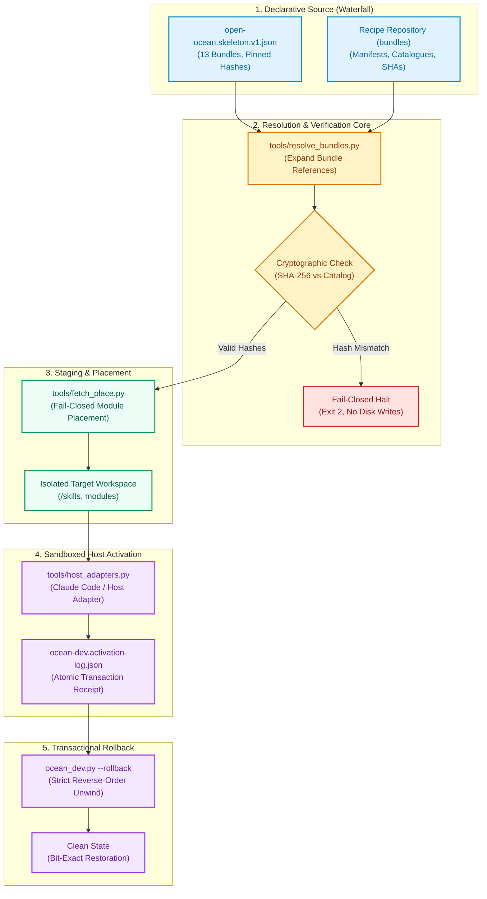
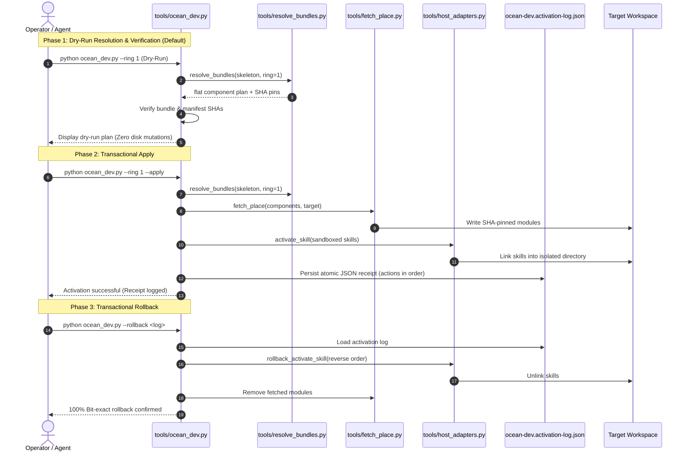

# open-ocean

**Free the ocean.**

The free community system of the ellmos ecosystem.

*[Deutsch](README_de.md)*

[](pyproject.toml)
[](https://www.python.org/)
[](https://github.com/ellmos-ai/open-ocean/actions/workflows/ci.yml)
[](tests/)
[](https://github.com/ellmos-ai/open-ocean)
[](https://github.com/astral-sh/ruff)
[](SECURITY.md)
[](SECURITY.md)
[](LICENSE)
[](llms.txt)
[](CHANGELOG.md)
[](https://github.com/ellmos-ai)
[](https://github.com/open-bricks)


> **Quick Navigation:**
> 1. [Overview & Core Mission](#read-this-first-this-repository-is-a-building-site)
> 2. [Water Metaphor & Architecture](#the-name-and-the-architecture-it-carries)
> 3. [System Architecture Diagram](#system-architecture)
> 4. [End-to-End Installation Lifecycle](#installation--rollback-lifecycle)
> 5. [Repository Structure & Tools](#what-is-actually-in-here)
> 6. [Governance & Runtime Invariants Matrix](#governance--runtime-invariants)
> 7. [Current Status & Component Traffic Light](#status)
> 8. [Release Conditions & Publication Gate](#release-conditions)
> 9. [Quickstart & CLI Usage](#quickstart--usage)
> 10. [Sibling Ecosystem & Partner Matrix](#sibling-ecosystem--partner-repositories)
> 11. [Verification & Test Suite](#verification--test-suite)
> 12. [Security Policy & Vulnerability Reporting](#security-policy)
> 13. [Licence & Open Source Integrity](#licence)
> 14. [LLM Context & Discovery (`llms.txt`)](#llm-context--discovery)

> [!NOTE]
> For machine-readable architecture maps and LLM context, see [`llms.txt`](llms.txt). Security policy and invariants are documented in [`SECURITY.md`](SECURITY.md). Third-party dependencies are inventoried in [`THIRD_PARTY_LICENSES.md`](THIRD_PARTY_LICENSES.md). Release changes are tracked in [`CHANGELOG.md`](CHANGELOG.md).

> **Public architecture, honest maturity.** This repository is the public OPEN OCEAN build.
> Its Full Ocean development composition is usable, while release-scope parity and fresh
> non-development-host acceptance remain open — see *[Release conditions](#release-conditions)*.

---

## Read this first: this repository is a building site

**The released OPEN OCEAN system is not here yet.** The local FULL OCEAN development composition is now
runnable on the development host: it can plan, install, start, inspect, bootstrap a user, stop and
restart one declared `runtime.host`. This is the first usable OCEAN product slice, not a BACH-parity
or OPEN OCEAN release claim. The verified 28-bundle composition now resolves every declared required
component and truthfully reports `full_composition: true`; its eleven unresolved module references
are optional for this composition.

OCEAN consumes the recipes from their canonical repository instead of copying them here. The
transaction layer resolves, verifies, fetches, places, activates and rolls back; the lifecycle
layer operates the selected runtime in an explicit local sandbox. The current Full Dev host is the
private `ellmos-core`, selected by capability rather than hard-coded as the future OPEN OCEAN runtime.
When the resolved composition also provides `unified-gui.host`, OCEAN exposes that operator UI as
its product entry point. The current development URL is `http://127.0.0.1:8810/control/`; the
dedicated port keeps OCEAN separate from the runtime provider's standalone TerminPilot PWA origin.
An OCEAN-owned origin adapter also redirects `/` to that entry point, serves the OCEAN manifest and
offline identity, and evicts provider service workers/caches before they can claim the OCEAN URL.

| Repository | What it is | State |
|---|---|---|
| **bundles** | the recipe layer: manifests, catalogue, export tool | private, releasing wave by wave |
| **open-ocean** (here) | the system build: architecture, installer, the thing that consumes recipes | public, under active development |

---

## The name, and the architecture it carries

The ratified product boundary is documented in
[Product stack boundaries](architecture/PRODUCT-STACK-BOUNDARIES.md):

- **OPEN OCEAN = PUBLIC**
- **PRIVATE OCEAN = PRIVATE, NON-PROPRIETARY**
- **FULL OCEAN = OPEN OCEAN + PRIVATE OCEAN**
- **SPEEDBOAT = PROPRIETARY + explicitly selected OPEN-/PRIVATE-OCEAN parts**

This repository builds OPEN OCEAN and operates FULL OCEAN as the private development/test
composition. SPEEDBOAT is an independent sibling stack, not an OCEAN edition or overlay.

The ecosystem names its layers after water, because the metaphor carries the architecture rather
than decorating it:

| Term | What it is |
|---|---|
| **stream / water** | the process itself — data, work, results flowing through everything |
| **Bach / Rinnsal** | the wild, grown streams: the original personal full instance |
| **water pipes** | the same water, tamed and modularised — modules and bundles |
| **waterfall** | the declarative source: the kit, the recipes, the catalogues |
| **ocean** | the successor product family; the end of the line Bach → Rinnsal → ocean |
| **open-ocean** | the part that belongs to everyone: the free community system |
| **private-ocean** | private, non-proprietary OCEAN components |
| **full-ocean** | OPEN OCEAN + PRIVATE OCEAN; the complete OCEAN development/test composition |
| **speedboat** | an independent proprietary stack that selects shared OCEAN parts explicitly |

The governing rule is a conservation law: **extraction changes the bed, never the water.**
Restructuring must preserve function — "same volume of water" means functional parity. That is
not decoration either; it is the release bar this repository has to clear.

Most extraction has already happened. The current work makes legacy BACH more modular by replacing
its internals with the canonical modules and bundles while OCEAN is completed as its successor.
A valuable BACH-only component may still be extracted, but that is an exception with its own gate.
BACH stays supplied by consuming the same modules as OCEAN; any later move to LTS, freeze, or
archive remains an explicit product decision, never an automatic consequence of this plan.

---

## System Architecture

The following diagram illustrates how declarative recipes flow from the upstream waterfall into verifiable, sandboxed, and transactionally rollback-capable local installations:



---

## Installation & Rollback Lifecycle

Every execution lifecycle follows a deterministic, three-phase path ensuring that accidental host mutations are physically impossible:



---

## What is actually in here

```
architecture/
  open-ocean.skeleton.v1.json   which recipes the system intends to consume, pinned by hash
  ocean-full-dev.component-bindings.v1.json  exact, non-authoritative per-module integration pins
  ocean-full-dev.source-pins.v1.json  reviewed recipe, binding, crosswalk and Skills Registry pins
  INSTALLER-TARGET.md           implemented target contract, invariants and remaining limits
  OCEAN-DEV-BUILD-PLAN_2026-08-18.md  staged build plan and verified foreign-host integration evidence
  BACH-EXTRACTION-ROADMAP.md    extraction order, parity gates and Cluster 9 kernel map
  bach-parity-baseline.v1.json  machine-readable registry and Cluster 9 coverage baseline
  bach-k9-data-contract.v1.json pinned dbsync/snapshot operation and fixture contract
  bach-k9-dbsync-adapter.v1.json thin lifecycle-adapter specification
  session-checkpoint-capability.v1.json boundary of the correct snapshot carrier
tools/
  audit_bach_handlers.py        side-effect-free source audit against that baseline
  check_k9_data_contract.py     static BACH check plus two synthetic carrier fixtures
  resolve_bundles.py            Resolve+Verify: bundle refs -> flat, hash-checked component plan
  host_adapters.py              vendor-neutral Activate: read-only readiness check plus write-side
                                activate_skill/rollback_activate_skill (Claude Code as reference)
  fetch_place.py                Fetch+Place for module: components, SHA-pinned, fail-closed (no
                                silent default-branch fallback)
  ocean_dev.py                  single entry point: Resolve -> Verify -> Fetch/Place -> Activate for
                                 one ring or a complete system manifest; dry-run by default,
                                 --apply for real writes, --rollback
  source_pins.py                fail-closed source-provenance verification before Resolve/Fetch
  accounts_projection.py       verify/read the minimal account projection without state writes
  ocean_lifecycle.py            capability-driven plan/up/status/down/user lifecycle
  runtime_supervisor.py         authenticated loopback supervisor for one runtime instance
  runtime_user.py               password-safe user bootstrap delegated to the runtime
ocean.py                        user-facing OCEAN Full Dev CLI
```

The skeleton references 13 bundles in two rings — the functional core, and breadth around it. It
**references** them: no manifest is copied here. Copies would fork the moment the recipe
repository moves on, and would make this repository look further along than it is.

### Local composition modes

- The repository skeleton is the 13-bundle public scope; choose ring `1`, `2`, or `all`.
- OCEAN Full Dev consumes the existing external `ellmos.system.v1` full-system manifest and all 28
  of its OCEAN-family `bundle_refs[]`. Proprietary SPEEDBOAT bundles are excluded. The manifest and
  private recipes remain in their canonical stores; nothing is copied into this repository.

```text
python tools/ocean_dev.py --bundles-root <recipe-projection> \
  --system-manifest <ellmos-development-fullsystem/system.v1.json> \
  --source-pins architecture/ocean-full-dev.source-pins.v1.json
```

Without `--apply` this is a read-only dry-run. A system manifest cannot be combined with a numbered
ring; partial work is selected adaptively as a separate bundle cycle, not by silently truncating
the declared Full Dev composition.

The default `--component-bindings` overlay closes recipe-to-provider naming gaps without changing
the canonical recipe or module catalog. Each binding is exact and fail-closed: component ref,
repository, full commit SHA, placement, provider manifest ID and required capabilities must all
match and the checkout must be clean before OCEAN treats the provider as resolved. The shipped
overlay currently binds `module:software-endpoint-registry` to `system-explorer` and the distinct
logical roles `module:automation-registry` and `module:automation-runtime` to independently pinned
placements of `automation-master`.

The Finance Assist path also pins `accounts-core` as the sole publisher and
`sqlite-transit-sync` as the read-only contract verifier. OCEAN's bounded consumer is separate:

```text
python tools/accounts_projection.py --database <closed-accounts.sqlite> \
  --consumer-id ocean-accounts-consumer --minimum-offline-seconds 2592000 \
  --previous-checkpoint <last-seen-checkpoint>
```

It verifies first, rejects sidecars or a file that changes across verification/readback, opens
SQLite with `mode=ro&immutable=1`, and returns only the contract's six consumer fields. It does not
persist a checkpoint, schedule transport, activate a live path, or write either database.

`ocean.py plan` and `ocean.py up` also pass the shipped `--source-pins` contract by default. Before
Resolve — and therefore before Fetch, Place or Activate — OCEAN requires the recipe input to be the
clean root checkout of the exact pinned Git origin and commit. It then verifies the recipe's native
component-registry binding self-hash, the raw Skills Crosswalk SHA-256, and the caller-supplied
Skills Registry URI/SHA-256 against one content-hashed contract. Any mismatch is an error, never an
implicit re-pin. Installed-snapshot `start` remains independent of changed live recipe authority.

The product lifecycle is exposed at the repository root:

```text
python ocean.py plan <composition arguments>
python ocean.py up <composition arguments> --apply
python ocean.py start --workspace <local-sandbox>
python ocean.py start <role> --manifest <ellmos-module.v2.json> [--provider <name>]
python ocean.py status --workspace <local-sandbox>
python ocean.py user add --workspace <local-sandbox> --username <name> --email <address>
python ocean.py down --workspace <local-sandbox>
```

Run `python ocean.py --help` and the respective subcommand help for the complete arguments. User
passwords are prompted without echo and are never passed as process arguments; local automation
may use `--password-stdin`. `ocean up` uses the dedicated OCEAN port `8810` by default. `ocean
start` restarts the already installed, verified snapshot without consulting changed live recipe
authority; it also recovers a stale `running` state after an OS or process loss when both the
authenticated control channel and the recorded runtime port are no longer active.
With a positional role, `ocean start <role>` instead forwards to the same
`python -m unified_gui.console start` entry used by Wheelhouse Lower Decks. It
does not enter the runtime lifecycle or touch the installed workspace. If that
optional console is absent, OCEAN prints `[FALLBACK]` and uses the same manifest
record through task-master, COMA or the module starter. `--dry-run` proves the
resolved chain without starting a provider.
On Windows, the supervisor also retries transient atomic state-file replacement contention within
a bounded one-second window, so a successful stop cannot leave a stale `running` record behind.
On `<DEV-HOST>`, the hidden limited-user logon task `EllmosOceanFullUserStart` now launches the exact
accepted checkout and `<workspace>`; its controlled
demand-start acceptance returned task result `0` with one supervisor, one child and one listener.
This proves the configured logon path, not an actual reboot. The former BACH session sidecar was
then stopped through BACH's own CLI.

---

## Governance & Runtime Invariants

`open-ocean` strictly guarantees 10 non-negotiable architectural invariants:

| ID | Invariant | Description | Enforcement Mechanism |
|---|---|---|---|
| `INV-LOCAL-01` | **100% Local-First & Zero-Egress** | All manifest resolution, verification, module placement, and activation run offline without telemetry. | Static analysis test (`test_zero_egress_and_offline_invariants`), pure standard library runtime |
| `INV-TRANS-02` | **Transactional Rollback** | Every mutation in `--apply` is recorded in `ocean-dev.activation-log.json` and unwound in strict reverse order upon `--rollback`. | `ocean_dev.py --rollback`, verified cross-platform on macOS & Windows (`test_ocean_dev.py`) |
| `INV-DRY-03` | **Mandatory Dry-Run First** | Default CLI execution is strictly read-only; mutations require explicit `--apply`. | CLI parser defaults, `--apply` flag requirement |
| `INV-PIN-04` | **Cryptographic SHA-256 Pinning** | Bundle manifests and components must match catalogued hashes; fail-closed on any discrepancy. | `resolve_bundles.py` SHA matching, immediate exit code 2 on mismatch |
| `INV-SAND-05` | **Sandboxed Skill Isolation** | Activations target `<workspace>/skills`, never a live agent's host config (`~/.claude/skills`). | `host_adapters.py` default sandbox check |
| `INV-PRIV-06` | **Non-Elevation (User-Mode)** | Tools run unprivileged in user space without administrator, root, or UAC prompts. | Standard user permissions, zero OS elevation APIs |
| `INV-GATE-07` | **Publication Gate (Lifted)** | Publication gate formally lifted per D-20260909-003 / user directive; historical release conditions preserved. | Release condition audit history |
| `INV-PARITY-08` | **Conservation Law of Parity** | Extraction changes the bed, never the water; modularization must strictly preserve function. | `audit_bach_handlers.py`, `check_k9_data_contract.py` |
| `INV-PLAT-09` | **Cross-Platform Operating Parity** | Universal execution across Linux, Windows, and macOS with normalized path handling. | CI multi-OS matrix (`windows-latest`, `ubuntu-latest`, `macos-latest`) |
| `INV-SLA-10` | **48h Response & 5-Day Triage SLA** | Security vulnerabilities acknowledged within 48 hours; triage completed within 5 business days. | `SECURITY.md` contract SLA |

---

## Status

**This repository:**

| Component | Status & Evidence |
|---|---|
| Architecture skeleton | present, 13 bundles referenced |
| BACH extraction baseline | present — 114 source-declared names; historic 113-name runtime bar retained; re-audited 2026-08-18 (106 handler classes, +1 vs. the 2026-08-08 baseline — traced to a host-suffixed duplicate file in BACH, `upgrade-<FRESH-HOST>.py` alongside `upgrade.py`; not fixed here, BACH is out of scope for this repository's changes). `registered_names` unchanged at 114. |
| K9-1 data/checkpoint gate | two carrier fixtures green; adapter and BACH equivalence remain open |
| Installer and lifecycle | **Resolve, Verify, source-provenance pins, SHA-pinned Fetch/Place, exact provider bindings, sandboxed skill Activate, append-preserving activation logging, target-validated Roll back, installed-snapshot recovery, runtime start/status/stop/restart and delegated user bootstrap are implemented.** The accepted Windows Full Ocean workspace is `C:\_Local_DEV\ocean-full`. It verifies **28/28** OCEAN-family bundle pins, resolves **54 of 65 module references and all 80 skills**, has no missing required component, reports `full_composition: true`, and runs at `http://127.0.0.1:8810/control/`. The eleven unresolved module references are optional. The separately placed `automation-runtime` provider passed native provider/scheduler readback, immutable-receipt, redaction and bounded-statistics acceptance at commit `c2de7188626510b181c4ecf2708c15f2395e32aa`. The active-runtime preflight stops a second `up --apply` before Fetch/Activate can write. The product-owned origin redirects Root to OCEAN and clears legacy provider PWA workers/caches without clearing cookies or other browser storage. Live HTTP and a real browser confirm `307 / → /control/`, the `OCEAN Full Dev` surface and no TerminPilot product markers. A real stop/start/stop/start cycle proves the Windows state-file fix. The suite now contains **181 passing tests plus 2 passing subtests on Windows**. This is a composition-complete private Full Dev build for its declared required scope, not an OPEN OCEAN release or BACH-parity claim. Full Ocean selection commit `1b461c9cb900ada15b8e104f2586a6b4a1ea5278` is adopted in canonical recipe `main`, whose post-adoption readback is `b13f1b11626141d6dc6927028dc10008bc406866`. See the [staged build plan](architecture/OCEAN-DEV-BUILD-PLAN_2026-08-18.md). |
| Runtime | **available for private Full Dev** through the declared `runtime.host` provider `ellmos-core`, with the resolved `unified-gui.host` exposed as the OCEAN operator surface; an OPEN OCEAN runtime is not shipped and the private provider is not a public dependency |
| Recipes | maintained in the recipe repository, not here |

**The traffic light** — release condition 1 turns green when every referenced bundle is green,
meaning each of its components is public and checked. Scope matters here: this repository's
skeleton references exactly **13** of the ecosystem's ~30 bundles (see [the skeleton](architecture/open-ocean.skeleton.v1.json));
condition 1 is about those 13, not the wider catalog.

| Metric | Verification Result |
|---|---|
| Bundles referenced by this repository | **13** |
| Of those, components verified public (2026-08-18) | **13 / 13** |
| Unique components checked | 18 modules, 1 access-surface repository (`ellmos-homebase-mcp`), 27 skills (in the public `ellmos-ai/skills` catalog), 1 optional software app (`MediaBrain`) — all confirmed public via live `gh repo view`/catalog lookup, not the modules' own manifest `visibility` field (that field records a target classification and can lag the actual GitHub state) |
| Not applicable to this check | 3 `access_surface` refs to commercial agent providers/subscriptions/APIs (no repository, no public/private state) |

None of the four repositories that blocked *other* parts of the wider ecosystem on 2026-08-08
(`ellmos-core`, plus the three that meanwhile went public — `ellmos-scheduler`, `system-explorer`,
`policy-registry`) are referenced by this repository's 13-bundle skeleton at all; they gate bundles
outside this repository's scope (`core-discovery`, `prompt-workflow`, `runtime-options`,
`governance-assurance`, `automation-control`). Condition 1, read strictly for what this repository
actually references, is met as of 2026-08-18. Conditions 2 and 3 below still block broader
release-maturity claims, not repository publication.

### Independent development-host fresh install (2026-08-30)

A second, independent Windows host completed the same Full Dev composition on 2026-08-30:
`<FRESH-HOST>`, workspace `<workspace>`, target directory absent beforehand (a
genuine fresh install). Input worktrees: `open-ocean` at tag
`ocean-full-laptop-hafenlicht-20260829` (`243a703c60e295f050a2dc68bdde13ef8e847d29`),
`ellmos-development-system` at `1b461c9cb900ada15b8e104f2586a6b4a1ea5278` — both detached and
clean. Pre-install tests: pytest 137/137, unittest 125/125, ruff clean, `compileall` exit 0.

The plan before apply reported 28/28 bundles (`all_ok`), 80/80 skills, but only 51/65 modules
(`full_composition: false`) — three required providers were not yet local. Apply fetched them by
git-fetch-at-SHA into `<workspace>\modules\`: `automation-registry@ad40de721615518e409b53b00ed4b2a49840db28`
and `automation-runtime@c2de7188626510b181c4ecf2708c15f2395e32aa` (both from
`dev-bricks/automation-master.git`), and `software-endpoint-registry@ec50c92319ba8fc262d695b86818fc85666feff7`
(from `ellmos-ai/system-explorer`) — all three then clean, detached checkouts. After apply: 28/28
bundles, 54/65 modules, 80/80 skills, no missing required component, `full_composition: true`,
runtime `ellmos-core` at `http://127.0.0.1:8810/control/`.

A full `down`/`start` lifecycle cycle was exercised (stopped, port freed, no stale processes, then
running again with no state reuse), followed by the same HTTP/browser/process checks as above.

The hidden limited-user logon task `EllmosOceanFullUserStart` (trigger `AtLogOn`, principal
`lukas`, `LogonType Interactive`, `RunLevel Limited`, hidden) launches `pythonw.exe` against the
pinned input worktree's `ocean.py start --workspace "C:\_Local_DEV\ocean-full"`. One controlled
on-demand start on 2026-08-30 returned `LastTaskResult 267009` (`SCHED_S_TASK_RUNNING`, the
expected code for an intentionally still-running server process, not `0`) with one supervisor
(PID 6460) and one child (PID 37676), both under `pythonw.exe`, the child being the sole listener
on `8810`; `full_composition: true` and the product identity held afterward. No actual device
reboot was tested.

No BACH session sidecar was ever running on this host (`service.running: false`, `pid: null`), so
none was stopped; BACH code, databases, tasks and configuration are unchanged. No user account was
created for OCEAN on this host — a deliberate decision, not an installation gap; device-bound
OS-account coupling is planned for a future release.

---

## Release conditions

The conditional publication gate that used to live here (`PRIVATE.txt`) was **lifted on
2026-09-11** by user decision D-20260909-003 (`open-ocean = B`, public via a sanitised
distribution); the file was removed in `6ca9a38`. What follows is therefore no longer a lock
on visibility — it is the maturity record the gate used to guard, kept because the questions
it asks are still the right ones and because a released repository should say plainly what it
does and does not yet demonstrate.

The four conditions and how they stand:

1. **Green components** — every referenced bundle is green: each of its components public and
   checked. **Met as of 2026-08-18** for this repository's 13-bundle scope — see the traffic-light
   table above.
2. **Sluice test passed** — the whole line works end to end: a fresh install from these recipes
   reaches a working state on a machine that is not the development host. **Not met yet.**
   *Which host counts was itself a question, and it is answered:* user decision D-20260906-003
   (2026-09-11) = **1B** — the fresh install on `<FRESH-HOST>` of 2026-08-30 does **not** settle
   this, because a second development machine is still a development host. Only the Full Ocean
   installation on the Mac Studio does (tracked as remaining work in `T-20260818-903104603`). The
   installer seam remains foreign-host integration-proven by the 2026-08-20 Mac Studio run. On
   2026-08-29 the development host additionally completed a real Full Dev plan/apply/start/status/
   stop/restart cycle. The initial root-page acceptance proved transport only and was later found
   to be the provider's TerminPilot domain surface, not OCEAN. The corrected cycle now exposes and
   browser-verifies the resolved operator UI at `127.0.0.1:8810/control/`. A later persistent-profile
   regression additionally made OCEAN own Root, manifest, offline identity and worker cleanup on
   that origin. The development-host composition now also resolves the distinct
   `module:automation-runtime`, has no missing required component and reports
   `full_composition: true`. That materially advances OCEAN, but it is still not the required fresh
   foreign-host full-system proof. The current apply verifies all 28 refs against Full Ocean
   selection commit `1b461c9cb900ada15b8e104f2586a6b4a1ea5278`, now adopted into canonical recipe
   `main` with post-adoption readback `b13f1b11626141d6dc6927028dc10008bc406866`. See
   `architecture/OCEAN-DEV-BUILD-PLAN_2026-08-18.md` for the exact evidence and remaining breadth.
3. **Parity for the release scope** — the system performs at the level it claims to cover. A
   smaller installable core is a build stage, not a release. *How that level is measured was
   itself a question, and it is answered:* user decision D-20260906-003 (2026-09-11) = **parity
   is measured functionally, against use cases** — not against a handler head count, and not
   against the `accepted` tally in `architecture/bach-parity-baseline.v1.json` (last written
   2026-08-18). Moving each module back into BACH so the old path can be switched off is a
   separate, parallel track, not the yardstick for this condition.
   The name counts stay on record as history, not as the bar: the source audit records 114
   reachable names and retains the historic 113-name runtime snapshot; re-measured 2026-08-18
   (read-only, BACH untouched) the 114-name bar was unchanged. See the
   [extraction roadmap](architecture/BACH-EXTRACTION-ROADMAP.md).
   A later read-only composition re-measurement on 2026-09-21 preserved those 114 names and
   found four source additions (`cloud`, `mcp`, `security`, `theme`), for 118 current names.
   Its [composition matrix](architecture/bach-composition-matrix.v1.json) separates declared
   carriers from gaps and intentional non-modules, and marks every carrier's functional
   use-case evidence as open. It is a wiring backlog, not a parity claim.
   Measured functionally, the picture does not improve: [Cluster 9's operation matrix](architecture/BACH-EXTRACTION-ROADMAP.md#cluster-9-operation-matrix)
   is the only cluster with active work (8 of 9 clusters have not started), and within it 0 of 30
   command names are functionally equivalent yet — 20 are `candidate-partial`, 9 are `gap`, 1 is
   an `alias`. Condition 3 is therefore **not close to met**; it depends on the same
   installer/runtime work as condition 2.
4. **Publication check passed** — law, privacy and licensing reviewed with no blockers. **Run
   2026-08-18** (`repo-publish-check` skill, 10 gates) — verdict and local report:
   `.GITHUBBOT/workflows/repo-publish-check/reports/ellmos-ai__open-ocean_2026-08-18.md` (kept
   local per the skill's own rule, not shipped in this repository).

Condition 2 is the one this repository is named after. Opening the sluices and watching whether
the water actually arrives is the test that no amount of correct manifests can substitute for.
Of the four conditions, 1 and 4 are addressed. Condition 2 now has a verified transactional seam
and a working development-host runtime, but still lacks a complete fresh foreign-host installation;
condition 3 still lacks functional parity. Since 2026-09-11 that no longer holds the repository
shut — the gate was lifted by decision, not by the conditions being met. The distinction matters:
this repository is public because the owner chose a sanitised public distribution, not because
OPEN OCEAN is finished. Conditions 2 and 3 remain open work, and nothing here should be read as
a claim that they are done.

---

## Quickstart & Usage

### Prerequisites & Installation

`open-ocean` requires Python 3.10+ and operates completely without external runtime libraries.

```bash
# Clone the repository
git clone https://github.com/ellmos-ai/open-ocean.git
cd open-ocean

# Install in editable mode
pip install -e .
```

### CLI Execution Modes

```bash
# 1. Dry-run preview for Ring-1 bundles (Safe, zero filesystem writes)
python tools/ocean_dev.py --bundles-root <path-to-bundles> --ring 1

# 2. Transactional live activation into sandboxed workspace
python tools/ocean_dev.py --bundles-root <path-to-bundles> --ring 1 --apply

# 3. Transactional rollback using the generated activation receipt
python tools/ocean_dev.py --rollback <workspace>/ocean-dev.activation-log.json
```

---

## Sibling Ecosystem & Partner Repositories

`open-ocean` acts as the community convergence point for the wider `ellmos-ai` and `open-bricks` ecosystem:

| Repository | Organization | Role & Ecosystem Relationship |
|---|---|---|
| [`ellmos-ai/ellmos-core`](https://github.com/ellmos-ai) | `ellmos-ai` | Core runtime orchestration & agent execution kernel |
| [`ellmos-ai/policy-registry`](https://github.com/ellmos-ai/policy-registry) | `ellmos-ai` | Machine-readable policies, governance rules, and system gates |
| [`ellmos-ai/system-explorer`](https://github.com/ellmos-ai/system-explorer) | `ellmos-ai` | System-wide inspection, process auditing, and topology discovery |
| [`ellmos-ai/sqlite-transit-sync`](https://github.com/ellmos-ai/sqlite-transit-sync) | `ellmos-ai` | High-frequency conflict-free SQLite state replication |
| [`ellmos-ai/decision-clicker`](https://github.com/ellmos-ai/decision-clicker) | `ellmos-ai` | Deterministic human-in-the-loop decision routing |
| [`ellmos-ai/memoryhooker`](https://github.com/ellmos-ai) | `ellmos-ai` | Dynamic agent session context & memory hooking |
| [`ellmos-ai/workflowhooker`](https://github.com/ellmos-ai) | `ellmos-ai` | Agent workflow interception and deterministic lifecycle triggers |
| [`ellmos-ai/ellmos-filecommander-mcp`](https://github.com/ellmos-ai) | `ellmos-ai` | Robust local filesystem MCP server for agent operations |
| [`ellmos-ai/ellmos-codecommander-mcp`](https://github.com/ellmos-ai) | `ellmos-ai` | High-level code analysis and refactoring MCP server |
| [`ellmos-ai/ellmos-controlcenter-mcp`](https://github.com/ellmos-ai) | `ellmos-ai` | Central agent orchestration and tool routing MCP server |
| [`dev-bricks/DevCenter`](https://github.com/dev-bricks) | `dev-bricks` | Modular developer tooling and workspace launcher |
| [`dev-bricks/CodeBox`](https://github.com/dev-bricks) | `dev-bricks` | Secure sandbox and snippet management environment |
| [`file-bricks/ExplorerPro`](https://github.com/file-bricks) | `file-bricks` | Advanced file management and directory synchronization GUI |
| [`doc-bricks/CleanMarkdown`](https://github.com/doc-bricks) | `doc-bricks` | Markdown sanitization, link validation, and documentation cleaner |
| [`entertain-and-more/BattleStage`](https://github.com/entertain-and-more) | `entertain-and-more` | Interactive game simulation environment built with ellmos modules |
| [`open-bricks/open-bricks`](https://github.com/open-bricks) | `open-bricks` | Umbrella open-source product catalog and ecosystem index |

---

## Verification & Test Suite

The test suite consists of 107+ automated tests running 100% offline without remote network access:

```bash
# Run the entire test suite with verbose output
pytest -ra -v

# Run linting with Ruff
ruff check .

# Validate bytecode compilation
python -m compileall -q .
```

Key test categories:
- **`test_audit_bach_handlers.py`**: Static AST auditing of reachable handler names against the parity baseline.
- **`test_check_k9_data_contract.py`**: Verification of database sync contracts and snapshot fixtures.
- **`test_fetch_place.py`**: SHA-pinned git fetching, fail-closed unpinned fallbacks, and local placement.
- **`test_host_adapters.py`**: Sandboxed agent skill activation and atomic rollback operations.
- **`test_ocean_dev.py`**: End-to-end dry-run, apply, and activation log unwinding lifecycle.
- **`test_resolve_bundles.py`**: Manifest expansion, dependency graph flattening, and checksum validation.
- **`test_metadata.py`**: Contract tests enforcing README anchors, Mermaid diagrams, Security SLAs, and packaging.

---

## Security Policy

Security and data integrity are governed by [`SECURITY.md`](SECURITY.md):
- **48-Hour Response SLA**: All vulnerability reports acknowledged within 48 hours.
- **5-Business-Day Triage Guarantee**: Detailed impact analysis and mitigation timeline within 5 working days.
- **Official Security Contacts**:
  - `security@ellmos.ai`
  - `security@open-bricks.org`
  - Fallback: `support@lukasgeiger.com`, `lukas@open-bricks.org`
- **Advisory Channel**: [GitHub Security Advisories](https://github.com/ellmos-ai/open-ocean/security/advisories)

---

## Licence

Licensed under the permissive **MIT License** ([`LICENSE`](LICENSE)).
Third-party development dependencies and their licenses are inventoried in [`THIRD_PARTY_LICENSES.md`](THIRD_PARTY_LICENSES.md).

---

## LLM Context & Discovery

For autonomous AI coding agents, context injectors, and automated discovery pipelines:
- Machine-readable architectural summaries and command indexes are maintained in [`llms.txt`](llms.txt).
