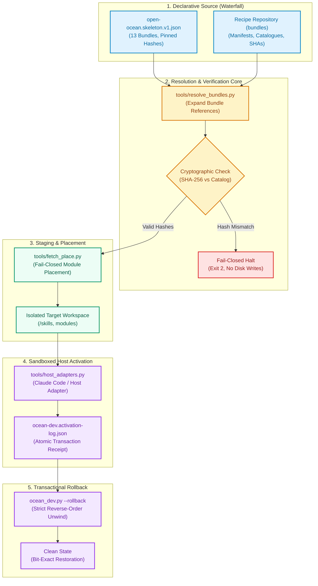
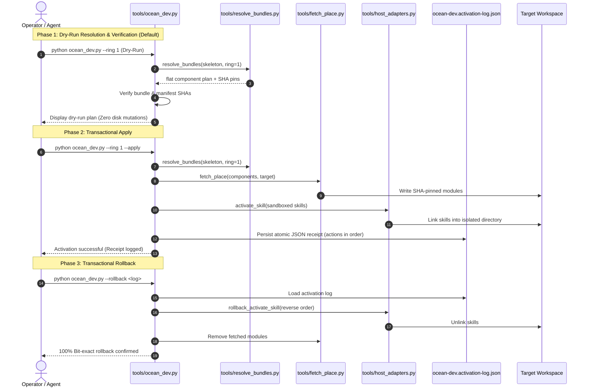

# open-ocean

**Free the ocean.**

A local-first, verifiable installer that composes AI-agent systems from declarative recipes —
the free community system of the ellmos ecosystem.

*[Deutsch](README_de.md)*

Candidate integration: [shared GUI consumer contract](architecture/GUI-CONSUMER.md)
documents pinned Astro releases, native read-only adapters and open runtime gates.

[](pyproject.toml)
[](https://www.python.org/)
[](https://github.com/ellmos-ai/open-ocean/actions/workflows/ci.yml)
[](tests/)
[](https://github.com/ellmos-ai/open-ocean)
[](https://github.com/astral-sh/ruff)
[](SECURITY.md)
[](SECURITY.md)
[](LICENSE)
[](llms.txt)
[](CHANGELOG.md)
[](https://github.com/ellmos-ai)
[](https://github.com/open-bricks)

> **Quick Navigation:**
> 1. [What it is](#what-it-is)
> 2. [Where it comes from](#where-it-comes-from)
> 3. [System Architecture](#system-architecture)
> 4. [Installation & Rollback Lifecycle](#installation--rollback-lifecycle)
> 5. [Guarantees](#guarantees)
> 6. [Quickstart & Usage](#quickstart--usage)
> 7. [What is in the repository](#what-is-in-the-repository)
> 8. [Status](#status)
> 9. [Contributing](#contributing)
> 10. [Related Projects](#related-projects)
> 11. [Security Policy](#security-policy)
> 12. [Licence](#licence)
> 13. [LLM Context & Discovery](#llm-context--discovery)

> [!NOTE]
> Machine-readable context for AI agents: [`llms.txt`](llms.txt). Security policy: [`SECURITY.md`](SECURITY.md). Third-party licences: [`THIRD_PARTY_LICENSES.md`](THIRD_PARTY_LICENSES.md). Changes: [`CHANGELOG.md`](CHANGELOG.md).

> **Early stage.** The installer works end to end on the maintainers' machines. It is not yet a
> tagged release — see *[Status](#status)*.

---

## What it is

open-ocean reads **recipes** — bundle manifests from the public
[`ellmos-ai/bundles`](https://github.com/ellmos-ai/bundles) repository — and turns them into a
working local installation. Every component is checked against a SHA-256 pin before anything is
written, placed into an isolated workspace, activated there, and recorded so that the whole
installation can be rolled back exactly.

- **Offline by design** — no telemetry, no network calls beyond the pinned fetches you ask for.
- **Dry-run first** — nothing is written unless you pass `--apply`.
- **Fail-closed** — a hash mismatch stops the run before the first write.
- **Reversible** — every change is logged and unwound in reverse order.

open-ocean is the open part of the wider ellmos system. Some parts of that system are private or
commercial and are not included in this repository.

---

## Where it comes from

The ecosystem names its layers after water, because the picture explains how the pieces relate:

| Term | What it is |
|---|---|
| **stream / water** | the work itself — data, tasks and results flowing through everything |
| **Bach / Rinnsal** | the grown streams: [BACH](https://github.com/ellmos-ai/bach), the original personal full system, and [Rinnsal](https://github.com/ellmos-ai/rinnsal), its lightweight successor |
| **water pipes** | the same water, tamed and modularised — reusable modules and bundles |
| **waterfall** | the declarative source: the recipes and catalogues everything is built from |
| **ocean** | where the streams arrive; the line runs Bach → Rinnsal → ocean |
| **open-ocean** | the part of the ocean that belongs to everyone — this repository |

One rule follows from the picture: restructuring changes the bed, never the water. Moving a
capability from BACH into modules must keep what it does.

---

## System Architecture

The following diagram illustrates how declarative recipes flow from the upstream waterfall into verifiable, sandboxed, and transactionally rollback-capable local installations:


```mermaid
flowchart TD
    subgraph Declarative["1. Declarative Source (Waterfall)"]
        SKEL["open-ocean.skeleton.v1.json\n(13 Bundles, Pinned Hashes)"]
        RECIPES["Recipe Repository (bundles)\n(Manifests, Catalogues, SHAs)"]
    end

    subgraph Resolver["2. Resolution & Verification Core"]
        RESOLVE["tools/resolve_bundles.py\n(Expand Bundle References)"]
        VERIFY{"Cryptographic Check\n(SHA-256 vs Catalog)"}
        FAIL_CLOSED["Fail-Closed Halt\n(Exit 2, No Disk Writes)"]
    end

    subgraph Staging["3. Staging & Placement"]
        FETCH["tools/fetch_place.py\n(Fail-Closed Module Placement)"]
        SANDBOX["Isolated Target Workspace\n(<workspace>/skills, modules)"]
    end

    subgraph Activation["4. Sandboxed Host Activation"]
        ADAPTER["tools/host_adapters.py\n(Claude Code / Host Adapter)"]
        TX_LOG["ocean-dev.activation-log.json\n(Atomic Transaction Receipt)"]
    end

    subgraph Rollback["5. Transactional Rollback"]
        RB_ENGINE["ocean_dev.py --rollback\n(Strict Reverse-Order Unwind)"]
        CLEAN["Clean State\n(Bit-Exact Restoration)"]
    end

    SKEL --> RESOLVE
    RECIPES --> RESOLVE
    RESOLVE --> VERIFY
    VERIFY -- "Hash Mismatch" --> FAIL_CLOSED
    VERIFY -- "Valid Hashes" --> FETCH
    FETCH --> SANDBOX
    SANDBOX --> ADAPTER
    ADAPTER --> TX_LOG
    TX_LOG --> RB_ENGINE
    RB_ENGINE --> CLEAN

    classDef source fill:#e0f2fe,stroke:#0284c7,stroke-width:2px,color:#0369a1;
    classDef core fill:#fef3c7,stroke:#d97706,stroke-width:2px,color:#92400e;
    classDef stage fill:#ecfdf5,stroke:#059669,stroke-width:2px,color:#065f46;
    classDef safe fill:#f3e8ff,stroke:#9333ea,stroke-width:2px,color:#6b21a8;
    classDef halt fill:#fee2e2,stroke:#dc2626,stroke-width:2px,color:#991b1b;
    class SKEL,RECIPES source;
    class RESOLVE,VERIFY core;
    class FETCH,SANDBOX stage;
    class ADAPTER,TX_LOG,RB_ENGINE,CLEAN safe;
    class FAIL_CLOSED halt;
```

---

## Installation & Rollback Lifecycle

Every execution lifecycle follows a deterministic, three-phase path ensuring that accidental host mutations are physically impossible:


```mermaid
sequenceDiagram
    autonumber
    actor Operator as Operator / Agent
    participant Dev as tools/ocean_dev.py
    participant Res as tools/resolve_bundles.py
    participant Fetch as tools/fetch_place.py
    participant Host as tools/host_adapters.py
    participant Log as ocean-dev.activation-log.json
    participant Target as Target Workspace

    Note over Operator,Dev: Phase 1: Dry-Run Resolution & Verification (Default)
    Operator->>Dev: python ocean_dev.py --ring 1 (Dry-Run)
    Dev->>Res: resolve_bundles(skeleton, ring=1)
    Res-->>Dev: flat component plan + SHA pins
    Dev->>Dev: Verify bundle & manifest SHAs
    Dev-->>Operator: Display dry-run plan (Zero disk mutations)

    Note over Operator,Dev: Phase 2: Transactional Apply
    Operator->>Dev: python ocean_dev.py --ring 1 --apply
    Dev->>Res: resolve_bundles(skeleton, ring=1)
    Dev->>Fetch: fetch_place(components, target)
    Fetch->>Target: Write SHA-pinned modules
    Dev->>Host: activate_skill(sandboxed skills)
    Host->>Target: Link skills into isolated directory
    Dev->>Log: Persist atomic JSON receipt (actions in order)
    Dev-->>Operator: Activation successful (Receipt logged)

    Note over Operator,Dev: Phase 3: Transactional Rollback
    Operator->>Dev: python ocean_dev.py --rollback <log>
    Dev->>Log: Load activation log
    Dev->>Host: rollback_activate_skill(reverse order)
    Host->>Target: Unlink skills
    Dev->>Fetch: Remove fetched modules
    Dev-->>Operator: 100% Bit-exact rollback confirmed
```

---

## Guarantees

| ID | Invariant | Description | Enforcement Mechanism |
|---|---|---|---|
| `INV-LOCAL-01` | **100% Local-First & Zero-Egress** | All manifest resolution, verification, module placement, and activation run offline without telemetry. | Static analysis test (`test_zero_egress_and_offline_invariants`), pure standard library runtime |
| `INV-TRANS-02` | **Transactional Rollback** | Every mutation in `--apply` is recorded in `ocean-dev.activation-log.json` and unwound in strict reverse order upon `--rollback`. | `ocean_dev.py --rollback`, verified cross-platform on macOS & Windows (`test_ocean_dev.py`) |
| `INV-DRY-03` | **Mandatory Dry-Run First** | Default CLI execution is strictly read-only; mutations require explicit `--apply`. | CLI parser defaults, `--apply` flag requirement |
| `INV-PIN-04` | **Cryptographic SHA-256 Pinning** | Bundle manifests and components must match catalogued hashes; fail-closed on any discrepancy. | `resolve_bundles.py` SHA matching, immediate exit code 2 on mismatch |
| `INV-SAND-05` | **Sandboxed Skill Isolation** | Activations target `<workspace>/skills`, never a live agent's host config (`~/.claude/skills`). | `host_adapters.py` default sandbox check |
| `INV-PRIV-06` | **Non-Elevation (User-Mode)** | Tools run unprivileged in user space without administrator, root, or UAC prompts. | Standard user permissions, zero OS elevation APIs |
| `INV-PLAT-09` | **Cross-Platform Operating Parity** | Universal execution across Linux, Windows, and macOS with normalized path handling. | CI multi-OS matrix (`windows-latest`, `ubuntu-latest`, `macos-latest`) |
| `INV-SLA-10` | **48h Response & 5-Day Triage SLA** | Security vulnerabilities acknowledged within 48 hours; triage completed within 5 business days. | `SECURITY.md` contract SLA |

The IDs are stable identifiers; numbers 07 and 08 were internal release and parity gates and are
no longer part of the public guarantees.

---

## Quickstart & Usage

open-ocean requires Python 3.10+ and `cryptography>=41` (used by `ocean inspect` for Ed25519
receipt verification).

```bash
# Get the installer and the public recipes
git clone https://github.com/ellmos-ai/open-ocean.git
git clone https://github.com/ellmos-ai/bundles.git
cd open-ocean
pip install -e .

# 1. Dry-run preview for ring-1 bundles (no filesystem writes)
python tools/ocean_dev.py --bundles-root ../bundles --ring 1

# 2. Transactional activation into a sandboxed workspace
python tools/ocean_dev.py --bundles-root ../bundles --ring 1 --apply

# 3. Roll back using the generated activation receipt
python tools/ocean_dev.py --rollback <workspace>/ocean-dev.activation-log.json

# 4. S8 skills- and workflow-projection (read-only Markdown export)
python tools/project_workflows.py --skills-registry <path-to-components.json> \
    --modules-catalog <path-to-modules.catalog.json> \
    --db-path <path-to-toolchains.json> \
    --output-dir <workspace>/projections \
    --include-toolchains
```

The skeleton references 13 bundles in two rings — the functional core (`--ring 1`) and the breadth
around it (`--ring 2`, or `all`).

For a running system, `ocean.py` wraps the same steps in a product lifecycle:

```text
python ocean.py plan <composition arguments>
python ocean.py up <composition arguments> --apply
python ocean.py start --workspace <local-sandbox>
python ocean.py status --workspace <local-sandbox>
python ocean.py inspect --workspace <local-sandbox> ...   # read-only, see architecture/OCEAN-INSPECT.md
python ocean.py user add --workspace <local-sandbox> --username <name> --email <address>
python ocean.py down --workspace <local-sandbox>
```

Run `python ocean.py --help` and the subcommand help for all arguments. Passwords are prompted
without echo and never passed as process arguments (`--password-stdin` for automation).

---

## What is in the repository

```
ocean.py                        user-facing lifecycle CLI (plan/up/start/status/inspect/user/down)
tools/
  ocean_dev.py                  single entry point: Resolve -> Verify -> Fetch/Place -> Activate,
                                dry-run by default, --apply for real writes, --rollback
  resolve_bundles.py            bundle refs -> flat, hash-checked component plan
  project_workflows.py          S8 skills-/workflow-projection into SKILLS.md/MODULES.md/TOOLCHAINS.md
  fetch_place.py                SHA-pinned, fail-closed module placement
  host_adapters.py              vendor-neutral skill activation and rollback (Claude Code as reference)
  source_pins.py                source-provenance verification before Resolve/Fetch
  ocean_lifecycle.py            plan/up/status/down/user lifecycle
  runtime_supervisor.py         authenticated loopback supervisor
architecture/
  open-ocean.skeleton.v1.json   the recipes this system consumes, pinned by hash
  INSTALLER-TARGET.md           installer contract and invariants
  OCEAN-INSPECT.md              read-only inspection adapter
  BACH-EXTRACTION-ROADMAP.md, bach-*.json
                                contracts for moving BACH capabilities into modules
tests/                          offline test suite
```

The skeleton **references** recipes; no manifest is copied here, so this repository never drifts
from the recipe source.

---

## Status

- **Works:** Resolve, Verify, SHA-pinned Fetch/Place, sandboxed Activate, rollback and the
  `ocean.py` runtime lifecycle, tested on Windows, Linux and macOS.
- **Open:** a fresh installation on a machine outside the maintainers' development setup, and
  functional coverage of everything BACH does today.
- **Not yet:** a tagged release. See [`CHANGELOG.md`](CHANGELOG.md) for what changed when.

---

## Contributing

Issues and pull requests are welcome. Before opening a PR, run the offline checks:

```bash
pytest -ra -v
ruff check .
python -m compileall -q .
```

The suite (263 tests passed, 27 skipped) runs without network access. Documentation is kept in English and
German side by side (`README.md` / `README_de.md`, `CHANGELOG.md` / `CHANGELOG_de.md`); please
update both. Security issues go through the channel below, not public issues.

---

## Related Projects

| Repository | Role |
|---|---|
| [`ellmos-ai/bundles`](https://github.com/ellmos-ai/bundles) | Recipe layer: bundle manifests and catalogues consumed here |
| [`ellmos-ai/bach`](https://github.com/ellmos-ai/bach) | The original full system open-ocean grows out of |
| [`ellmos-ai/rinnsal`](https://github.com/ellmos-ai/rinnsal) | Lightweight local-first agent infrastructure |
| [`ellmos-ai/policy-registry`](https://github.com/ellmos-ai/policy-registry) | Machine-readable policies, governance rules, and system gates |
| [`ellmos-ai/system-explorer`](https://github.com/ellmos-ai/system-explorer) | System-wide inspection; provider behind `ocean inspect` |
| [`ellmos-ai/sqlite-transit-sync`](https://github.com/ellmos-ai/sqlite-transit-sync) | Conflict-free SQLite state replication |
| [`ellmos-ai/decision-clicker`](https://github.com/ellmos-ai/decision-clicker) | Human-in-the-loop decision routing |
| [`ellmos-ai/memoryhooker`](https://github.com/ellmos-ai/memoryhooker) | Agent session context and memory hooks |
| [`ellmos-ai/workflowhooker`](https://github.com/ellmos-ai/workflowhooker) | Agent workflow lifecycle hooks |
| [`ellmos-ai/ellmos-filecommander-mcp`](https://github.com/ellmos-ai/ellmos-filecommander-mcp) | Local filesystem MCP server |
| [`ellmos-ai/ellmos-codecommander-mcp`](https://github.com/ellmos-ai/ellmos-codecommander-mcp) | Code analysis and refactoring MCP server |
| [`ellmos-ai/ellmos-controlcenter-mcp`](https://github.com/ellmos-ai/ellmos-controlcenter-mcp) | Agent tool routing and profile MCP server |
| [`dev-bricks/DevCenter`](https://github.com/dev-bricks/DevCenter) | Modular developer tooling and workspace launcher |
| [`dev-bricks/CodeBox`](https://github.com/dev-bricks/CodeBox) | Sandbox and snippet management |
| [`file-bricks/ExplorerPro`](https://github.com/file-bricks/ExplorerPro) | File management and directory synchronisation GUI |
| [`doc-bricks/CleanMarkdown`](https://github.com/doc-bricks/CleanMarkdown) | Markdown sanitisation and link validation |

---

## Security Policy

Security and data integrity are governed by [`SECURITY.md`](SECURITY.md):
- **48-Hour Response SLA**: All vulnerability reports acknowledged within 48 hours.
- **5-Business-Day Triage Guarantee**: Detailed impact analysis and mitigation timeline within 5 working days.
- **Official Security Contacts**:
  - `security@ellmos.ai`
  - `security@open-bricks.org`
  - Fallback: `support@lukasgeiger.com`, `lukas@open-bricks.org`
- **Advisory Channel**: [GitHub Security Advisories](https://github.com/ellmos-ai/open-ocean/security/advisories)

---

## Licence

Licensed under the permissive **MIT License** ([`LICENSE`](LICENSE)).
Third-party development dependencies and their licenses are inventoried in [`THIRD_PARTY_LICENSES.md`](THIRD_PARTY_LICENSES.md).

---

## LLM Context & Discovery

For AI coding agents and automated discovery, a machine-readable summary and command index is
maintained in [`llms.txt`](llms.txt).
