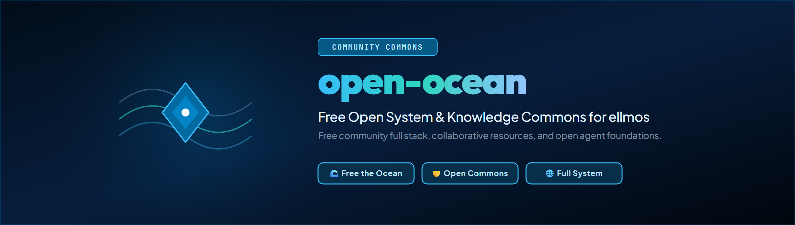
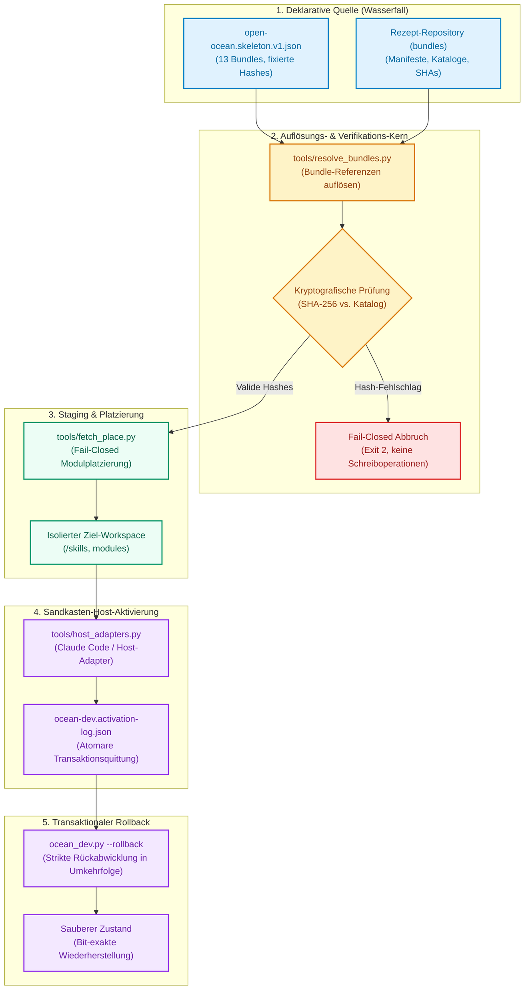
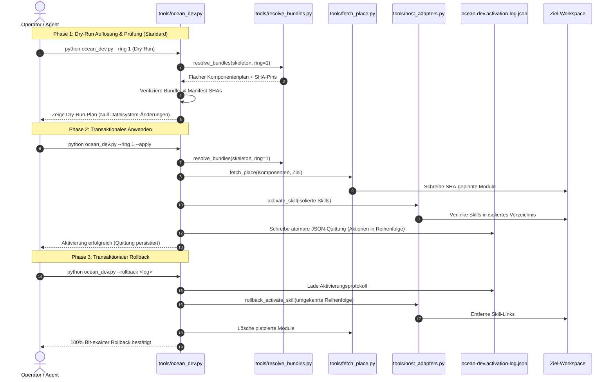

# open-ocean

**Free the ocean.**

Das kostenlose Community-Vollsystem des ellmos-Ökosystems.

*[English](README.md)*

[](pyproject.toml)
[](https://www.python.org/)
[](https://github.com/ellmos-ai/open-ocean/actions/workflows/ci.yml)
[](tests/)
[](https://github.com/ellmos-ai/open-ocean)
[](https://github.com/astral-sh/ruff)
[](SECURITY.md)
[](SECURITY.md)
[](LICENSE)
[](llms.txt)
[](CHANGELOG.md)
[](https://github.com/ellmos-ai)
[](https://github.com/open-bricks)
[](MARKETING-LOG.txt)

> **Schnellnavigation:**
> 1. [Überblick und Kernmission](#zuerst-lesen-dieses-repository-ist-eine-baustelle)
> 2. [Wassermetapher und Architektur](#der-name-und-die-architektur-die-er-tr%C3%A4gt)
> 3. [Systemarchitektur-Diagramm](#systemarchitektur)
> 4. [End-to-End Installations-Lebenszyklus](#installations--und-rollback-lebenszyklus)
> 5. [Repository-Struktur und Werkzeuge](#was-sich-tats%C3%A4chlich-hier-befindet)
> 6. [Governance- und Laufzeit-Invarianten](#governance--und-laufzeit-invarianten)
> 7. [Status und Komponenten-Ampel](#status)
> 8. [Freigabebedingungen und Publikations-Gate](#freigabebedingungen)
> 9. [Schnellstart und CLI-Nutzung](#schnellstart-und-cli-nutzung)
> 10. [Geschwister-Ökosystem und Partner-Matrix](#geschwister-%C3%B6kosystem-und-partner-repositories)
> 11. [Verifikation und Testsuite](#verifikation-und-testsuite)
> 12. [Sicherheitsrichtlinie und Schwachstellenmeldung](#sicherheitsrichtlinie)
> 13. [Lizenz und Open-Source-Integrit%C3%A4t](#lizenz)
> 14. [LLM-Kontext und Discovery (`llms.txt`)](#llm-kontext-und-discovery)

> [!NOTE]
> Für maschinenlesbare Architekturübersichten und LLM-Kontext siehe [`llms.txt`](llms.txt). Sicherheitsrichtlinien und Invarianten sind in [`SECURITY.md`](SECURITY.md) dokumentiert. Drittanbieter-Lizenzen sind in [`THIRD_PARTY_LICENSES.md`](THIRD_PARTY_LICENSES.md) inventarisiert. Versionsänderungen werden in [`CHANGELOG.md`](CHANGELOG.md) gepflegt.

> **Privater Aufbau, und bewusst früh.** Dieses Repository existiert, bevor das System existiert —
> damit die Architektur einen Ort hat, während sie entschieden wird. Es öffnet sich, wenn das
> Wasser im Ozean ankommt; siehe *[Freigabebedingungen](#freigabebedingungen)*.

---

## Zuerst lesen: dieses Repository ist eine Baustelle

**Das veröffentlichte Vollsystem liegt hier noch nicht.** Ein transaktionaler Installer-Kern ist
inzwischen vorhanden und unter Windows und macOS erprobt, aber es gibt weiterhin keine eigene
Laufzeit mit BACH-Parität — und bewusst keine Kopien der Rezepte. Was hier liegt, ist die
Architektur und die erste ausführbare Systembau-Schicht: welche Rezepte das System konsumiert, wo
sie leben und wie sie aufgelöst, geprüft, geholt, platziert, aktiviert und zurückgerollt werden.

Wer etwas heute Nutzbares sucht, findet es in der Rezept-Schicht — einem eigenen Repository mit
den Bundle-Manifesten, das Welle für Welle freigegeben wird. Die Rezepte sind Monate vor dem
System fertig, das sie konsumiert, und genau deshalb liegen sie nicht hier: Ein Repository, das
Rezepte unter dem Namen des Systems ausliefert, sähe fertig aus, während das System es nicht ist.

| Repository | Was es ist | Zustand |
|---|---|---|
| **bundles** | die Rezept-Schicht: Manifeste, Katalog, Export-Werkzeug | privat, Freigabe Welle für Welle |
| **open-ocean** (hier) | der Systembau: Architektur, Installer, das Konsumierende | privat, früh |

---

## Der Name und die Architektur, die er trägt

Das Ökosystem benennt seine Ebenen nach Wasser, weil das Bild die Architektur trägt statt sie zu
schmücken:

| Begriff | Was es ist |
|---|---|
| **stream / Wasser** | der Prozess selbst — Daten, Arbeit, Ergebnisse, die durch alles hindurchfließen |
| **Bach / Rinnsal** | die wilden, gewachsenen Läufe: die ursprüngliche persönliche Vollinstanz |
| **water pipes** | dasselbe Wasser, gezähmt und modularisiert — Module und Bundles |
| **waterfall** | die deklarative Quelle: Baukasten, Rezepte, Kataloge |
| **ocean** | das Vollsystem; Endpunkt der Linie Bach → Rinnsal → Ozean |
| **open-ocean** | der Teil, der allen gehört: das kostenlose Community-Vollsystem |

Die leitende Regel ist ein Erhaltungssatz: **Extraktion ändert das Bett, nie das Wasser.** Umbau
muss die Funktion erhalten — „gleiche Wassermenge" heißt Funktionsparität. Auch das ist keine
Zierde, sondern die Messlatte, die dieses Repository für seine Freigabe überspringen muss.

Das System wird nicht neben der ursprünglichen Instanz neu geschrieben, und die Ursprungsinstanz
wird nicht umgebaut. Es entsteht durch fortgesetzte **Extraktion**: Module fließen heraus, und die
ursprüngliche Instanz bindet sie anschließend wieder ein und ersetzt damit ihre eigenen Interna.
Sie wird kein Museumsstück. Sie fließt als begradigter Fluss weiter — nicht mehr ganz natürlich,
aber mit dem Wasser verbunden und weiter versorgt.

---

## Systemarchitektur

Das folgende Diagramm zeigt, wie deklarative Rezepte aus dem vorgeschalteten Wasserfall in verifizierbare, isolierte und transaktional rückrollbare lokale Installationen überführt werden:



---

## Installations- und Rollback-Lebenszyklus

Jeder Ausführungslebenszyklus folgt einem deterministischen Drei-Phasen-Pfad, der versehentliche Änderungen am Host-System physisch ausschließt:



---

## Was sich tatsächlich hier befindet

```
architecture/
  open-ocean.skeleton.v1.json   welche Rezepte das System konsumieren will, per Hash fixiert
  INSTALLER-TARGET.md           was der Installer werden muss und was er nicht tun darf
  OCEAN-DEV-BUILD-PLAN_2026-08-18.md  Stufenweiser Bauplan und Integrationsbelege auf Fremd-Hosts
  BACH-EXTRACTION-ROADMAP.md    Extraktionsreihenfolge, Paritäts-Gatter und Cluster-9-Kernkarte
  bach-parity-baseline.v1.json  maschinenlesbare Registry- und Cluster-9-Abdeckungsbasis
  bach-k9-data-contract.v1.json fixierter dbsync/Snapshot-Operations- und Fixture-Vertrag
  bach-k9-dbsync-adapter.v1.json schlanke Lifecycle-Adapter-Spezifikation
  session-checkpoint-capability.v1.json Grenze des korrekten Snapshot-Trägers
tools/
  audit_bach_handlers.py        nebenwirkungsfreier Quelltext-Audit gegen diese Basis
  check_k9_data_contract.py     statischer BACH-Check plus zwei synthetische Träger-Fixtures
  resolve_bundles.py            Resolve+Verify: Bundle-Refs -> flacher, hash-geprüfter Komponentenplan
  host_adapters.py              anbieterneutrales Activate: Nur-Lese-Bereitschaftsprüfung plus
                                Schreibseite activate_skill/rollback_activate_skill (Claude Code als Referenz)
  fetch_place.py                Fetch+Place für Modul-Komponenten, SHA-gepinnt, Fail-Closed (kein
                                stillschweigender Rückgriff auf Default-Branches)
  ocean_dev.py                  einziger Einstiegspunkt: Resolve -> Verify -> Fetch/Place -> Activate
                                für einen Ring; Dry-Run standardmäßig, --apply für reale Schreibvorgänge, --rollback
PRIVATE.txt                     das Veröffentlichungsgatter, absichtlich eingecheckt
```

Das Skelett referenziert 13 Bundles in zwei Ringen — den funktionalen Kern und die Breite darum herum.
Es **referenziert** sie: Kein Manifest ist hierher kopiert. Kopien würden forken, sobald das
Rezept-Repository weiterzieht, und ließen dieses Repository weiter aussehen, als es ist.

---

## Governance- und Laufzeit-Invarianten

`open-ocean` garantiert 10 unverhandelbare architektonische Invarianten:

| ID | Invariante | Beschreibung | Durchsetzungs-Mechanismus |
|---|---|---|---|
| `INV-LOCAL-01` | **100% Local-First & Zero-Egress** | Alle Manifest-Auflösungen, Hash-Prüfungen, Modulplatzierungen und Aktivierungen laufen offline ohne Telemetrie. | Statische Codeanalyse (`test_zero_egress_and_offline_invariants`), reine Python-Standardbibliothek |
| `INV-TRANS-02` | **Transaktionaler Rollback** | Jede Schreiboperation unter `--apply` wird in `ocean-dev.activation-log.json` protokolliert und mit `--rollback` strikt in Umkehrfolge zurückgenommen. | `ocean_dev.py --rollback`, plattformübergreifend verifiziert auf macOS und Windows (`test_ocean_dev.py`) |
| `INV-DRY-03` | **Verbindliches Dry-Run-First** | Standardausführung der CLI ist rein lesend; Änderungen erfordern die explizite Angabe von `--apply`. | CLI-Argument-Parser, Standard-Schutzgatter |
| `INV-PIN-04` | **Kryptografisches SHA-256-Pinning** | Bundle-Manifeste und Komponenten müssen exakt mit den Katalog-Hashes übereinstimmen; Fail-Closed bei jeder Abweichung. | `resolve_bundles.py` SHA-Prüfung, sofortiger Exit-Code 2 |
| `INV-SAND-05` | **Sandkasten-Isolation bei Aktivierung** | Aktivierungen zielen auf `<workspace>/skills`, niemals auf produktive Agenten-Verzeichnisse (`~/.claude/skills`). | `host_adapters.py` Standardziel-Sicherheitsprüfung |
| `INV-PRIV-06` | **Keine Rechteausweitung (User-Mode)** | Alle Werkzeuge laufen ohne administrative Rechte im Standard-Benutzerkontext. | Normale Benutzerrechte, keine OS-Elevation-APIs |
| `INV-GATE-07` | **Publikations-Gate (`PRIVATE.txt`)** | Die Sichtbarkeit bleibt gesperrt, bis alle 4 Freigabebedingungen nachweisbar erfüllt sind. | `PRIVATE.txt` Vertragsspezifikation |
| `INV-PARITY-08` | **Erhaltungssatz der Parität** | Extraktion ändert das Bett, nie das Wasser; Modularisierung muss die Funktion strikt erhalten. | `audit_bach_handlers.py`, `check_k9_data_contract.py` |
| `INV-PLAT-09` | **Plattformübergreifende Parität** | Einheitliches Verhalten und normalisierte Pfadbehandlung unter Linux, Windows und macOS. | CI-Matrix auf GitHub Actions (`windows-latest`, `ubuntu-latest`, `macos-latest`) |
| `INV-SLA-10` | **48h Reaktions- & 5-Tage-Triage-SLA** | Schwachstellenmeldungen werden innerhalb von 48 Stunden bestätigt; Triage erfolgt verbindlich innerhalb von 5 Werktagen. | `SECURITY.md` Sicherheitsrichtlinie |

---

## Status

**Dieses Repository:**

| Komponente | Status und Nachweis |
|---|---|
| Architektur-Skelett | vorhanden, 13 Bundles referenziert |
| BACH-Extraktions-Baseline | vorhanden — 114 quelltext-deklarierte Namen; historische 113-Namen-Laufzeitlatte beibehalten; re-auditiert am 2026-08-18 (106 Handler-Klassen, +1 gegenüber der Baseline 2026-08-08 — zurückgeführt auf eine Host-spezifische Dateidublette in BACH, `upgrade-WORKSTATION-LG.py` neben `upgrade.py`; hier nicht korrigiert, da BACH außerhalb des Umfangs dieses Repositories liegt). `registered_names` unverändert bei 114. |
| K9-1 Daten-/Checkpoint-Gatter | zwei Träger-Fixtures grün; Adapter und BACH-Äquivalenz bleiben offen |
| Installer | **Resolve, Verify, SHA-gepinntes Fetch/Place, sandkasten-isoliertes Skill-Activate, Aktivierungsprotokollierung und zielvalidierter Rollback sind für den derzeit unterstützten Komponentenpfad implementiert; dieses pinnbare Ring-1-Segment ist auf einem Fremd-Host integrationserprobt.** Am 2026-08-20 verifizierte ein Mac Studio `--apply`-Lauf alle 5 Ring-1-Bundles, holte `WikiStub-Seed` mit dem katalogisierten SHA `3476ba2…12458af4` und aktivierte alle 9 Ring-1-Skills in einer expliziten Sandbox. Dessen einzelnes 10-Eintrags-Aktivierungsprotokoll rollte anschließend das geholte Modul und alle Skills zurück; der Snapshot des produktiven Mac `~/.claude/skills` blieb vor, nach apply und nach rollback identisch. Die portable Testsuite umfasst nun 107 Tests, inklusive echter Git-Transaktionsabdeckung sowie Fail-Closed-Regressionstests für das Wiederholen eines Protokolls gegen ein anderes Ziel, für ein Löschen mit verbleibenden Resten und für Katalog-IDs mit unterschiedlicher Groß-/Kleinschreibung. Dies stellt noch keinen Vollsystemanspruch dar: Zwei Ring-1-Git-Module bleiben ungepinnt, zehn Modulreferenzen sind lokale Verzeichnisquellen und eine Katalogreferenz weist noch die bekannte `memory-hooker`/`memoryhooker`-Abweichung auf. Siehe [stufenweisen Bauplan](architecture/OCEAN-DEV-BUILD-PLAN_2026-08-18.md). |
| Eigene Laufzeit | **nicht verfügbar** — jeder Kandidat ist privat oder nur deklariert |
| Rezepte | gepflegt im Rezept-Repository, nicht hier |

**Die Ampel** — Freigabebedingung 1 wird grün, wenn jedes referenzierte Bundle grün ist,
also jede seiner Komponenten öffentlich und geprüft ist. Der Umfang ist hier entscheidend:
Das Skelett dieses Repositories referenziert genau **13** der rund 30 Bundles des Ökosystems
(siehe [Skelett](architecture/open-ocean.skeleton.v1.json)); Bedingung 1 bezieht sich auf diese 13,
nicht auf den gesamten Katalog.

| Metrik | Prüfergebnis |
|---|---|
| Von diesem Repository referenzierte Bundles | **13** |
| Davon verifiziert öffentlich (2026-08-18) | **13 / 13** |
| Geprüfte eindeutige Komponenten | 18 Module, 1 Access-Surface-Repository (`ellmos-homebase-mcp`), 27 Skills (im öffentlichen Katalog `ellmos-ai/skills`), 1 optionale Software-App (`MediaBrain`) — alle über `gh repo view`/Katalog-Lookup bestätigt, nicht über das feldinterne `visibility`-Flag der Module (jenes hält ein Klassifikationsziel fest und kann hinter dem GitHub-Stand zurückbleiben) |
| Nicht anwendbar auf diese Prüfung | 3 `access_surface`-Referenzen auf kommerzielle Agenten-Provider/Abonnements/APIs (kein Repository, kein öffentlich/privat-Status) |

Keines der vier Repositories, die andere Teile des Ökosystems am 2026-08-08 blockierten
(`ellmos-core` sowie die drei inzwischen veröffentlichten Repositories `ellmos-scheduler`,
`system-explorer`, `policy-registry`), wird vom 13-Bundle-Skelett dieses Repositories referenziert;
sie betreffen Bundles außerhalb dieses Scopes (`core-discovery`, `prompt-workflow`,
`runtime-options`, `governance-assurance`, `automation-control`). Bedingung 1 ist für den Umfang
dieses Repositories mit Stand 2026-08-18 erfüllt. Was die Veröffentlichung noch hemmt, sind die
Bedingungen 2 und 3.

---

## Freigabebedingungen

Dieses Repository führt ein bedingtes Veröffentlichungsgatter (`PRIVATE.txt`, bewusst eingecheckt,
damit das Gatter dort sichtbar ist, wo die Sichtbarkeit geschaltet wird). Es öffnet sich, sobald alle
vier Bedingungen nachweislich erfüllt sind:

1. **Grüne Komponenten** — jedes referenzierte Bundle ist grün: jede Komponente öffentlich und
   geprüft. **Erfüllt mit Stand 2026-08-18** für den 13-Bundle-Umfang — siehe obige Ampel-Tabelle.
2. **Schleusentest bestanden** — die gesamte Linie funktioniert durchgängig: Eine frische Installation
   aus diesen Rezepten erreicht auf einem Rechner, der nicht der Entwicklungshost ist, einen arbeitsfähigen
   Zustand. **Noch nicht erfüllt, die Schnittstelle des Installers ist jedoch auf einem Fremd-Host erprobt.**
   Ein Mac-Studio-Lauf am 2026-08-20 führte Resolve, Verify, ein reales SHA-gepinntes Fetch/Place und alle
   neun Ring-1-Skill-Aktivierungen in einem einzigen `--apply`-Aufruf aus und entfernte anschließend alle zehn
   Schreibvorgänge über dasselbe Aktivierungsprotokoll. Dies schließt den zuvor unerprobten kombinierten
   Mechanismenpfad ab, nicht die Freigabebedingung an sich: Das Ziel war eine explizite Sandbox, nur ein
   Ring-1-Git-Modul verfügt über einen sicheren Katalog-Pin, und der Lauf erzeugte noch keine vollständige
   arbeitsfähige Ozean-Laufzeit aus allen benötigten Komponenten. Siehe
   `architecture/OCEAN-DEV-BUILD-PLAN_2026-08-18.md` Stufe 2 für Belege und Restumfang.
3. **Parität für den Freigabeumfang** — das System leistet das, was es vorgibt abzudecken. Ein kleinerer
   installierbarer Kern ist eine Baustufe, keine Freigabe. Der aktuelle Quelltext-Audit verzeichnet 114
   erreichbare Namen und behält die historische 113-Namen-Laufzeitaufnahme als Mindestverpflichtung bei;
   siehe [Extraktions-Roadmap](architecture/BACH-EXTRACTION-ROADMAP.md). **Neu gemessen am 2026-08-18**
   (lesend, BACH unangetastet): Die 114-Namen-Latte ist unverändert und aktuell; siehe
   `architecture/bach-parity-baseline.v1.json` → `re_audit_2026-08-18`. Diese Bedingung erfordert jedoch
   mehr als eine Namenszählung: [Cluster 9's Operationsmatrix](architecture/BACH-EXTRACTION-ROADMAP.md#cluster-9-operation-matrix)
   ist der einzige Cluster mit aktiven Arbeiten (8 von 9 Clustern sind unberührt), und darin führt noch
   keiner von 30 Befehlsnamen den Status `accepted` (funktional äquivalent) — 20 sind `candidate-partial`,
   9 `gap`, 1 `alias`. Bedingung 3 ist daher **noch nicht erfüllt**; sie hängt von denselben Installer-
   und Laufzeitarbeiten ab wie Bedingung 2.
4. **Veröffentlichungsprüfung bestanden** — Recht, Datenschutz und Lizenzierung ohne Blocker geprüft.
   **Ausgeführt am 2026-08-18** (`repo-publish-check`-Skill, 10 Tore) — Prüfprotokoll und lokaler Bericht:
   `.GITHUBBOT/workflows/repo-publish-check/reports/ellmos-ai__open-ocean_2026-08-18.md` (lokal gehalten
   gemäß Skill-Regel, nicht in diesem Repository eingecheckt).

Bedingung 2 ist jene, nach der dieses Repository benannt ist. Die Schleusen zu öffnen und zu prüfen,
ob das Wasser tatsächlich ankommt, ist der Test, den kein noch so korrektes Manifest ersetzen kann.
Von den vier Bedingungen sind 1 und 4 adressiert. Bedingung 2 verfügt über eine verifizierte
transaktionale Installernaht, benötigt jedoch noch eine vollständige frische Installation eines
arbeitsfähigen Systems; Bedingung 3 benötigt funktionale BACH-Parität.

---

## Schnellstart und CLI-Nutzung

### Voraussetzungen & Installation

`open-ocean` setzt Python 3.10+ voraus und kommt vollständig ohne externe Laufzeitbibliotheken aus.

```bash
# Repository klonen
git clone https://github.com/ellmos-ai/open-ocean.git
cd open-ocean

# Im Editable-Modus installieren
pip install -e .
```

### CLI-Ausführungsmodi

```bash
# 1. Dry-Run Vorschau für Ring-1-Bundles (Sicher, keine Datei-Schreibvorgänge)
python tools/ocean_dev.py --bundles-root <pfad-zu-bundles> --ring 1

# 2. Transaktionale Live-Aktivierung in isolierte Sandbox
python tools/ocean_dev.py --bundles-root <pfad-zu-bundles> --ring 1 --apply

# 3. Transaktionaler Rollback anhand des erzeugten Aktivierungsprotokolls
python tools/ocean_dev.py --rollback <workspace>/ocean-dev.activation-log.json
```

---

## Geschwister-Ökosystem und Partner-Repositories

`open-ocean` bildet den zentralen Konvergenzpunkt des `ellmos-ai`- und `open-bricks`-Ökosystems:

| Repository | Organisation | Rolle & Integration im Ökosystem |
|---|---|---|
| [`ellmos-ai/ellmos-core`](https://github.com/ellmos-ai) | `ellmos-ai` | Kern-Laufzeitorchestrierung & Agentenausführungs-Kernel |
| [`ellmos-ai/policy-registry`](https://github.com/ellmos-ai/policy-registry) | `ellmos-ai` | Maschinenlesbare Richtlinien, Governance-Regeln und System-Gatter |
| [`ellmos-ai/system-explorer`](https://github.com/ellmos-ai/system-explorer) | `ellmos-ai` | Systemweite Inspektion, Prozessprüfung und Topologie-Erkennung |
| [`ellmos-ai/sqlite-transit-sync`](https://github.com/ellmos-ai/sqlite-transit-sync) | `ellmos-ai` | Hochfrequente, konfliktfreie SQLite-Zustandsreplikation |
| [`ellmos-ai/decision-clicker`](https://github.com/ellmos-ai/decision-clicker) | `ellmos-ai` | Deterministisches Human-in-the-Loop Entscheidungsrouting |
| [`ellmos-ai/memoryhooker`](https://github.com/ellmos-ai) | `ellmos-ai` | Dynamische Agenten-Sitzungskontexte & Memory-Hooking |
| [`ellmos-ai/workflowhooker`](https://github.com/ellmos-ai) | `ellmos-ai` | Workflow-Interzeption und deterministische Lifecycle-Trigger |
| [`ellmos-ai/ellmos-filecommander-mcp`](https://github.com/ellmos-ai) | `ellmos-ai` | Robuster lokaler Dateisystem-MCP-Server für Agentenoperationen |
| [`ellmos-ai/ellmos-codecommander-mcp`](https://github.com/ellmos-ai) | `ellmos-ai` | High-Level Code-Analyse- und Refactoring-MCP-Server |
| [`ellmos-ai/ellmos-controlcenter-mcp`](https://github.com/ellmos-ai) | `ellmos-ai` | Zentraler Agenten-Orchestrierungs- und Tool-Routing-MCP-Server |
| [`dev-bricks/DevCenter`](https://github.com/dev-bricks) | `dev-bricks` | Modulare Entwicklerwerkzeuge und Workspace-Starter |
| [`dev-bricks/CodeBox`](https://github.com/dev-bricks) | `dev-bricks` | Sichere Sandbox- und Snippet-Verwaltungsumgebung |
| [`file-bricks/ExplorerPro`](https://github.com/file-bricks) | `file-bricks` | Dateiverwaltungs- und Verzeichnissynchronisations-GUI |
| [`doc-bricks/CleanMarkdown`](https://github.com/doc-bricks) | `doc-bricks` | Markdown-Bereinigung, Link-Validierung und Dokumentations-Cleaner |
| [`entertain-and-more/BattleStage`](https://github.com/entertain-and-more) | `entertain-and-more` | Interaktive Spielesimulationsumgebung auf ellmos-Modulbasis |
| [`open-bricks/open-bricks`](https://github.com/open-bricks) | `open-bricks` | Dachkatalog aller Open-Source-Produkte und Ökosystem-Index |

---

## Verifikation und Testsuite

Die Testsuite umfasst 107+ automatisierte Tests, die zu 100% offline ohne Netzwerkzugriff laufen:

```bash
# Gesamte Testsuite mit detaillierter Ausgabe ausführen
pytest -ra -v

# Linter-Prüfung mit Ruff
ruff check .

# Bytecode-Kompilierung validieren
python -m compileall -q .
```

Wichtigste Testkategorien:
- **`test_audit_bach_handlers.py`**: Statischer AST-Audit erreichbarer Handler-Namen gegen die Paritäts-Baseline.
- **`test_check_k9_data_contract.py`**: Verifikation von Datenbanksynchronisations-Verträgen und Snapshot-Fixtures.
- **`test_fetch_place.py`**: SHA-gepinnter Git-Abruf, Fail-Closed-Verhalten bei ungesicherten Zweigen und lokale Platzierung.
- **`test_host_adapters.py`**: Isolierte Agenten-Skill-Aktivierung und atomare Rollback-Operationen.
- **`test_ocean_dev.py`**: End-to-End Dry-Run, Apply und Protokoll-Rückabwicklungs-Lebenszyklus.
- **`test_resolve_bundles.py`**: Manifest-Auflösung, Abhängigkeitsbaum-Glättung und Prüfsummenvalidierung.
- **`test_metadata.py`**: Vertragstests zur Durchsetzung von README-Ankern, Mermaid-Diagrammen, Sicherheits-SLAs und Metadaten.

---

## Sicherheitsrichtlinie

Sicherheit und Datenintegrität unterliegen der verbindlichen Richtlinie in [`SECURITY.md`](SECURITY.md):
- **48-Stunden Reaktions-SLA**: Alle Sicherheitsmeldungen werden innerhalb von 48 Stunden bestätigt.
- **5-Werktage Triage-Zusage**: Detaillierte Auswirkungsanalyse und Behebungszeitplan innerhalb von 5 Werktagen.
- **Offizielle Sicherheitskontakte**:
  - `security@ellmos.ai`
  - `security@open-bricks.org`
  - Fallback: `support@lukasgeiger.com`, `lukas@open-bricks.org`
- **Sicherheits-Advisories**: [GitHub Security Advisories](https://github.com/ellmos-ai/open-ocean/security/advisories)

---

## Lizenz

Lizenziert unter der freien **MIT-Lizenz** ([`LICENSE`](LICENSE)).
Drittanbieter-Entwicklungswerkzeuge und deren Lizenzen sind in [`THIRD_PARTY_LICENSES.md`](THIRD_PARTY_LICENSES.md) dokumentiert.

---

## LLM-Kontext und Discovery

Für autonome KI-Programmieragenten, Kontext-Injektoren und automatisierte Discovery-Pipelines:
- Maschinenlesbare Architekturzusammenfassungen und Befehlsindizes werden in [`llms.txt`](llms.txt) geführt.
- Lokale Marketing-, Sichtbarkeits- und Verzeichnisempfehlungen sind in [`MARKETING-LOG.txt`](MARKETING-LOG.txt) protokolliert.
