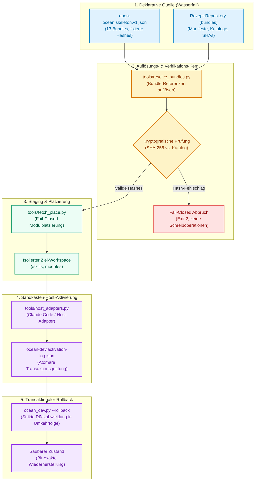
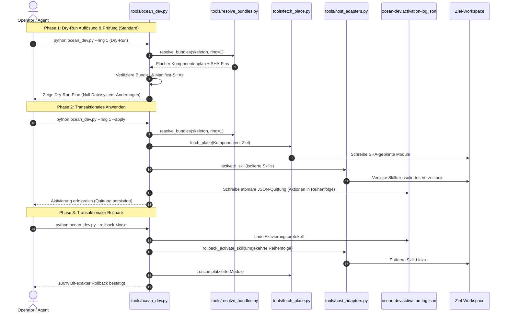

# open-ocean

**Free the ocean.**

Das kostenlose Community-System des ellmos-Ökosystems.

*[English](README.md)*

[](pyproject.toml)
[](https://www.python.org/)
[](https://github.com/ellmos-ai/open-ocean/actions/workflows/ci.yml)
[](tests/)
[](https://github.com/ellmos-ai/open-ocean)
[](https://github.com/astral-sh/ruff)
[](SECURITY.md)
[](SECURITY.md)
[](LICENSE)
[](llms.txt)
[](CHANGELOG.md)
[](https://github.com/ellmos-ai)
[](https://github.com/open-bricks)

> **Schnellnavigation:**
> 1. [Überblick und Kernmission](#zuerst-lesen-dieses-repository-ist-eine-baustelle)
> 2. [Wassermetapher und Architektur](#der-name-und-die-architektur-die-er-tr%C3%A4gt)
> 3. [Systemarchitektur-Diagramm](#systemarchitektur)
> 4. [End-to-End Installations-Lebenszyklus](#installations--und-rollback-lebenszyklus)
> 5. [Repository-Struktur und Werkzeuge](#was-sich-tats%C3%A4chlich-hier-befindet)
> 6. [Governance- und Laufzeit-Invarianten](#governance--und-laufzeit-invarianten)
> 7. [Status und Komponenten-Ampel](#status)
> 8. [Freigabebedingungen und Publikations-Gate](#freigabebedingungen)
> 9. [Schnellstart und CLI-Nutzung](#schnellstart-und-cli-nutzung)
> 10. [Geschwister-Ökosystem und Partner-Matrix](#geschwister-%C3%B6kosystem-und-partner-repositories)
> 11. [Verifikation und Testsuite](#verifikation-und-testsuite)
> 12. [Sicherheitsrichtlinie und Schwachstellenmeldung](#sicherheitsrichtlinie)
> 13. [Lizenz und Open-Source-Integrit%C3%A4t](#lizenz)
> 14. [LLM-Kontext und Discovery (`llms.txt`)](#llm-kontext-und-discovery)

> [!NOTE]
> Für maschinenlesbare Architekturübersichten und LLM-Kontext siehe [`llms.txt`](llms.txt). Sicherheitsrichtlinien und Invarianten sind in [`SECURITY.md`](SECURITY.md) dokumentiert. Drittanbieter-Lizenzen sind in [`THIRD_PARTY_LICENSES.md`](THIRD_PARTY_LICENSES.md) inventarisiert. Versionsänderungen werden in [`CHANGELOG.md`](CHANGELOG.md) gepflegt.

> **Öffentliche Architektur mit ehrlichem Reifegrad.** Dieses Repository ist der öffentliche
> OPEN-OCEAN-Bau. Die Full-Ocean-Entwicklungskomposition ist nutzbar; Parität im Freigabeumfang
> und die frische Abnahme auf einem Nicht-Entwicklungsrechner bleiben offen; siehe
> *[Freigabebedingungen](#freigabebedingungen)*.

---

## Zuerst lesen: dieses Repository ist eine Baustelle

**Das veröffentlichte OPEN-OCEAN-System liegt hier noch nicht.** Die lokale FULL-OCEAN-
Entwicklungskomposition ist auf dem Entwicklungsrechner jetzt lauffähig: Sie kann einen deklarierten
`runtime.host` planen, installieren, starten, prüfen, mit einem Benutzer versehen, stoppen und neu
starten. Das ist der erste nutzbare OCEAN-Produktabschnitt, aber kein Claim auf BACH-Parität oder
OPEN-OCEAN-Veröffentlichungsreife. Die geprüfte 28-Bundle-Komposition löst jetzt jede deklarierte
Pflichtkomponente auf und meldet wahrheitsgemäß `full_composition: true`; ihre elf unaufgelösten
Modulreferenzen sind für diese Komposition optional.

OCEAN konsumiert die Rezepte aus ihrem kanonischen Repository, statt sie hierher zu kopieren. Die
Transaktionsschicht löst auf, prüft, holt, platziert, aktiviert und rollt zurück; die
Lebenszyklusschicht betreibt die ausgewählte Laufzeit in einer ausdrücklichen lokalen Sandbox. Der
aktuelle Full-Dev-Host ist das private `ellmos-core`, über seine Fähigkeit ausgewählt und nicht als
künftige OPEN-OCEAN-Laufzeit fest verdrahtet.
Wenn die aufgelöste Komposition zusätzlich `unified-gui.host` bereitstellt, macht OCEAN diese
Operator-Oberfläche zu seinem Produkteinstieg. Die aktuelle Entwicklungsadresse lautet
`http://127.0.0.1:8810/control/`; der eigene Port trennt OCEAN vom eigenständigen
TerminPilot-PWA-Ursprung des Laufzeitanbieters. Ein OCEAN-eigener Ursprungsadapter leitet zusätzlich
`/` auf diesen Einstieg um, liefert OCEAN-Manifest und -Offline-Identität und entfernt
Anbieter-Service-Worker sowie -Caches, bevor sie die OCEAN-Adresse beanspruchen können.

| Repository | Was es ist | Zustand |
|---|---|---|
| **bundles** | die Rezept-Schicht: Manifeste, Katalog, Export-Werkzeug | privat, Freigabe Welle für Welle |
| **open-ocean** (hier) | der Systembau: Architektur, Installer, das Konsumierende | öffentlich, in aktiver Entwicklung |

---

## Der Name und die Architektur, die er trägt

Die ratifizierte Produktgrenze ist unter
[Produkt- und Stackgrenzen](architecture/PRODUKT-STACK-GRENZEN.md) dokumentiert:

- **OPEN OCEAN = PUBLIC**
- **PRIVATE OCEAN = PRIVATE, NICHT PROPRIETÄR**
- **FULL OCEAN = OPEN OCEAN + PRIVATE OCEAN**
- **SPEEDBOAT = PROPRIETÄR + ausdrücklich ausgewählte OPEN-/PRIVATE-OCEAN-Teile**

Dieses Repository baut OPEN OCEAN und betreibt FULL OCEAN als private Entwicklungs- und
Testkomposition. SPEEDBOAT ist ein eigenständiger Geschwister-Stack, keine OCEAN-Edition und
kein Overlay.

Das Ökosystem benennt seine Ebenen nach Wasser, weil das Bild die Architektur trägt statt sie zu
schmücken:

| Begriff | Was es ist |
|---|---|
| **stream / Wasser** | der Prozess selbst — Daten, Arbeit, Ergebnisse, die durch alles hindurchfließen |
| **Bach / Rinnsal** | die wilden, gewachsenen Läufe: die ursprüngliche persönliche Vollinstanz |
| **water pipes** | dasselbe Wasser, gezähmt und modularisiert — Module und Bundles |
| **waterfall** | die deklarative Quelle: Baukasten, Rezepte, Kataloge |
| **ocean** | die Nachfolger-Produktfamilie; Endpunkt der Linie Bach → Rinnsal → Ozean |
| **open-ocean** | der Teil, der allen gehört: das kostenlose Community-System |
| **private-ocean** | private, nicht proprietäre OCEAN-Komponenten |
| **full-ocean** | OPEN OCEAN + PRIVATE OCEAN; die vollständige OCEAN-Entwicklungs-/Testkomposition |
| **speedboat** | ein eigenständiger proprietärer Stack, der gemeinsame OCEAN-Teile ausdrücklich auswählt |

Die leitende Regel ist ein Erhaltungssatz: **Extraktion ändert das Bett, nie das Wasser.** Umbau
muss die Funktion erhalten — „gleiche Wassermenge" heißt Funktionsparität. Auch das ist keine
Zierde, sondern die Messlatte, die dieses Repository für seine Freigabe überspringen muss.

Der größte Teil der Extraktion ist bereits erfolgt. Die aktuelle Arbeit macht das bisherige BACH
modularer, indem seine Innereien durch die kanonischen Module und Bundles ersetzt werden, während
OCEAN als Nachfolger fertiggestellt wird. Eine wertvolle BACH-Eigenheit kann ausnahmsweise noch
extrahiert werden, aber nur über ein eigenes Gate. BACH bleibt durch dieselben Module wie OCEAN
versorgt; ein späterer Wechsel in LTS, Stillstand oder Archiv bleibt eine ausdrückliche
Produktentscheidung und folgt niemals automatisch aus diesem Plan.

---

## Systemarchitektur

Das folgende Diagramm zeigt, wie deklarative Rezepte aus dem vorgeschalteten Wasserfall in verifizierbare, isolierte und transaktional rückrollbare lokale Installationen überführt werden:



---

## Installations- und Rollback-Lebenszyklus

Jeder Ausführungslebenszyklus folgt einem deterministischen Drei-Phasen-Pfad, der versehentliche Änderungen am Host-System physisch ausschließt:



---

## Was sich tatsächlich hier befindet

```
architecture/
  open-ocean.skeleton.v1.json   welche Rezepte das System konsumieren will, per Hash fixiert
  ocean-full-dev.component-bindings.v1.json  exakte, nicht-autoritative Modul-Integrationspins
  INSTALLER-TARGET.md           implementierter Zielvertrag, Invarianten und Restgrenzen
  OCEAN-DEV-BUILD-PLAN_2026-08-18.md  Stufenweiser Bauplan und Integrationsbelege auf Fremd-Hosts
  BACH-EXTRACTION-ROADMAP.md    Extraktionsreihenfolge, Paritäts-Gatter und Cluster-9-Kernkarte
  bach-parity-baseline.v1.json  maschinenlesbare Registry- und Cluster-9-Abdeckungsbasis
  bach-k9-data-contract.v1.json fixierter dbsync/Snapshot-Operations- und Fixture-Vertrag
  bach-k9-dbsync-adapter.v1.json schlanke Lifecycle-Adapter-Spezifikation
  session-checkpoint-capability.v1.json Grenze des korrekten Snapshot-Trägers
tools/
  audit_bach_handlers.py        nebenwirkungsfreier Quelltext-Audit gegen diese Basis
  check_k9_data_contract.py     statischer BACH-Check plus zwei synthetische Träger-Fixtures
  resolve_bundles.py            Resolve+Verify: Bundle-Refs -> flacher, hash-geprüfter Komponentenplan
  host_adapters.py              anbieterneutrales Activate: Nur-Lese-Bereitschaftsprüfung plus
                                Schreibseite activate_skill/rollback_activate_skill (Claude Code als Referenz)
  fetch_place.py                Fetch+Place für Modul-Komponenten, SHA-gepinnt, Fail-Closed (kein
                                stillschweigender Rückgriff auf Default-Branches)
  ocean_dev.py                  einziger Einstiegspunkt: Resolve -> Verify -> Fetch/Place -> Activate
                                für einen Ring oder ein vollständiges System-Manifest; Dry-Run
                                standardmäßig, --apply für reale Schreibvorgänge, --rollback
  source_pins.py                fail-closed Prüfung der Quellprovenienz vor Resolve/Fetch
  accounts_projection.py        minimale Kontoprojektion ohne Zustandswrites prüfen/lesen
  ocean_lifecycle.py            fähigkeitsgesteuerter plan/up/status/down/user-Lebenszyklus
  runtime_supervisor.py         authentifizierter Loopback-Supervisor für eine Laufzeitinstanz
  runtime_user.py               passwortsichere Nutzeranlage, an die Laufzeit delegiert
ocean.py                        nutzerseitige OCEAN-Full-Dev-CLI
```

Das Skelett referenziert 13 Bundles in zwei Ringen — den funktionalen Kern und die Breite darum herum.
Es **referenziert** sie: Kein Manifest ist hierher kopiert. Kopien würden forken, sobald das
Rezept-Repository weiterzieht, und ließen dieses Repository weiter aussehen, als es ist.

---

## Governance- und Laufzeit-Invarianten

`open-ocean` garantiert 10 unverhandelbare architektonische Invarianten:

| ID | Invariante | Beschreibung | Durchsetzungs-Mechanismus |
|---|---|---|---|
| `INV-LOCAL-01` | **100% Local-First & Zero-Egress** | Alle Manifest-Auflösungen, Hash-Prüfungen, Modulplatzierungen und Aktivierungen laufen offline ohne Telemetrie. | Statische Codeanalyse (`test_zero_egress_and_offline_invariants`), reine Python-Standardbibliothek |
| `INV-TRANS-02` | **Transaktionaler Rollback** | Jede Schreiboperation unter `--apply` wird in `ocean-dev.activation-log.json` protokolliert und mit `--rollback` strikt in Umkehrfolge zurückgenommen. | `ocean_dev.py --rollback`, plattformübergreifend verifiziert auf macOS und Windows (`test_ocean_dev.py`) |
| `INV-DRY-03` | **Verbindliches Dry-Run-First** | Standardausführung der CLI ist rein lesend; Änderungen erfordern die explizite Angabe von `--apply`. | CLI-Argument-Parser, Standard-Schutzgatter |
| `INV-PIN-04` | **Kryptografisches SHA-256-Pinning** | Bundle-Manifeste und Komponenten müssen exakt mit den Katalog-Hashes übereinstimmen; Fail-Closed bei jeder Abweichung. | `resolve_bundles.py` SHA-Prüfung, sofortiger Exit-Code 2 |
| `INV-SAND-05` | **Sandkasten-Isolation bei Aktivierung** | Aktivierungen zielen auf `<workspace>/skills`, niemals auf produktive Agenten-Verzeichnisse (`~/.claude/skills`). | `host_adapters.py` Standardziel-Sicherheitsprüfung |
| `INV-PRIV-06` | **Keine Rechteausweitung (User-Mode)** | Alle Werkzeuge laufen ohne administrative Rechte im Standard-Benutzerkontext. | Normale Benutzerrechte, keine OS-Elevation-APIs |
| `INV-GATE-07` | **Publikations-Gate (Geöffnet)** | Publikations-Gate per D-20260909-003 und Nutzeranweisung formell geöffnet; historische Freigabebedingungen dokumentiert. | Historische Freigabeprüfung |
| `INV-PARITY-08` | **Erhaltungssatz der Parität** | Extraktion ändert das Bett, nie das Wasser; Modularisierung muss die Funktion strikt erhalten. | `audit_bach_handlers.py`, `check_k9_data_contract.py` |
| `INV-PLAT-09` | **Plattformübergreifende Parität** | Einheitliches Verhalten und normalisierte Pfadbehandlung unter Linux, Windows und macOS. | CI-Matrix auf GitHub Actions (`windows-latest`, `ubuntu-latest`, `macos-latest`) |
| `INV-SLA-10` | **48h Reaktions- & 5-Tage-Triage-SLA** | Schwachstellenmeldungen werden innerhalb von 48 Stunden bestätigt; Triage erfolgt verbindlich innerhalb von 5 Werktagen. | `SECURITY.md` Sicherheitsrichtlinie |

---

### Lokale Kompositionsmodi

- Das Repository-Gerüst bildet den öffentlichen Umfang mit 13 Bundles ab; auswählbar sind Ring
  `1`, `2` oder `all`.
- OCEAN Full Dev konsumiert das vorhandene externe Vollsystemmanifest `ellmos.system.v1` und alle
  28 OCEAN-Familien-Referenzen in `bundle_refs[]`. Proprietäre SPEEDBOAT-Bundles sind
  ausgeschlossen. Manifest und private Rezepte bleiben in ihren kanonischen Ablagen; nichts davon
  wird in dieses Repository kopiert.

```text
python tools/ocean_dev.py --bundles-root <recipe-projection> \
  --system-manifest <ellmos-development-fullsystem/system.v1.json>
```

Ohne `--apply` ist dies ein rein lesender Dry-run. Ein Systemmanifest lässt sich nicht mit einem
nummerierten Ring kombinieren; Teilarbeit wird adaptiv als eigener Bundle-Zyklus ausgewählt und
nicht durch stilles Kürzen der deklarierten Full-Dev-Komposition.

Das standardmäßige `--component-bindings`-Overlay schließt Benennungslücken zwischen Rezept und
Anbieter, ohne das kanonische Rezept oder den Modulkatalog zu verändern. Jede Bindung ist exakt und
schlägt im Zweifel geschlossen fehl: Komponentenreferenz, Repository, vollständiger Commit-SHA,
Platzierung, ID des Anbieter-Manifests und erforderliche Fähigkeiten müssen übereinstimmen und der
Checkout muss sauber sein, bevor OCEAN den Anbieter als aufgelöst wertet. Das ausgelieferte Overlay
bindet derzeit `module:software-endpoint-registry` an `system-explorer` und die getrennten logischen
Rollen `module:automation-registry` und `module:automation-runtime` an unabhängig gepinnte
Platzierungen von `automation-master`.

Der Finance-Assist-Pfad pinnt zusätzlich `accounts-core` als alleinigen Publisher und
`sqlite-transit-sync` als read-only Vertragsprüfer. OCEANs begrenzter Consumer bleibt getrennt:

```text
python tools/accounts_projection.py --database <closed-accounts.sqlite> \
  --consumer-id ocean-accounts-consumer --minimum-offline-seconds 2592000 \
  --previous-checkpoint <zuletzt-gesehener-checkpoint>
```

Er prüft zuerst, weist Sidecars oder eine während Prüfung/Readback veränderte Datei zurück, öffnet
SQLite mit `mode=ro&immutable=1` und gibt nur die sechs Consumer-Felder des Vertrags aus. Er
speichert keinen Checkpoint, plant keinen Transport, aktiviert keinen Live-Pfad und schreibt in
keine der Datenbanken.

Der Produktlebenszyklus liegt im Wurzelverzeichnis:

```text
python ocean.py plan <composition arguments>
python ocean.py up <composition arguments> --apply
python ocean.py start --workspace <local-sandbox>
python ocean.py start <rolle> --manifest <ellmos-module.v2.json> [--provider <name>]
python ocean.py status --workspace <local-sandbox>
python ocean.py inspect --workspace <local-sandbox> --resolution <resolution.json> \
  --receipt <actual-self.json> --trust-store <receipt-trust.json> \
  --trust-store-sha256 <sha256> --expected-instance-id <instanz> \
  --expected-host-id <host> [--root-only-resolution] --evaluated-at <ISO-8601> --json
python ocean.py user add --workspace <local-sandbox> --username <name> --email <address>
python ocean.py down --workspace <local-sandbox>
```

`python ocean.py --help` und die Hilfe des jeweiligen Unterbefehls zeigen alle Argumente. Das
Passwort wird verdeckt abgefragt und nie als Prozessargument übergeben; lokale Automatisierung kann
`--password-stdin` verwenden. `ocean up` verwendet standardmäßig den eigenen OCEAN-Port `8810`.
`ocean start` startet den bereits installierten, geprüften Snapshot ohne erneute Abfrage einer
inzwischen veränderten Live-Rezeptautorität. Nach einem Betriebssystem- oder Prozessverlust kann
der Befehl außerdem einen veralteten `running`-Status wiederherstellen, sofern weder der
authentifizierte Kontrollkanal noch der aufgezeichnete Runtime-Port aktiv ist.
Mit einer positionalen Rolle leitet `ocean start <rolle>` stattdessen an
denselben Einstieg `python -m unified_gui.console start` aus Wheelhouse Lower
Decks weiter. Der Befehl betritt dabei den Runtime-Lifecycle nicht und verändert
den installierten Workspace nicht. Fehlt die optionale Konsole, meldet OCEAN
`[FALLBACK]` und verwendet denselben Manifesteintrag über task-master, COMA oder
den Modulstarter. `--dry-run` belegt die aufgelöste Kette ohne Anbieterstart.

`ocean inspect` ist ein rein lesender Adapter zum System-Explorer-Checkout, den das exakte Binding
`module:software-endpoint-registry` bereits installiert hat. Der Binding-Name bezeichnet die
Kompositionsrolle; der geprüfte Anbieter bleibt `system-explorer` aus
`ellmos-ai/system-explorer`, Paket `system_explorer`, CLI `system-explorer`. OCEAN prüft
Installationsbeleg, Git-Pin, sauberen Baum, Repository, Manifestidentität und erwartete
Anbieterversion, bevor es die nativen APIs importiert. Danach validiert System Explorer die
Resolution, den Trust-Store-Pin und jeden signierten Actual-Self-Beleg in einem frischen temporären
Evidenzspeicher und berechnet die Coverage. Ein ungültiger Beleg weist die gesamte Operation ab.
Eine Resolution mit Subsystemen wird standardmäßig abgewiesen. Die ausdrückliche Option
`--root-only-resolution` weist den nativen Anbieter an, diese Subsysteme auszulassen. Das Ergebnis
zeigt dessen `projection_scope` und `subsystems_omitted`, sodass auch der Status
`valid-no-required-gaps` sichtbar auf die Root-only-Projektion begrenzt bleibt. Exit `0` bedeutet
gültig ohne Pflichtlücken im ausgewiesenen Projektionsbereich, Exit `1` gültig mit Pflichtlücken und
Exit `2` abgewiesen. Die JSON-Präsentationssicht lässt ausschließlich die Store-Buchhaltungsfelder
`created_at` an vier dokumentierten Coverage-Positionen aus; signierte und fachliche Zeitpunkte,
Verdicts, Evidenzbezüge und Metadaten bleiben unverändert. Siehe
[OCEAN-Inspektion](architecture/OCEAN-INSPEKTION.md).
Unter Windows wiederholt der Supervisor außerdem eine vorübergehend blockierte atomare Ersetzung
der Statusdatei innerhalb eines begrenzten Ein-Sekunden-Fensters. Damit kann ein erfolgreicher
Stopp keinen veralteten `running`-Eintrag zurücklassen.
Auf `<DEV-HOST>` startet der verborgene Logon-Task mit eingeschränkten Benutzerrechten
`EllmosOceanFullUserStart` jetzt den exakt abgenommenen Checkout und `<workspace>`. Seine kontrollierte
Bedarfsstart-Abnahme endete mit Task-Ergebnis `0`, genau einem Supervisor, einem Kind und einem
Listener. Das belegt den konfigurierten Logon-Pfad, aber keinen tatsächlich ausgeführten Neustart.
Anschließend wurde der frühere BACH-Session-Sidecar über BACHs eigene CLI beendet.

## Status

**Dieses Repository:**

| Komponente | Status und Nachweis |
|---|---|
| Architektur-Gerüst | vorhanden, 13 Bundles referenziert |
| BACH-Extraktionsbasis | vorhanden — 114 quellseitige Namen; historische 113er Runtime-Messlatte bleibt erhalten; erneut geprüft am 2026-08-18 (106 Handler-Klassen, +1 gegenüber der 2026-08-08-Basis — zurückverfolgt auf eine hostgebundene Duplikatdatei in BACH, `upgrade-<FRESH-HOST>.py` neben `upgrade.py`; hier NICHT behoben, BACH liegt außerhalb des Änderungsumfangs dieses Repositories). `registered_names` unverändert bei 114. |
| K9-1 Daten-/Checkpoint-Gate | zwei Träger-Fixtures grün; Adapter und BACH-Äquivalenz bleiben offen |
| Installer und Lebenszyklus | **Resolve, Verify, Quellprovenienz-Pins, SHA-gepinnte Fetch/Place-Schritte, exakte Anbieterbindungen, isolierte Skill-Aktivierung, erhaltende Aktivierungsprotokollierung, zielvalidiertes Rollback, Wiederherstellung des installierten Snapshots, Runtime-Start/Status/Stopp/Neustart und delegierte Benutzeranlage sind implementiert.** Der abgenommene Windows-Full-Ocean-Workspace ist `C:\_Local_DEV\ocean-full`. Er bestätigt **28/28** OCEAN-Familien-Bundle-Pins, löst **54 von 65 Modulreferenzen und alle 80 Skills** auf, hat keine fehlende Pflichtkomponente, meldet `full_composition: true` und läuft unter `http://127.0.0.1:8810/control/`. Die elf unaufgelösten Modulreferenzen sind optional. Der getrennt platzierte Anbieter für `automation-runtime` bestand am Commit `c2de7188626510b181c4ecf2708c15f2395e32aa` die Abnahme für natives Provider-/Scheduler-Rücklesen, unveränderliche Belege, Bereinigung und begrenzte Statistik. Die Vorprüfung der aktiven Laufzeit stoppt ein zweites `up --apply` vor jedem Fetch/Activate-Schreibzugriff. Der produkteigene Ursprung leitet Root auf OCEAN um und entfernt alte Anbieter-PWA-Worker und -Caches, ohne Cookies oder anderen Browserspeicher zu löschen. Live-HTTP und ein echter Browser bestätigen `307 / → /control/`, die Oberfläche `OCEAN Full Dev` und keine TerminPilot-Produktmarker. Ein echter Stopp-/Start-/Stopp-/Start-Zyklus belegt die Windows-Statusdatei-Reparatur. Die Suite umfasst jetzt **181 grüne Tests plus 2 grüne Subtests unter Windows**. Dies ist für den deklarierten Pflichtumfang ein kompositionsvollständiger privater Full-Dev-Build, aber weder eine OPEN-OCEAN-Freigabe noch ein BACH-Paritätsclaim. Der Full-Ocean-Auswahlcommit `1b461c9cb900ada15b8e104f2586a6b4a1ea5278` ist in den kanonischen Rezept-Branch `main` übernommen; dessen Nachlesestand lautet `b13f1b11626141d6dc6927028dc10008bc406866`. Siehe [gestuften Bauplan](architecture/OCEAN-DEV-BUILD-PLAN_2026-08-18.md). |
| Laufzeit | **für das private Full Dev verfügbar** über den deklarierten `runtime.host`-Anbieter `ellmos-core`, mit dem aufgelösten `unified-gui.host` als OCEAN-Operator-Oberfläche; eine OPEN-OCEAN-Laufzeit wird noch nicht ausgeliefert, und der private Anbieter ist keine öffentliche Abhängigkeit |
| Rezepte | im Rezept-Repository gepflegt, nicht hier |

**Die Ampel** — Freigabebedingung 1 wird grün, wenn jedes referenzierte Bundle grün ist,
also jede seiner Komponenten öffentlich und geprüft ist. Der Umfang ist hier entscheidend:
Das Skelett dieses Repositories referenziert genau **13** der rund 30 Bundles des Ökosystems
(siehe [Skelett](architecture/open-ocean.skeleton.v1.json)); Bedingung 1 bezieht sich auf diese 13,
nicht auf den gesamten Katalog.

| Metrik | Prüfergebnis |
|---|---|
| Von diesem Repository referenzierte Bundles | **13** |
| Davon verifiziert öffentlich (2026-08-18) | **13 / 13** |
| Geprüfte eindeutige Komponenten | 18 Module, 1 Access-Surface-Repository (`ellmos-homebase-mcp`), 27 Skills (im öffentlichen Katalog `ellmos-ai/skills`), 1 optionale Software-App (`MediaBrain`) — alle über `gh repo view`/Katalog-Lookup bestätigt, nicht über das feldinterne `visibility`-Flag der Module (jenes hält ein Klassifikationsziel fest und kann hinter dem GitHub-Stand zurückbleiben) |
| Nicht anwendbar auf diese Prüfung | 3 `access_surface`-Referenzen auf kommerzielle Agenten-Provider/Abonnements/APIs (kein Repository, kein öffentlich/privat-Status) |

Keines der vier Repositories, die andere Teile des Ökosystems am 2026-08-08 blockierten
(`ellmos-core` sowie die drei inzwischen veröffentlichten Repositories `ellmos-scheduler`,
`system-explorer`, `policy-registry`), wird vom 13-Bundle-Skelett dieses Repositories referenziert;
sie betreffen Bundles außerhalb dieses Scopes (`core-discovery`, `prompt-workflow`,
`runtime-options`, `governance-assurance`, `automation-control`). Bedingung 1 ist für den Umfang
dieses Repositories mit Stand 2026-08-18 erfüllt. Die Bedingungen 2 und 3 hemmen weiterhin
weitergehende Reifeclaims, nicht die Veröffentlichung des Repositories.

---

### Fresh-Install auf einem unabhängigen Entwicklungsrechner (2026-08-30)

Ein zweiter, unabhängiger Windows-Host hat dieselbe Full-Dev-Komposition am 2026-08-30
durchlaufen: `<FRESH-HOST>`, Workspace `<workspace>`, Zielverzeichnis existierte
vorher nicht (ein echter Fresh-Install). Eingangs-Worktrees: `open-ocean` am Tag
`ocean-full-laptop-hafenlicht-20260829` (`243a703c60e295f050a2dc68bdde13ef8e847d29`),
`ellmos-development-system` an `1b461c9cb900ada15b8e104f2586a6b4a1ea5278` — beide detached und
sauber. Tests vor der Installation: pytest 137/137, unittest 125/125, ruff ohne Befunde,
`compileall` Exit 0.

Der Plan vor dem Apply meldete 28/28 Bundles (`all_ok`), 80/80 Skills, aber nur 51/65 Module
(`full_composition: false`) — drei Pflicht-Provider waren noch nicht lokal vorhanden. Der Apply
holte sie per Git-Fetch-at-SHA nach `<workspace>\modules\`:
`automation-registry@ad40de721615518e409b53b00ed4b2a49840db28` und
`automation-runtime@c2de7188626510b181c4ecf2708c15f2395e32aa` (beide aus
`dev-bricks/automation-master.git`) sowie
`software-endpoint-registry@ec50c92319ba8fc262d695b86818fc85666feff7` (aus
`ellmos-ai/system-explorer`) — anschließend alle drei als saubere, detached Checkouts. Nach dem
Apply: 28/28 Bundles, 54/65 Module, 80/80 Skills, keine fehlende Pflichtkomponente,
`full_composition: true`, Laufzeit `ellmos-core` unter `http://127.0.0.1:8810/control/`.

Ein vollständiger `down`/`start`-Lebenszyklus wurde durchlaufen (gestoppt, Port frei, keine
verwaisten Prozesse, danach erneut laufend ohne Zustandswiederverwendung), gefolgt von denselben
HTTP-/Browser-/Prozessprüfungen wie oben.

Der verborgene Logon-Task mit eingeschränkten Benutzerrechten `EllmosOceanFullUserStart` (Trigger
`AtLogOn`, Principal `lukas`, `LogonType Interactive`, `RunLevel Limited`, verborgen) startet
`pythonw.exe` gegen `ocean.py start --workspace "C:\_Local_DEV\ocean-full"` im gepinnten
Eingangs-Worktree. Ein kontrollierter Bedarfsstart am 2026-08-30 lieferte `LastTaskResult 267009`
(`SCHED_S_TASK_RUNNING`, der erwartete Code für einen absichtlich dauerhaft laufenden
Serverprozess, nicht `0`), mit genau einem Supervisor (PID 6460) und einem Kind (PID 37676), beide
unter `pythonw.exe`, wobei das Kind der einzige Listener auf `8810` ist; `full_composition: true`
und die Produktidentität blieben danach bestätigt. Ein tatsächlicher Geräte-Neustart wurde nicht
getestet.

Auf diesem Host lief zu keinem Zeitpunkt ein BACH-Session-Sidecar (`service.running: false`,
`pid: null`), daher wurde keiner gestoppt; BACH-Code, -Datenbanken, -Tasks und -Konfiguration sind
unverändert. Für OCEAN wurde auf diesem Host kein Benutzerkonto angelegt — eine bewusste
Entscheidung, keine Installationslücke; eine geräteseitige OS-Konto-Kopplung ist für ein
zukünftiges Release vorgesehen.

## Freigabebedingungen

Das bedingte Veröffentlichungsgatter, das hier lag (`PRIVATE.txt`), wurde am **2026-09-11** durch
den Nutzerentscheid D-20260909-003 aufgehoben (`open-ocean = B`, öffentlich über eine
sanitisierte Distribution); die Datei ist in `6ca9a38` entfernt worden. Was folgt, ist deshalb
keine Sperre der Sichtbarkeit mehr — es ist der Reifegrad-Nachweis, den das Gatter bewachte,
beibehalten, weil seine Fragen die richtigen bleiben und weil ein veröffentlichtes Repository
klar sagen sollte, was es belegt und was noch nicht.

Die vier Bedingungen und ihr Stand:

1. **Grüne Bestandteile** — jedes referenzierte Bundle ist grün: jede seiner Komponenten
   öffentlich und geprüft. **Erfüllt zum 2026-08-18** für den 13-Bundle-Umfang dieses
   Repositories — siehe Ampel-Tabelle oben.
2. **Schleusen-Test bestanden** — die Gesamtleitung trägt: eine frische Installation aus diesen
   Rezepten erreicht auf einer Maschine, die nicht der Entwicklungsrechner ist, einen
   arbeitsfähigen Zustand. **Noch nicht erfüllt.**
   *Welcher Rechner dabei zählt, war selbst eine Frage, und sie ist beantwortet:* Nutzerentscheid
   D-20260906-003 (2026-09-11) = **1B** — die frische Installation auf `<FRESH-HOST>` vom
   2026-08-30 entscheidet das **nicht**, denn ein zweiter Entwicklungsrechner ist weiterhin ein
   Entwicklungsrechner. Nur die Full-Ocean-Installation auf dem Mac Studio tut das (als
   Restarbeit in `T-20260818-903104603` geführt). Die Installer-Naht bleibt durch den Mac-Studio-
   Lauf vom 2026-08-20 auf einem Fremdrechner integrationsgeprüft. Am 2026-08-29 absolvierte der
   Entwicklungsrechner zusätzlich einen echten Full-Dev-Zyklus aus Plan/Apply/Start/Status/Stopp/
   Neustart. Die erste Abnahme des Wurzelpfads belegte nur den Transport und stellte sich später
   als TerminPilot-Fachoberfläche des Anbieters statt OCEAN heraus. Der korrigierte Zyklus stellt
   nun die aufgelöste Operator-Oberfläche unter `127.0.0.1:8810/control/` bereit und prüft sie im
   echten Browser. Eine spätere Regression mit persistentem Browserprofil übertrug zusätzlich Root,
   Manifest, Offline-Identität und Worker-Bereinigung dieses Ursprungs an OCEAN. Die Komposition
   auf dem Entwicklungsrechner löst nun zusätzlich das getrennte `module:automation-runtime` auf,
   hat keine fehlende Pflichtkomponente und meldet `full_composition: true`. Das bringt OCEAN
   substanziell voran, ist aber weiterhin nicht der geforderte frische
   Fremdrechner-Vollsystembeleg. Der aktuelle Apply-Lauf bestätigt alle 28 Referenzen gegen den
   Full-Ocean-Auswahlcommit `1b461c9cb900ada15b8e104f2586a6b4a1ea5278`. Er ist in den
   kanonischen Rezept-Branch `main` übernommen; dessen Nachlesestand lautet
   `b13f1b11626141d6dc6927028dc10008bc406866`. Die genauen Belege und die verbleibende Breite stehen im
   `architecture/OCEAN-DEV-BUILD-PLAN_2026-08-18.md`.
3. **Parität für den Release-Umfang** — das System leistet, was es zu decken beansprucht. Ein
   kleinerer installierbarer Kern ist eine Bau-Etappe, kein Release. *Woran diese Leistung
   gemessen wird, war selbst eine Frage, und sie ist beantwortet:* Nutzerentscheid D-20260906-003
   (2026-09-11) = **Parität wird funktional an Use-Cases gemessen** — nicht an einer
   Handler-Zählung und nicht an der `accepted`-Zählung in `bach-parity-baseline.v1.json`, die
   seit 2026-08-18 nicht fortgeschrieben wurde. Module nach BACH zurückzuführen, um den alten
   Pfad abzuschalten, ist eine eigene, parallele Spur und nicht die Messlatte dieser Bedingung.
   Die Namenszählungen bleiben als Historie im Protokoll, nicht als Messlatte: Der Quell-Audit
   erfasst 114 erreichbare Namen und erhält den historischen 113er Runtime-Snapshot; erneut
   gemessen am 2026-08-18 (nur lesend, BACH unangetastet) war die 114er-Messlatte unverändert.
   Siehe [Extraktionsroadmap](architecture/BACH-EXTRAKTIONSROADMAP.md).
   Funktional gemessen wird das Bild nicht freundlicher: Die
   [Operationsmatrix für Cluster 9](architecture/BACH-EXTRAKTIONSROADMAP.md#operationsmatrix-für-cluster-9)
   ist der einzige Cluster mit laufender Arbeit (8 von 9 Clustern haben noch nicht begonnen), und
   darin sind 0 von 30 Kommandonamen funktional äquivalent — 20 sind `candidate-partial`, 9 sind
   `gap`, 1 ist ein `alias`. Bedingung 3 ist damit **nicht annähernd erfüllt**; sie hängt an
   derselben Installer-/Laufzeit-Arbeit wie Bedingung 2.
4. **Publikationsprüfung bestanden** — Recht, Privacy und Lizenz geprüft, keine Blocker.
   **Durchgeführt am 2026-08-18** (Skill `repo-publish-check`, 10 Gates) — Verdikt und lokaler
   Bericht: `.GITHUBBOT/workflows/repo-publish-check/reports/ellmos-ai__open-ocean_2026-08-18.md`
   (bleibt lokal gemäß Skill-Regel, wird nicht in diesem Repository ausgeliefert).

Bedingung 2 ist die, nach der dieses Repository benannt ist. Die Schleusen zu öffnen und
zuzusehen, ob das Wasser wirklich ankommt, ist der Test, den keine Menge korrekter Manifeste
ersetzt. Von den vier Bedingungen sind 1 und 4 erledigt. Bedingung 2 besitzt jetzt eine geprüfte
Transaktionsnaht und eine arbeitsfähige Laufzeit auf dem Entwicklungsrechner, aber noch keine
vollständige frische Installation auf einem Fremdrechner; Bedingung 3 hat weiterhin keine
Funktionsparität. Seit dem 2026-09-11 hält das dieses Repository nicht mehr verschlossen — das
Gatter wurde durch Entscheidung aufgehoben, nicht dadurch, dass die Bedingungen erfüllt wären.
Der Unterschied zählt: Dieses Repository ist öffentlich, weil der Eigentümer eine sanitisierte
öffentliche Distribution gewählt hat, nicht weil OPEN OCEAN fertig wäre. Die Bedingungen 2 und 3
bleiben offene Arbeit, und nichts hier ist als Behauptung des Gegenteils zu lesen.

## Schnellstart und CLI-Nutzung

### Voraussetzungen & Installation

`open-ocean` setzt Python 3.10+ sowie `cryptography>=41` für die native
Ed25519-Belegprüfung des System Explorers in `ocean inspect` voraus.

```bash
# Repository klonen
git clone https://github.com/ellmos-ai/open-ocean.git
cd open-ocean

# Im Editable-Modus installieren
pip install -e .
```

### CLI-Ausführungsmodi

```bash
# 1. Dry-Run Vorschau für Ring-1-Bundles (Sicher, keine Datei-Schreibvorgänge)
python tools/ocean_dev.py --bundles-root <pfad-zu-bundles> --ring 1

# 2. Transaktionale Live-Aktivierung in isolierte Sandbox
python tools/ocean_dev.py --bundles-root <pfad-zu-bundles> --ring 1 --apply

# 3. Transaktionaler Rollback anhand des erzeugten Aktivierungsprotokolls
python tools/ocean_dev.py --rollback <workspace>/ocean-dev.activation-log.json
```

---

## Geschwister-Ökosystem und Partner-Repositories

`open-ocean` bildet den zentralen Konvergenzpunkt des `ellmos-ai`- und `open-bricks`-Ökosystems:

| Repository | Organisation | Rolle & Integration im Ökosystem |
|---|---|---|
| [`ellmos-ai/ellmos-core`](https://github.com/ellmos-ai) | `ellmos-ai` | Kern-Laufzeitorchestrierung & Agentenausführungs-Kernel |
| [`ellmos-ai/policy-registry`](https://github.com/ellmos-ai/policy-registry) | `ellmos-ai` | Maschinenlesbare Richtlinien, Governance-Regeln und System-Gatter |
| [`ellmos-ai/system-explorer`](https://github.com/ellmos-ai/system-explorer) | `ellmos-ai` | Systemweite Inspektion, Prozessprüfung und Topologie-Erkennung |
| [`ellmos-ai/sqlite-transit-sync`](https://github.com/ellmos-ai/sqlite-transit-sync) | `ellmos-ai` | Hochfrequente, konfliktfreie SQLite-Zustandsreplikation |
| [`ellmos-ai/decision-clicker`](https://github.com/ellmos-ai/decision-clicker) | `ellmos-ai` | Deterministisches Human-in-the-Loop Entscheidungsrouting |
| [`ellmos-ai/memoryhooker`](https://github.com/ellmos-ai) | `ellmos-ai` | Dynamische Agenten-Sitzungskontexte & Memory-Hooking |
| [`ellmos-ai/workflowhooker`](https://github.com/ellmos-ai) | `ellmos-ai` | Workflow-Interzeption und deterministische Lifecycle-Trigger |
| [`ellmos-ai/ellmos-filecommander-mcp`](https://github.com/ellmos-ai) | `ellmos-ai` | Robuster lokaler Dateisystem-MCP-Server für Agentenoperationen |
| [`ellmos-ai/ellmos-codecommander-mcp`](https://github.com/ellmos-ai) | `ellmos-ai` | High-Level Code-Analyse- und Refactoring-MCP-Server |
| [`ellmos-ai/ellmos-controlcenter-mcp`](https://github.com/ellmos-ai) | `ellmos-ai` | Zentraler Agenten-Orchestrierungs- und Tool-Routing-MCP-Server |
| [`dev-bricks/DevCenter`](https://github.com/dev-bricks) | `dev-bricks` | Modulare Entwicklerwerkzeuge und Workspace-Starter |
| [`dev-bricks/CodeBox`](https://github.com/dev-bricks) | `dev-bricks` | Sichere Sandbox- und Snippet-Verwaltungsumgebung |
| [`file-bricks/ExplorerPro`](https://github.com/file-bricks) | `file-bricks` | Dateiverwaltungs- und Verzeichnissynchronisations-GUI |
| [`doc-bricks/CleanMarkdown`](https://github.com/doc-bricks) | `doc-bricks` | Markdown-Bereinigung, Link-Validierung und Dokumentations-Cleaner |
| [`entertain-and-more/BattleStage`](https://github.com/entertain-and-more) | `entertain-and-more` | Interaktive Spielesimulationsumgebung auf ellmos-Modulbasis |
| [`open-bricks/open-bricks`](https://github.com/open-bricks) | `open-bricks` | Dachkatalog aller Open-Source-Produkte und Ökosystem-Index |

---

## Verifikation und Testsuite

Die Testsuite umfasst 107+ automatisierte Tests, die zu 100% offline ohne Netzwerkzugriff laufen:

```bash
# Gesamte Testsuite mit detaillierter Ausgabe ausführen
pytest -ra -v

# Linter-Prüfung mit Ruff
ruff check .

# Bytecode-Kompilierung validieren
python -m compileall -q .
```

Wichtigste Testkategorien:
- **`test_audit_bach_handlers.py`**: Statischer AST-Audit erreichbarer Handler-Namen gegen die Paritäts-Baseline.
- **`test_check_k9_data_contract.py`**: Verifikation von Datenbanksynchronisations-Verträgen und Snapshot-Fixtures.
- **`test_fetch_place.py`**: SHA-gepinnter Git-Abruf, Fail-Closed-Verhalten bei ungesicherten Zweigen und lokale Platzierung.
- **`test_host_adapters.py`**: Isolierte Agenten-Skill-Aktivierung und atomare Rollback-Operationen.
- **`test_ocean_dev.py`**: End-to-End Dry-Run, Apply und Protokoll-Rückabwicklungs-Lebenszyklus.
- **`test_resolve_bundles.py`**: Manifest-Auflösung, Abhängigkeitsbaum-Glättung und Prüfsummenvalidierung.
- **`test_metadata.py`**: Vertragstests zur Durchsetzung von README-Ankern, Mermaid-Diagrammen, Sicherheits-SLAs und Metadaten.

---

## Sicherheitsrichtlinie

Sicherheit und Datenintegrität unterliegen der verbindlichen Richtlinie in [`SECURITY.md`](SECURITY.md):
- **48-Stunden Reaktions-SLA**: Alle Sicherheitsmeldungen werden innerhalb von 48 Stunden bestätigt.
- **5-Werktage Triage-Zusage**: Detaillierte Auswirkungsanalyse und Behebungszeitplan innerhalb von 5 Werktagen.
- **Offizielle Sicherheitskontakte**:
  - `security@ellmos.ai`
  - `security@open-bricks.org`
  - Fallback: `support@lukasgeiger.com`, `lukas@open-bricks.org`
- **Sicherheits-Advisories**: [GitHub Security Advisories](https://github.com/ellmos-ai/open-ocean/security/advisories)

---

## Lizenz

Lizenziert unter der freien **MIT-Lizenz** ([`LICENSE`](LICENSE)).
Drittanbieter-Entwicklungswerkzeuge und deren Lizenzen sind in [`THIRD_PARTY_LICENSES.md`](THIRD_PARTY_LICENSES.md) dokumentiert.

---

## LLM-Kontext und Discovery

Für autonome KI-Programmieragenten, Kontext-Injektoren und automatisierte Discovery-Pipelines:
- Maschinenlesbare Architekturzusammenfassungen und Befehlsindizes werden in [`llms.txt`](llms.txt) geführt.
