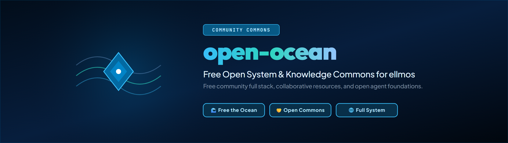
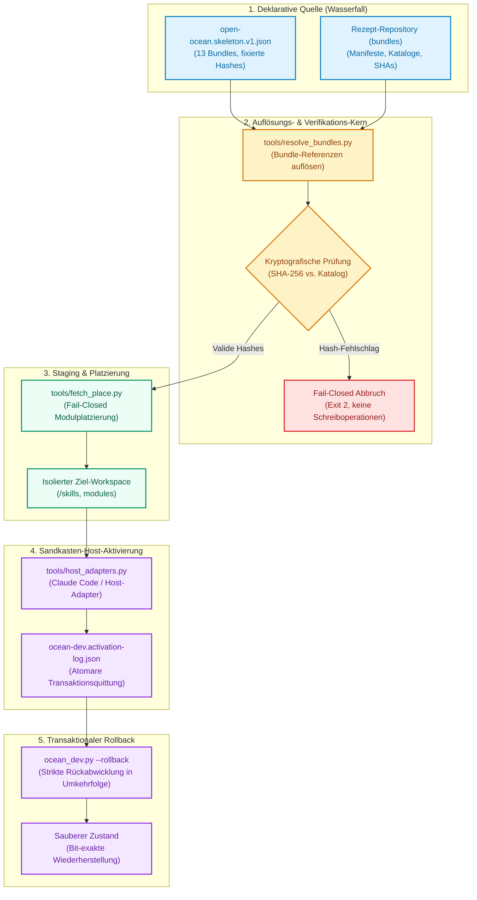
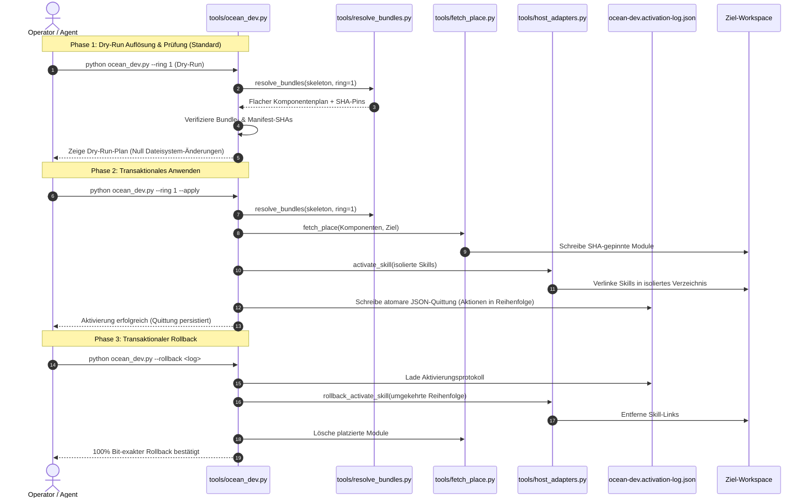

# open-ocean

**Free the ocean.**

Ein lokaler, prüfbarer Installer, der KI-Agentensysteme aus deklarativen Rezepten zusammensetzt —
das kostenlose Community-System des ellmos-Ökosystems.

*[English](README.md)*

[](pyproject.toml)
[](https://www.python.org/)
[](https://github.com/ellmos-ai/open-ocean/actions/workflows/ci.yml)
[](tests/)
[](https://github.com/ellmos-ai/open-ocean)
[](https://github.com/astral-sh/ruff)
[](SECURITY.md)
[](SECURITY.md)
[](LICENSE)
[](llms.txt)
[](CHANGELOG.md)
[](https://github.com/ellmos-ai)
[](https://github.com/open-bricks)

> **Schnellnavigation:**
> 1. [Was es ist](#was-es-ist)
> 2. [Woher es kommt](#woher-es-kommt)
> 3. [Systemarchitektur](#systemarchitektur)
> 4. [Installations- und Rollback-Lebenszyklus](#installations--und-rollback-lebenszyklus)
> 5. [Garantien](#garantien)
> 6. [Schnellstart und CLI-Nutzung](#schnellstart-und-cli-nutzung)
> 7. [Was im Repository liegt](#was-im-repository-liegt)
> 8. [Status](#status)
> 9. [Mitmachen](#mitmachen)
> 10. [Verwandte Projekte](#verwandte-projekte)
> 11. [Sicherheitsrichtlinie](#sicherheitsrichtlinie)
> 12. [Lizenz](#lizenz)
> 13. [LLM-Kontext und Discovery](#llm-kontext-und-discovery)

> [!NOTE]
> Maschinenlesbarer Kontext für KI-Agenten: [`llms.txt`](llms.txt). Sicherheitsrichtlinie: [`SECURITY.md`](SECURITY.md). Drittanbieter-Lizenzen: [`THIRD_PARTY_LICENSES.md`](THIRD_PARTY_LICENSES.md). Änderungen: [`CHANGELOG.md`](CHANGELOG.md).

> **Frühes Stadium.** Der Installer läuft auf den Rechnern der Entwickler durchgehend. Ein
> getaggtes Release gibt es noch nicht — siehe *[Status](#status)*.

---

## Was es ist

open-ocean liest **Rezepte** — Bundle-Manifeste aus dem öffentlichen Repository
[`ellmos-ai/bundles`](https://github.com/ellmos-ai/bundles) — und macht daraus eine lauffähige
lokale Installation. Jede Komponente wird vor dem ersten Schreibzugriff gegen einen
SHA-256-Pin geprüft, in einen isolierten Arbeitsordner gelegt, dort aktiviert und so
protokolliert, dass sich die ganze Installation exakt zurückrollen lässt.

- **Offline gebaut** — keine Telemetrie, keine Netzzugriffe außer den gepinnten Abrufen, die du anforderst.
- **Erst Probelauf** — geschrieben wird nur mit `--apply`.
- **Fail-Closed** — eine Hash-Abweichung stoppt den Lauf vor dem ersten Schreibzugriff.
- **Umkehrbar** — jede Änderung wird protokolliert und in umgekehrter Reihenfolge zurückgenommen.

open-ocean ist der offene Teil des größeren ellmos-Systems. Einige Teile dieses Systems sind
privat oder kommerziell und nicht in diesem Repository enthalten.

---

## Woher es kommt

Das Ökosystem benennt seine Schichten nach Wasser, weil das Bild erklärt, wie die Teile
zusammenhängen:

| Begriff | Was es ist |
|---|---|
| **Strom / Wasser** | die Arbeit selbst — Daten, Aufgaben und Ergebnisse, die durch alles fließen |
| **Bach / Rinnsal** | die gewachsenen Ströme: [BACH](https://github.com/ellmos-ai/bach), das ursprüngliche persönliche Gesamtsystem, und [Rinnsal](https://github.com/ellmos-ai/rinnsal), sein schlanker Nachfolger |
| **Wasserleitungen** | dasselbe Wasser, gezähmt und modularisiert — wiederverwendbare Module und Bundles |
| **Wasserfall** | die deklarative Quelle: die Rezepte und Kataloge, aus denen alles gebaut wird |
| **Ozean** | wo die Ströme ankommen; die Linie verläuft Bach → Rinnsal → Ozean |
| **open-ocean** | der Teil des Ozeans, der allen gehört — dieses Repository |

Aus dem Bild folgt eine Regel: Umbauen ändert das Bett, nie das Wasser. Wer eine Fähigkeit
aus BACH in Module verlegt, muss erhalten, was sie tut.

---

## Systemarchitektur

Das folgende Diagramm zeigt, wie deklarative Rezepte aus dem vorgeschalteten Wasserfall in verifizierbare, isolierte und transaktional rückrollbare lokale Installationen überführt werden:


```mermaid
flowchart TD
    subgraph Declarative["1. Deklarative Quelle (Wasserfall)"]
        SKEL["open-ocean.skeleton.v1.json\n(13 Bundles, fixierte Hashes)"]
        RECIPES["Rezept-Repository (bundles)\n(Manifeste, Kataloge, SHAs)"]
    end

    subgraph Resolver["2. Auflösungs- & Verifikations-Kern"]
        RESOLVE["tools/resolve_bundles.py\n(Bundle-Referenzen auflösen)"]
        VERIFY{"Kryptografische Prüfung\n(SHA-256 vs. Katalog)"}
        FAIL_CLOSED["Fail-Closed Abbruch\n(Exit 2, keine Schreiboperationen)"]
    end

    subgraph Staging["3. Staging & Platzierung"]
        FETCH["tools/fetch_place.py\n(Fail-Closed Modulplatzierung)"]
        SANDBOX["Isolierter Ziel-Workspace\n(<workspace>/skills, modules)"]
    end

    subgraph Activation["4. Sandkasten-Host-Aktivierung"]
        ADAPTER["tools/host_adapters.py\n(Claude Code / Host-Adapter)"]
        TX_LOG["ocean-dev.activation-log.json\n(Atomare Transaktionsquittung)"]
    end

    subgraph Rollback["5. Transaktionaler Rollback"]
        RB_ENGINE["ocean_dev.py --rollback\n(Strikte Rückabwicklung in Umkehrfolge)"]
        CLEAN["Sauberer Zustand\n(Bit-exakte Wiederherstellung)"]
    end

    SKEL --> RESOLVE
    RECIPES --> RESOLVE
    RESOLVE --> VERIFY
    VERIFY -- "Hash-Fehlschlag" --> FAIL_CLOSED
    VERIFY -- "Valide Hashes" --> FETCH
    FETCH --> SANDBOX
    SANDBOX --> ADAPTER
    ADAPTER --> TX_LOG
    TX_LOG --> RB_ENGINE
    RB_ENGINE --> CLEAN

    classDef source fill:#e0f2fe,stroke:#0284c7,stroke-width:2px,color:#0369a1;
    classDef core fill:#fef3c7,stroke:#d97706,stroke-width:2px,color:#92400e;
    classDef stage fill:#ecfdf5,stroke:#059669,stroke-width:2px,color:#065f46;
    classDef safe fill:#f3e8ff,stroke:#9333ea,stroke-width:2px,color:#6b21a8;
    classDef halt fill:#fee2e2,stroke:#dc2626,stroke-width:2px,color:#991b1b;
    class SKEL,RECIPES source;
    class RESOLVE,VERIFY core;
    class FETCH,SANDBOX stage;
    class ADAPTER,TX_LOG,RB_ENGINE,CLEAN safe;
    class FAIL_CLOSED halt;
```

---

## Installations- und Rollback-Lebenszyklus

Jeder Ausführungslebenszyklus folgt einem deterministischen Drei-Phasen-Pfad, der versehentliche Änderungen am Host-System physisch ausschließt:


```mermaid
sequenceDiagram
    autonumber
    actor Operator as Operator / Agent
    participant Dev as tools/ocean_dev.py
    participant Res as tools/resolve_bundles.py
    participant Fetch as tools/fetch_place.py
    participant Host as tools/host_adapters.py
    participant Log as ocean-dev.activation-log.json
    participant Target as Ziel-Workspace

    Note over Operator,Dev: Phase 1: Dry-Run Auflösung & Prüfung (Standard)
    Operator->>Dev: python ocean_dev.py --ring 1 (Dry-Run)
    Dev->>Res: resolve_bundles(skeleton, ring=1)
    Res-->>Dev: Flacher Komponentenplan + SHA-Pins
    Dev->>Dev: Verifiziere Bundle- & Manifest-SHAs
    Dev-->>Operator: Zeige Dry-Run-Plan (Null Dateisystem-Änderungen)

    Note over Operator,Dev: Phase 2: Transaktionales Anwenden
    Operator->>Dev: python ocean_dev.py --ring 1 --apply
    Dev->>Res: resolve_bundles(skeleton, ring=1)
    Dev->>Fetch: fetch_place(Komponenten, Ziel)
    Fetch->>Target: Schreibe SHA-gepinnte Module
    Dev->>Host: activate_skill(isolierte Skills)
    Host->>Target: Verlinke Skills in isoliertes Verzeichnis
    Dev->>Log: Schreibe atomare JSON-Quittung (Aktionen in Reihenfolge)
    Dev-->>Operator: Aktivierung erfolgreich (Quittung persistiert)

    Note over Operator,Dev: Phase 3: Transaktionaler Rollback
    Operator->>Dev: python ocean_dev.py --rollback <log>
    Dev->>Log: Lade Aktivierungsprotokoll
    Dev->>Host: rollback_activate_skill(umgekehrte Reihenfolge)
    Host->>Target: Entferne Skill-Links
    Dev->>Fetch: Lösche platzierte Module
    Dev-->>Operator: 100% Bit-exakter Rollback bestätigt
```

---

## Garantien

| ID | Invariante | Beschreibung | Durchsetzungs-Mechanismus |
|---|---|---|---|
| `INV-LOCAL-01` | **100% Local-First & Zero-Egress** | Alle Manifest-Auflösungen, Hash-Prüfungen, Modulplatzierungen und Aktivierungen laufen offline ohne Telemetrie. | Statische Codeanalyse (`test_zero_egress_and_offline_invariants`), reine Python-Standardbibliothek |
| `INV-TRANS-02` | **Transaktionaler Rollback** | Jede Schreiboperation unter `--apply` wird in `ocean-dev.activation-log.json` protokolliert und mit `--rollback` strikt in Umkehrfolge zurückgenommen. | `ocean_dev.py --rollback`, plattformübergreifend verifiziert auf macOS und Windows (`test_ocean_dev.py`) |
| `INV-DRY-03` | **Verbindliches Dry-Run-First** | Standardausführung der CLI ist rein lesend; Änderungen erfordern die explizite Angabe von `--apply`. | CLI-Argument-Parser, Standard-Schutzgatter |
| `INV-PIN-04` | **Kryptografisches SHA-256-Pinning** | Bundle-Manifeste und Komponenten müssen exakt mit den Katalog-Hashes übereinstimmen; Fail-Closed bei jeder Abweichung. | `resolve_bundles.py` SHA-Prüfung, sofortiger Exit-Code 2 |
| `INV-SAND-05` | **Sandkasten-Isolation bei Aktivierung** | Aktivierungen zielen auf `<workspace>/skills`, niemals auf produktive Agenten-Verzeichnisse (`~/.claude/skills`). | `host_adapters.py` Standardziel-Sicherheitsprüfung |
| `INV-PRIV-06` | **Keine Rechteausweitung (User-Mode)** | Alle Werkzeuge laufen ohne administrative Rechte im Standard-Benutzerkontext. | Normale Benutzerrechte, keine OS-Elevation-APIs |
| `INV-PLAT-09` | **Plattformübergreifende Parität** | Einheitliches Verhalten und normalisierte Pfadbehandlung unter Linux, Windows und macOS. | CI-Matrix auf GitHub Actions (`windows-latest`, `ubuntu-latest`, `macos-latest`) |
| `INV-SLA-10` | **48h Reaktions- & 5-Tage-Triage-SLA** | Schwachstellenmeldungen werden innerhalb von 48 Stunden bestätigt; Triage erfolgt verbindlich innerhalb von 5 Werktagen. | `SECURITY.md` Sicherheitsrichtlinie |

Die IDs sind feste Kennungen; die Nummern 07 und 08 waren interne Freigabe- und Paritäts-Gates
und gehören nicht mehr zu den öffentlichen Garantien.

---

## Schnellstart und CLI-Nutzung

open-ocean braucht Python 3.10+ und `cryptography>=41` (für die Ed25519-Belegprüfung von
`ocean inspect`).

```bash
# Installer und öffentliche Rezepte holen
git clone https://github.com/ellmos-ai/open-ocean.git
git clone https://github.com/ellmos-ai/bundles.git
cd open-ocean
pip install -e .

# 1. Probelauf für die Ring-1-Bundles (keine Schreibzugriffe)
python tools/ocean_dev.py --bundles-root ../bundles --ring 1

# 2. Transaktionale Aktivierung in einen isolierten Arbeitsordner
python tools/ocean_dev.py --bundles-root ../bundles --ring 1 --apply

# 3. Rollback anhand des erzeugten Aktivierungsbelegs
python tools/ocean_dev.py --rollback <workspace>/ocean-dev.activation-log.json
```

Das Skelett verweist auf 13 Bundles in zwei Ringen — den funktionalen Kern (`--ring 1`) und die
Breite drumherum (`--ring 2` oder `all`).

Für ein laufendes System fasst `ocean.py` dieselben Schritte in einen Produkt-Lebenszyklus:

```text
python ocean.py plan <kompositions-argumente>
python ocean.py up <kompositions-argumente> --apply
python ocean.py start --workspace <lokale-sandbox>
python ocean.py status --workspace <lokale-sandbox>
python ocean.py inspect --workspace <lokale-sandbox> ...   # nur lesend, siehe architecture/OCEAN-INSPEKTION.md
python ocean.py user add --workspace <lokale-sandbox> --username <name> --email <adresse>
python ocean.py down --workspace <lokale-sandbox>
```

Alle Argumente zeigt `python ocean.py --help` samt Unterbefehls-Hilfe. Passwörter werden ohne
Echo abgefragt und nie als Prozessargument übergeben (`--password-stdin` für Automatisierung).

---

## Was im Repository liegt

```
ocean.py                        Lebenszyklus-CLI (plan/up/start/status/inspect/user/down)
tools/
  ocean_dev.py                  ein Einstiegspunkt: Resolve -> Verify -> Fetch/Place -> Activate,
                                standardmäßig Probelauf, --apply für echte Schreibzugriffe, --rollback
  resolve_bundles.py            Bundle-Verweise -> flacher, hash-geprüfter Komponentenplan
  fetch_place.py                SHA-gepinnte Modulplatzierung, Fail-Closed
  host_adapters.py              anbieterneutrale Skill-Aktivierung und -Rückbau (Claude Code als Referenz)
  source_pins.py                Prüfung der Quellherkunft vor Resolve/Fetch
  ocean_lifecycle.py            Lebenszyklus plan/up/status/down/user
  runtime_supervisor.py         authentifizierter Loopback-Supervisor
architecture/
  open-ocean.skeleton.v1.json   die Rezepte, die dieses System konsumiert, per Hash gepinnt
  INSTALLER-TARGET.md           Installer-Vertrag und Invarianten
  OCEAN-INSPEKTION.md           nur lesender Inspektionsadapter
  BACH-EXTRAKTIONSROADMAP.md, bach-*.json
                                Verträge für das Verlegen von BACH-Fähigkeiten in Module
tests/                          Offline-Testsuite
```

Das Skelett **verweist** auf Rezepte; hier wird kein Manifest kopiert, darum kann dieses
Repository nie von der Rezeptquelle abdriften.

---

## Status

- **Läuft:** Resolve, Verify, SHA-gepinntes Fetch/Place, isoliertes Activate, Rollback und der
  `ocean.py`-Laufzeit-Lebenszyklus, getestet unter Windows, Linux und macOS.
- **Offen:** eine Neuinstallation auf einem Rechner außerhalb der Entwicklungsumgebung und die
  funktionale Abdeckung dessen, was BACH heute kann.
- **Noch nicht:** ein getaggtes Release. Was sich wann geändert hat, steht in [`CHANGELOG.md`](CHANGELOG.md).

---

## Mitmachen

Issues und Pull Requests sind willkommen. Vor einem PR bitte die Offline-Prüfungen laufen lassen:

```bash
pytest -ra -v
ruff check .
python -m compileall -q .
```

Die Suite (360 Tests bestanden, 297 übersprungen; Überspringungen hängen an optionalen gepinnten Checkouts und dem Betriebssystem — gemessen unter Windows, 2026-10-04) läuft ohne Netzzugriff. Die Dokumentation wird auf Englisch und
Deutsch nebeneinander gepflegt (`README.md` / `README_de.md`, `CHANGELOG.md` / `CHANGELOG_de.md`);
bitte beide aktualisieren. Sicherheitsprobleme bitte über den Kanal unten melden, nicht als
öffentliches Issue.

---

## Verwandte Projekte

| Repository | Rolle |
|---|---|
| [`ellmos-ai/bundles`](https://github.com/ellmos-ai/bundles) | Rezeptschicht: Bundle-Manifeste und Kataloge, die hier konsumiert werden |
| [`ellmos-ai/bach`](https://github.com/ellmos-ai/bach) | Das ursprüngliche Gesamtsystem, aus dem open-ocean hervorgeht |
| [`ellmos-ai/rinnsal`](https://github.com/ellmos-ai/rinnsal) | Schlanke lokale Agenten-Infrastruktur |
| [`ellmos-ai/policy-registry`](https://github.com/ellmos-ai/policy-registry) | Maschinenlesbare Policies, Governance-Regeln und System-Gates |
| [`ellmos-ai/system-explorer`](https://github.com/ellmos-ai/system-explorer) | Systemweite Inspektion; Anbieter hinter `ocean inspect` |
| [`ellmos-ai/sqlite-transit-sync`](https://github.com/ellmos-ai/sqlite-transit-sync) | Konfliktfreie SQLite-Zustandsreplikation |
| [`ellmos-ai/decision-clicker`](https://github.com/ellmos-ai/decision-clicker) | Entscheidungsrouting mit Mensch in der Schleife |
| [`ellmos-ai/memoryhooker`](https://github.com/ellmos-ai/memoryhooker) | Sitzungskontext und Gedächtnis-Hooks für Agenten |
| [`ellmos-ai/workflowhooker`](https://github.com/ellmos-ai/workflowhooker) | Lebenszyklus-Hooks für Agenten-Workflows |
| [`ellmos-ai/ellmos-filecommander-mcp`](https://github.com/ellmos-ai/ellmos-filecommander-mcp) | Lokaler Dateisystem-MCP-Server |
| [`ellmos-ai/ellmos-codecommander-mcp`](https://github.com/ellmos-ai/ellmos-codecommander-mcp) | MCP-Server für Codeanalyse und Refactoring |
| [`ellmos-ai/ellmos-controlcenter-mcp`](https://github.com/ellmos-ai/ellmos-controlcenter-mcp) | MCP-Server für Werkzeugrouting und Profile |
| [`dev-bricks/DevCenter`](https://github.com/dev-bricks/DevCenter) | Modulare Entwicklerwerkzeuge und Workspace-Launcher |
| [`dev-bricks/CodeBox`](https://github.com/dev-bricks/CodeBox) | Sandbox und Snippet-Verwaltung |
| [`file-bricks/ExplorerPro`](https://github.com/file-bricks/ExplorerPro) | Dateiverwaltung und Verzeichnissynchronisation |
| [`doc-bricks/CleanMarkdown`](https://github.com/doc-bricks/CleanMarkdown) | Markdown-Bereinigung und Linkprüfung |

---

## Sicherheitsrichtlinie

Sicherheit und Datenintegrität unterliegen der verbindlichen Richtlinie in [`SECURITY.md`](SECURITY.md):
- **48-Stunden Reaktions-SLA**: Alle Sicherheitsmeldungen werden innerhalb von 48 Stunden bestätigt.
- **5-Werktage Triage-Zusage**: Detaillierte Auswirkungsanalyse und Behebungszeitplan innerhalb von 5 Werktagen.
- **Offizielle Sicherheitskontakte**:
  - `security@ellmos.ai`
  - `security@open-bricks.org`
  - Fallback: `support@lukasgeiger.com`, `lukas@open-bricks.org`
- **Sicherheits-Advisories**: [GitHub Security Advisories](https://github.com/ellmos-ai/open-ocean/security/advisories)

---

## Lizenz

Lizenziert unter der freien **MIT-Lizenz** ([`LICENSE`](LICENSE)).
Drittanbieter-Entwicklungswerkzeuge und deren Lizenzen sind in [`THIRD_PARTY_LICENSES.md`](THIRD_PARTY_LICENSES.md) dokumentiert.

---

## LLM-Kontext und Discovery

Für KI-Programmieragenten und automatisierte Discovery gibt es eine maschinenlesbare
Zusammenfassung mit Befehlsindex in [`llms.txt`](llms.txt).
