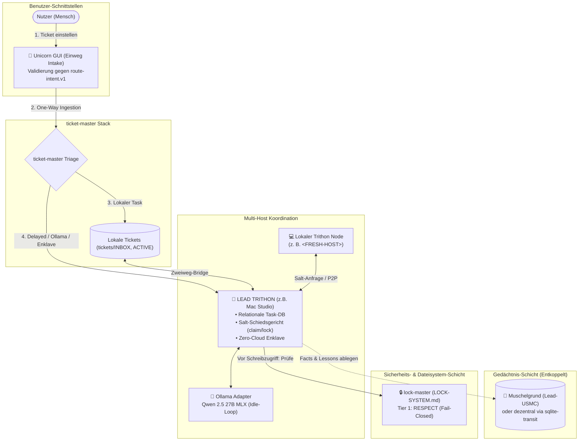

# Architekturentwurf: Ocean, ticket-master (Unicorn & Trithon) & Muschelgrund
**Föderierte Multi-User-Architektur, flexible USMC-Modi, Unicorn Einweg-Intake, Trithon Zweiweg-Ollama-Organisation und entkoppelte Lead-Rollen**

*Datum: 2026-09-08 (Auditiert & geschärft gegen system-gap-master und lock-master)*  
*Status: Gültiger Architekturentwurf & Ökosystem-Standard*  
*Autor: Lukas & Antigravity (Gemini)*  

---

## 1. Rollen- & Namensdefinitionen im Ökosystem

Das Ökosystem gliedert sich in spezialisierte, orthogonale Bausteine für Ticket-Intake, relationale Task-Abarbeitung, kollektives Wissensgedächtnis und physikalische Zugriffssperren:

```
┌────────────────────────────────────────────────────────────────────────────────────────┐
│ TICKET-MASTER (Gesamtsystem für Task- & Ticket-Management)                             │
│                                                                                        │
│  ┌────────────────────────────────────────┐  ┌──────────────────────────────────────┐  │
│  │ UNICORN (Einweg-GUI-Zugang)            │  │ TRITHON (Zweiweg-Engine & DB)        │  │
│  │ • One-Way Ingestion / Ticket-Intake    │  │ • Relationale DB (tasks, history)    │  │
│  │ • Einfaches, schnelles Erfassungs-UI   │  │ • Bidirektionaler Lifecycle & State  │  │
│  │ • Validierung gegen route-intent.v1    │  │ • Nativer Ollama-Adapter (LLM-Führung)│  │
│  │ • Keine Worker-Verwaltung für den User │  │ • Delayed Tasks, Crons, Daten-Enklave │  │
│  └────────────────────────────────────────┘  └──────────────────────────────────────┘  │
└────────────────────────────────────────────────────────────────────────────────────────┘

┌────────────────────────────────────────────────────────────────────────────────────────┐
│ MUSCHELGRUND & USMC (Das kollektive Gedächtnis)                                        │
│ • Modus A (Lead-USMC): Heißt "Muschelgrund" – zentrale Server-DB auf einem Lead-Host   │
│ • Modus B (Föderiert): Jeder Rechner führt eigenes USMC + sync via sqlite-transit-sync │
└────────────────────────────────────────────────────────────────────────────────────────┘

┌────────────────────────────────────────────────────────────────────────────────────────┐
│ MULTI-TRITHON FÖDERATION & ENTKOPPELTE LEAD-ROLLEN                                     │
│ • Mehrere Trithons können dezentral auf verschiedenen Rechnern koexistieren.           │
│ • Für den Salt-Schutz (claim-salt & lock-salt) wird genau ein LEAD TRITHON definiert.  │
│ • Entkopplung: LEAD TRITHON muss NICHT identisch sein mit USMC LEAD (Muschelgrund)!    │
└────────────────────────────────────────────────────────────────────────────────────────┘

┌────────────────────────────────────────────────────────────────────────────────────────┐
│ LOCK-DOKTRIN & DIE ZWEIFACHE SALT-MECHANIK (claim-salt & lock-salt)                    │
│ • Lokales Lock-System (LOCK-SYSTEM.md): Tier 1 (RESPECT) bleibt unberührtes Gesetz!    │
│ • claim-salt (.salt): Schützt Ticket-/Task-Claims vor Cloud-Latenz und Race Conditions │
│ • lock-salt (.salt): Schützt Verzeichnis-Locks vor Cloud-Verzögerung                   │
└────────────────────────────────────────────────────────────────────────────────────────┘
```

---

## 2. ticket-master: Unicorn (Einweg) vs. Trithon (Zweiweg)

Das Ticket- und Aufgabenmanagement wird innerhalb von `ticket-master` in eine reine Einweg-Erfassungs-Schnittstelle und eine transaktionale Zweiweg-Engine aufgeteilt:

### 2.1 Unicorn: Der Einweg-GUI-Zugang (One-Way Intake)
* **Zweck:** Schnelle, barrierefreie und intuitive Aufgabeingabe für den Menschen (sowie für externe Webhooks/Tools).
* **Einweg-Prinzip (*Write-Only / Intake*):** 
  * Der Nutzer muss keine laufenden Agenten-Prozesse, Tokenbudgets, Datenbank-Transaktionen oder Tool-Schleifen verwalten.
  * Eine aufgeräumte GUI/Webmaske/Tray-Shortcut nimmt Titel, Beschreibung, Priorität, Tags und Zuweisungswunsch auf.
  * Unicorn validiert die Eingabe gegen das Schema `ellmos.ticket.route-intent.v1` und legt das Ticket in die Intake-Warteschlange.
* **Ergebnis:** Höchste Nutzerfreundlichkeit ohne kognitive Belastung durch Hintergrundzustände.

### 2.2 Trithon: Die relationale Zweiweg-Engine & Ollama-Organisation
* **Zweck:** Bidirektionale Aufgabensteuerung, Ausführungskontrolle und strukturierte Einbindung lokaler Sprachmodelle.
* **Zweiweg-Prinzip (*Bidirectional Execution & State*):**
  * **Task-Lifecycle:** Verwaltet Zustände atomar (`open` $\leftrightarrow$ `in_progress` $\leftrightarrow$ `completed` / `failed`).
  * **Step-by-Step Protokollierung:** Zeichnet jeden Tool-Aufruf (Tool 1 bis Tool 25) und Systemzustände in `tasks` und `task_history` auf.
  * **Synthese & Rückmeldung:** Schreibt die Lösungssynthese zurück in die Datenbank und erzeugt bei Bedarf Folgeaufgaben.
* **Der native Ollama-Adapter:**
  * Lokale Open-Source-Modelle (wie Qwen 2.5 27B MLX auf Apple Silicon oder Llama auf Linux) geraten bei direkter Dateisystem-Manipulation und Git-Operationen leicht in Halluzinationen oder Datei-Zerstörungen.
  * Der Trithon-Ollama-Adapter bietet dem lokalen LLM eine **geführte, formale Schnittstelle**:
    * Strukturierte Prompts und Tool-Definitionen via API/SQLite.
    * Atomare Transaktionen statt fragiler Dateirenames.
    * Sicherer Compute-Lock und automatische Leerlauf-Erkennung (*Idle-Worker*).

---

## 3. Multi-Trithon Föderation & Entkopplung der Lead-Rollen

Ein zentraler Grundsatz von Ocean ist, dass alle Maschinen gleichwertige Nodes sind, aber spezialisierte Schwerpunkte übernehmen können:

### 3.1 Mehrere Trithons (Multi-Node)
Theoretisch und praktisch kann auf jedem Rechner (`<FRESH-HOST>`, `<DEV-HOST>`, Mac Studio, künftiger Mac Mini) eine eigene Trithon-Instanz laufen. Dies erlaubt vollkommen autonomes lokales Arbeiten ohne Netzwerkverbindung.

### 3.2 Die Rolle des `Lead Trithon`
Sobald mehrere Systeme an gemeinsamen Projekten arbeiten und die **Salt-Funktionen** (`claim-salt` und `lock-salt`) genutzt werden sollen, um Cloud-Latenzen abzufangen, wird **ein Lead Trithon** bestimmt:
* Der Lead Trithon fungiert als **Atomreferenz**: Claims und Salt-Validierungen laufen in Millisekunden über dessen P2P-/Tailscale-Endpunkt ab.
* Verhindert Split-Brain und Doppel-Claims über verzögerte Cloud-Synchronisationen.

### 3.3 Entkopplung: Lead Trithon $\perp$ USMC Lead (Muschelgrund)
Die Systemrollen für Aufgabenkoordination und Wissensgedächtnis sind **vollkommen unabhängig voneinander**:

$$\mathbf{Lead\text{ }Trithon\text{ (Aufgaben, Ollama, Salt)}} \quad\mathbf{\neq}\quad \mathbf{USMC\text{ }Lead\text{ / Muschelgrund (Wissen, Facts)}}$$

* **Konfigurationsbeispiele:**
  * **Szenario 1 (Empfohlener Standard):**
    * *Lead Trithon:* Mac Studio (läuft 24/7, 64 GB Unified Memory, treibt lokale Ollama-Inferenz, fungiert als Zero-Cloud-Enklave und Salt-Schiedsstelle).
    * *USMC Lead (Muschelgrund):* `<FRESH-HOST>` (großer NVMe-Speicher, primäre Entwickler-Konsole).
  * **Szenario 2 (Vollständige Server-Zentrierung):**
    * Mac Studio übernimmt sowohl *Lead Trithon* als auch *Muschelgrund* (Lead-USMC).
  * **Szenario 3 (Dezentraler Wanderbetrieb):**
    * Mac Studio ist *Lead Trithon*, während alle Hosts für USMC den *Modus B* nutzen (jeder eigene SQLite-DB, Abgleich über `sqlite-transit-sync`).

---

## 4. USMC: Die zwei Betriebsmodi für das Wissensgedächtnis

Das Gedächtnissystem USMC (*United Shared Memory Client*) unterstützt zwei Betriebsarten:

1. **Modus A: Lead-USMC („Muschelgrund“)**
   * Ein ausgewählter Host betreibt die kanonische zentrale USMC-Instanz namens **Muschelgrund**.
   * Alle Ocean-Knoten und Agenten synchronisieren Facts, Lessons und Working Notes direkt gegen Muschelgrund.
2. **Modus B: Dezentrales USMC mit `sqlite-transit-sync` (Dezentraler Default)**
   * Jeder Host führt seine eigene lokale `usmc_memory.db` (`~/.usmc/`).
   * Der Abgleich erfolgt über den bewährten `sqlite-transit-sync` aus `system-gap-master`:
     * *Direkter Tunnel (Push/Pull):* Bei aktiver Tailscale/SSH-Verbindung.
     * *Republica-Showcase-Pfad:* Asynchron über transiente Snapshots im Sync-Yard.

---

## 5. Die Lock-Doktrin: Lokales Locking bleibt unantastbar

> [!IMPORTANT]
> **Das kanonische lokale Lock-System wird NICHT ersetzt!**
> Die Regeln aus `LOCK-SYSTEM.md` und `lock-master` (`LOCK.user.*`, `LOCK.until.*`, `LOCK.condition.*`, `LOCK.txt`) bleiben unverändert auf allen Systemen in Kraft.

* **Lokale Locks:** Verhindern weiterhin zuverlässig, dass ein lokaler Agent oder eine Hintergrund-Automation verbotene Pfade überschreibt oder unfertige Branches anfasst.
* **Tier 1 (RESPECT):** Trithon-Worker müssen **vor jeder Dateiänderung** den lokalen Lock-Status prüfen (`lock_utils.check_lock()` / MCP `controlcenter_check_lock`). Ist ein Pfad gesperrt, geht der Trithon-Task in `waiting_for_lock` (Fail-Closed).
* **Trithon-Koordination:** Dient als **Zusatzweg** für die übergeordnete Aufgabenverteilung und Multi-System-Zusammenarbeit, ersetzt aber niemals die Schutzwälle im Dateisystem.

---

## 6. Die Salt-Mechanik: `claim-salt` & `lock-salt`

Das Arbeiten über Cloud-Spiegel (OneDrive, Dropbox) hat eine physikalische Schwachstelle: **Synchronisations-Latenz (30 s bis 5 min)**. Bei hohem Cloudaufkommen kann es zu Race Conditions kommen.

Hier greift die **Salt-Mechanik** als flüchtiger Vorab-Schutz:

```
                          DIE SALT-DUALITÄT
                          
    ┌─────────────────────────────────────────────────────────────┐
    │  1. claim-salt (Aufgaben-Ebene)                             │
    │  • Schützt: Ticket- und Task-Beanspruchungen                │
    │  • Problem: Zwei Rechner beanspruchen während des Sync-Staus│
    │    zeitgleich dasselbe Ticket in tickets/INBOX              │
    │  • Lösung: Sofortige Salt-Registrierung am Lead Trithon     │
    │    verhindert Doppel-Claims atomar.                         │
    │  • Dateiformat: <task_id>.claim.salt in hosts/<HOST>/salts/ │
    └─────────────────────────────────────────────────────────────┘
    
    ┌─────────────────────────────────────────────────────────────┐
    │  2. lock-salt (Ressourcen-Ebene)                            │
    │  • Schützt: Dateien, Repositories und Verzeichnisse         │
    │  • Problem: LOCK.user.* wird gesetzt, ist aber auf Partner- │
    │    systemen wegen Cloud-Sync-Stau noch nicht sichtbar       │
    │  • Lösung: Sofortiger lock-salt am Lead Trithon blockiert   │
    │    Schreibzugriffe schon vor der physischen Cloud-Datei     │
    │  • Dateiformat: <scope>.lock.salt in hosts/<HOST>/salts/    │
    └─────────────────────────────────────────────────────────────┘
```

> [!CAUTION]
> **Namenskonvention gegen Fehlinterpretation durch lock-master:**  
> Salts dürfen **niemals** als `LOCK.salt*.txt` im Projektordner abgelegt werden! `lock-master` würde sie sonst als exklusives Lock mit dem Scope `salt` fehlinterpretieren. Salts tragen immer die Endung `.salt` und liegen im eigenen Host-Slot (`hosts/<HOST>/salts/`) oder werden direkt im Lead Trithon via P2P registriert.

---

## 7. Der Gesamtablauf (Architecture Data Flow)



---

## 8. Konformitätsprüfung gegen system-gap-master (Audit & Invarianten)

Ein sorgfältiger Abgleich mit dem verbindlichen `system-gap-master`-Protokoll (`PROTOCOL.md`, `SECURITY.md`, `ticket-route-intent.v1`) zeigt, dass der Entwurf **vollkommen konform ist und bestehende Schutzregeln sogar aktiv verstärkt**:

| Regel in `system-gap-master` | Anforderung / Doktrin | Abgleich mit unserem Entwurf | Befund & Vorgabe |
|:---|:---|:---|:---|
| **Regel 9 (R9)**<br>*Keine Live-DBs im Yard* | Niemals eine Live-SQLite-DB (`.db`, `-wal`, `-shm`) in den Cloud-Yard legen. | **Voll konform:** Alle Trithon- und USMC-DBs laufen **strikt host-lokal**. Datenaustausch erfolgt über P2P (Tailscale) oder Snapshots via `sqlite-transit-sync`. | ✅ **Bestanden** |
| **Regel 1 (R1)**<br>*Slot-Ownership* | Jeder Host schreibt nur in seinen eigenen Slot `hosts/<OWN-HOST>/`. | **Voll konform:** Salts nutzen `hosts/<OWN-HOST>/salts/` oder direkte Trithon-P2P-Endpunkte. | ✅ **Bestanden** |
| **Regel 6 (R6)**<br>*No Secrets in the Yard* | Keine Passwörter, API-Keys oder sensible Klientendaten im Yard. | **Verstärkt R6 aktiv:** Trithon auf dem Lead-Host dient als geschützte Zero-Cloud-Enklave. Sensible Tasks verlassen das LAN/Tailscale-Netz nicht. | ✅ **Hervorragend** |
| **Regel 7 (R7)**<br>*Konfliktkopien-Vermeidung* | Parallele Schreibkonflikte sind verboten. | **Voll konform:** `claim-salt` und `lock-salt` verhindern Konflikte präventiv vor dem Eintreffen der Cloud-Synchronisation. | ✅ **Bestanden** |
| **Ticket-Routing API**<br>*`route-intent.v1`* | `ticket-master` besitzt den Ticket-Lifecycle; Validierung nach Schema. | **Nahtlose Integration:** Unicorn und Trithon nutzen das offizielle Schema `ellmos.ticket.route-intent.v1`. | ✅ **Bestanden** |
| **Ping-Pong & Cadence**<br>*Taktsteuerung* | Versetzte Takte und Cooldown-Leiter (15m → 30m → 1h → 24h). | **1:1 übernommen:** Der hormonelle Slow Track von Trithon übernimmt exakt die Cooldown-Leiter aus `communications-protocols-skill.md`. | ✅ **Bestanden** |

---

## 9. Konformitätsprüfung gegen lock-master & LOCK-SYSTEM.md (Locks, Scopes, Claims & Salts)

Ein detaillierter Abgleich mit der Spezifikation von `lock-master` (`LOCK-SYSTEM.md`, `pure-locking/lock_utils.py`, `pure-locking/contested.py` und `KONZEPT-CLOUD-SYNC-PREFLIGHT_2026-08-17.md`) bestätigt die uneingeschränkte Parität:

1. **Modulgrenze & Aufgabentrennung:**
   In `lock-master/TODO.md` (Zeile 93–96) gilt: *„lock-master verwaltet weiterhin keine Aufgaben, keine Abhängigkeiten, keine Validierungen...“*  
   `ticket-master` (inkl. Unicorn & Trithon) verwaltet Aufgaben. `lock-master` verwaltet Dateisystem-Sperren. Keine Kompetenzkonflikte.
2. **Unantastbarkeit von Tier 1 (RESPECT):**
   Trithon-Worker müssen vor Schreiboperationen den lokalen Lock-Status via `lock_utils.check_lock()` prüfen. Lokale Locks (`LOCK.user.*`, `LOCK.until.*`, `LOCK.condition.*`, `LOCK.txt`) sind absolut dominant und führen bei Trithon zu Fail-Closed (`waiting_for_lock`).
3. **Formale Namensdisziplin für Salts:**
   Salts dürfen niemals als `LOCK.salt*.txt` benannt werden, um Fehlinterpretationen durch `lock_scan.py` auszuschließen. Sie tragen immer die Endung `.salt` und liegen in `salts/` bzw. `hosts/<HOST>/salts/`.
4. **Lösung des Cloud-Latenz-Dilemmas:**
   Trithon auf dem Lead-Host liefert die Millisekunden-Atomreferenz, die die 300-Sekunden-Quarantäne von `contested.py` bei bestehender Netzwerkverbindung ablöst, während `contested.py` der sichere dateibasierte Fallback bei Offline-Betrieb bleibt.

---

### Fazit & Ausblick
Das erweiterte Design mit **Unicorn** als One-Way-Eingabe, **Trithon** als relationaler Zweiweg-Engine mit Ollama-Adapter, der **Multi-Trithon Föderation** mit definierbarem **Lead Trithon** und der **vollständigen Entkopplung von Muschelgrund (USMC Lead)** schafft ein Höchstmaß an Ausfallsicherheit, Skalierbarkeit und Nutzerkomfort.
