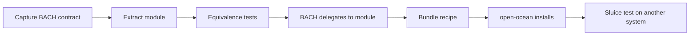

# BACH → open-ocean: extraction roadmap

*[Deutsch](BACH-EXTRAKTIONSROADMAP.md)*

- **As of:** 2026-08-08
- **Status:** executable architecture roadmap; not parity evidence
- **First work area:** Cluster 9 — system, data and operations (kernel)

## Goal and bar

open-ocean emerges by extraction from BACH, not by an independent rewrite. Every function passes
through the same sluice sequence:



A handler name is not parity. A function counts only after its operation contract, state
migration, error behaviour, rollback path, BACH reintegration and an off-development-host test
are evidenced. The original full instance stays alive: functionality flows out of BACH and then
returns through a thin adapter.

The release condition names the evidenced **113-handler runtime snapshot** from 2026-06-15. The
current source at BACH commit `5e8fe80607091378477523b2b6dc99e8c17d7d18` statically declares
**105 canonical profiles** and **13 alias rules**, of which **9 add reachable names**, producing
**114 reachable names**. The alias targets `curriculum`, `data_analysis` and `messages` do not
exist in the current profile set. This discrepancy is kept explicit:

- 113 remains the historic minimum release commitment.
- The current 114-name source surface is additive until a side-effect-free runtime dump resolves
  the drift.
- A newer name cannot silently disappear merely because the older number is retained.

The machine-readable snapshot is
[`bach-parity-baseline.v1.json`](bach-parity-baseline.v1.json). The static checker
[`../tools/audit_bach_handlers.py`](../tools/audit_bach_handlers.py) does not import or boot BACH.

## Why Cluster 9 comes first

Cluster 9 carries state, paths, backup, lifecycle, diagnostics and protection boundaries. Without
it, later domain modules may exist in isolation but cannot be installed, upgraded, verified,
rolled back or reintegrated safely. The kernel is not the largest feature group; it is the
dependency beneath all of them.

The current catalogue contains 51 modules. Cluster 9 has plausible partial carriers, but no
accepted end-to-end parity evidence yet:

| State | Count | Meaning |
|---|---:|---|
| accepted | 0 | full functional and reintegration evidence exists |
| candidate-partial | 20 | related capability exists; equivalence is not evidenced |
| gap | 9 | no plausible current catalogue carrier |
| alias | 1 | `health` follows `healthcheck`; it is not independent functionality |

“Candidate-partial” is deliberately not green. For example, `sqlite-transit-sync` provides
verified SQLite transport and database snapshots, but that does not automatically satisfy
BACH's query, export, backup and restore contracts. The similarly named BACH `snapshot` handler
is explicitly evidenced as a different domain: it stores session id, open tasks and working
memory as one JSON row. The new private `session-checkpoint` carrier fits that domain, but remains
candidate-partial until the BACH collector, output translation and old/new equivalence exist.

## Extraction guardrails

1. **Contract before code.** Capture inputs, outputs, side effects, dry-run behaviour, errors and
   state locations for every handler before extraction.
2. **Personal data stays behind.** Code, schemas and empty templates may flow; BACH databases,
   backups, logs, tokens, path values and user settings may not.
3. **One state owner.** After extraction, the module owns its state. BACH uses the public
   interface; parallel write paths are forbidden.
4. **Reintegration is part of done.** An external module without a BACH adapter is only half
   extracted.
5. **Compatibility is measurable.** Existing BACH calls and aliases remain equivalent during
   migration; deprecations need a migration and deadline.
6. **Failure is closed.** Hash, schema, permission, backup or migration failures stop the
   operation.
7. **Progress is not publication.** The publication gate (`PRIVATE.txt`) was lifted on
   2026-09-11 by user decision D-20260909-003, so this repository is public — by decision,
   not because the four release conditions were evidenced. Conditions 2 and 3 are still open,
   and progress in this roadmap remains no claim that they are met.

## Cluster 9 work packages

| Package | Scope | Existing candidates | Result |
|---|---|---|---|
| **K9-0 Contract and inventory** | registry, alias drift, operation surfaces, catalogue fingerprint | `system-explorer` as a later import carrier | baseline and reproducible audit; **created in this revision** |
| **K9-1 Data and continuity** | `db`, `dbsync`, `sync`, `backup`, `restore`; `snapshot` as a separate session-checkpoint seam | `sqlite-transit-sync`, `session-checkpoint`, `system-gap-master`, `system-explorer`, planned `mac-backup` | portable data API, backup format, restore proof, session-checkpoint carrier and BACH adapter |
| **K9-2 Observation and quality** | `status`, `healthcheck`, `logs`, `tokens`, `maintain`, `tuev`, `scan`, `watcher` | `system-explorer`, `ellmos-tests`, `project-docs-template`, `ellmos-unified-gui` | common state/event model, health probes and maintainable checks |
| **K9-3 Lifecycle and distribution** | `update`, `upgrade`, `setup`, `settings`, `session`, `shutdown`, `path`, `mount`, `dist` | `policy-registry`, private `ellmos-core`, `bundles`; supported OCEAN installer lifecycle implemented, BACH parity open | transactional installer core, migration, rollback and host-neutral paths |
| **K9-4 Boundaries and operation** | `fs`, `trash`, `sandbox`, `lang`, `gui`, `help` | `system-explorer`, `lock-master`, `ellmos-unified-gui`, `project-docs-template` | filesystem policy, quarantine/trash, real isolation, i18n and help interface |
| **K9-5 BACH reintegration** | thin adapters for all 29 canonical profiles plus `health` | outputs of K9-1 through K9-4 | BACH calls external contracts and disables old internal write paths |
| **K9-6 Bundle and sluice** | kernel recipe, installer resolution, fresh installation | `bundles`, open-ocean installer | hash-pinned recipe and successful off-host test |

The labels `K9-DATA`, `K9-OBSERVE`, `K9-LIFECYCLE` and `K9-BOUNDARY` in the JSON baseline are
capability seams, not pre-decided repository names. A new repository is justified only by a
clear API and state boundary; otherwise an existing carrier is extended.

## Cluster 9 operation matrix

Operation names were read statically from `get_operations()` and current dispatch code. They are
the beginning of each contract, not its full semantics.

| Profile | Current operation surface | Current carrier finding |
|---|---|---|
| `db` | `status`, `tables`, `info`, `query`, `schema`, `count`, `export`, `insert`, `backup` | partial: `sqlite-transit-sync`, `system-explorer` |
| `dbsync` | `init`, `status`, `enable`, `disable`, `push`, `pull`, `sync`, `backup`, `cleanup` | partial: `sqlite-transit-sync` |
| `sync` | `status`, `all`, `skills`, `tools` | partial: `system-gap-master`, `sqlite-transit-sync` |
| `backup` | `create`, `list`, `info`, `status` | partial: `sqlite-transit-sync`; `mac-backup` is planned only |
| `restore` | `list`, `info`, `file`, `category` | partial: snapshot carrier exists; restore parity is open |
| `snapshot` | `create`, `load`, `list`, `delete` | partial: correct private `session-checkpoint` carrier exists; BACH adapter and equivalence remain open |
| `status` | system summary | partial: `system-explorer`, `ellmos-unified-gui` |
| `healthcheck` | `status`, `all`, `disk`, `network`, `nas`, `dns`, `ping` | **gap**; `health` is an alias only |
| `logs` | `status`, `show`, `tail`, `clear` | partial run/trace histories; no common system-log contract |
| `tokens` | `status`, `today`, `week`, `report` | partial analysis surfaces; no usage parity |
| `maintain` | scans, repair, registry/docs/JSON/skill maintenance, export and sync | partial: `system-explorer`, `project-docs-template`, `ellmos-tests` |
| `tuev` | `init`, `status`, `run`, `check`, `renew` | partial: `ellmos-tests`; workflow certificate is open |
| `scan` | `status`, `run`, `tasks`, `tools`, `dir` | partial: `system-explorer` |
| `watcher` | `status`, `start`, `stop`, `events`, `logs`, `classify` | **gap** |
| `update` | `check`, `apply`, `status`, `rollback`, `verify`, `migrations` | **gap** |
| `upgrade` | status/check plus upgrade or repair of core, hub, skills, tools, GUI and templates | **gap** |
| `setup` | preflight, user, language, secrets, MCP, hooks, n8n, ProSync, full install | **gap for BACH parity**; OCEAN's supported installer path is implemented |
| `settings` | `list`, `get`, `set`, `reset`, `export`, `import`, `categories` | partial: `policy-registry` |
| `session` | `start`, `end`, `status`, `check`, `next` | **gap** |
| `shutdown` | `complete`, `quick`, `emergency` | **gap** |
| `path` | `get`, `set`, `list`, `resolve`, `validate`, `overrides`, `status` | partial: `ellmos-core` spaces/artifacts |
| `mount` | `list`, `add`, `remove`, `restore` | partial: `ellmos-core` spaces |
| `dist` | `status`, `classify`, `list`, `verify`, `snapshot`, `restore`, `release`, `install` | partial: module/bundle catalogues and recipes |
| `fs` | `status`, `scan`, `check`, `heal`, `classify` | partial: `system-explorer`; mutating repair is open |
| `trash` | `list`, `info`, `restore`, `delete`, `purge` | **gap** |
| `sandbox` | `policy`, `eval`, `run`, `shell`, `allow`, `deny`, `test` | partial: `lock-master` permissions, not process isolation |
| `lang` | status, languages, dictionary, scan, translation, import/export and report | **gap** |
| `gui` | `info`, `status`, `start`, `start-bg`, `stop` | partial: `ellmos-unified-gui` |
| `help` | `list`, `show`, `get`, `run` for topics and folders | partial: `project-docs-template` |

## K9-1 interim result: `dbsync` and the `snapshot` seam

The machine-readable
[`bach-k9-data-contract.v1.json`](bach-k9-data-contract.v1.json) binds all 9 `dbsync` and
4 `snapshot` operations to the statically inspected BACH files. The SQL fixtures under
[`../tests/fixtures/k9_data`](../tests/fixtures/k9_data) contain synthetic nodes, values and
placeholders only. The checker
[`../tools/check_k9_data_contract.py`](../tools/check_k9_data_contract.py) neither imports nor
boots BACH: it verifies BACH through AST and hashes and runs only the carrier against temporary
fixture databases.

Pinned carrier commit `7648a20b11ca958e9622d2b5d8a13fd02613e92a` provides conservative
`cleanup` and verified `pull_selected` in `sqlite-transit-sync`: manifest, size,
SHA-256 and SQLite integrity are verified before selection; the default is a dry-run scoped to
the local node; foreign nodes require explicit all-node authority in addition to apply. This
closes the generic mechanism, not the BACH contract. Selected pull lets the future adapter retain
BACH's one-newest-snapshot lifecycle without copying merge/state logic. The daily push guard,
heartbeat, cooldown, text output and `enable`/`disable` remain adapter concerns; their complete
machine-readable contract is
[`bach-k9-dbsync-adapter.v1.json`](bach-k9-dbsync-adapter.v1.json). `init` is not a valid golden
target because the BACH source itself documents its first-copy source as stale.

`snapshot` was not forced into the SQLite carrier. The new private carrier
[`session-checkpoint`](session-checkpoint-capability.v1.json), pinned at
`2a9ce5ec5c5c47fb07615ae7b0aa19b04ef53098`, owns a separate local store and accepts only an
application-provided JSON object. It verifies canonical payload hashes, isolates namespaces and
supports reversible dry-run-first export/import with bounded record and aggregate payload input.
New sensitive files use owner-only POSIX mode bits; Windows confidentiality remains the local
directory ACL. The anonymized fixture exercises create, get, list, delete, export, import and the
record-count guard. Collection from BACH tables, legacy text output and any restore effect remain
strictly in the later adapter. The profile is therefore candidate-partial, not accepted.

This interim result is **not equivalence evidence**: the old implementation did not run against
the fixture during the BACH hold, BACH does not delegate yet, and migration, rollback, bundle,
installer and foreign-system sluice evidence remain open.

## Acceptance chain per handler

A profile moves to `accepted` in the JSON baseline only when all evidence exists:

1. **Contract:** every operation specifies inputs, outputs, errors, side effects, state owner and
   security boundary.
2. **Fixture parity:** old and new implementations run against the same anonymised starting
   state; results and permitted state changes match.
3. **Migration and return:** export/import and rollback are tested on a copy.
4. **BACH-IN:** the BACH handler is only an adapter to the module; a guard blocks the old parallel
   write path.
5. **Bundle:** the carrier is in the module catalogue and a hash-pinned kernel recipe. Optional
   host capabilities are choices or adapters, not hard assumptions.
6. **open-ocean:** the installer resolves, verifies, places, activates and rolls back on failure.
7. **Sluice test:** a fresh install on another system passes functional, privacy and uninstall
   probes. Local tests alone are insufficient.

## Order after the kernel

The binding order currently ends at “Cluster 9 first”. After that, dependencies are re-evaluated.
The provisional technical flow is:

1. Cluster 1 — memory and knowledge,
2. Cluster 3 — tasks, time and automation,
3. Cluster 5 — multi-agent and LLM orchestration,
4. Cluster 7 — self-extension and developer tools,
5. Cluster 4 — documents, media and content,
6. Cluster 6 — communication and the outside world,
7. Cluster 8 — cognitive control,
8. Cluster 2 — personal-life services as separate, data-sensitive packs.

Cluster 2 remains the largest open domain block, but it does not belong in the free core. Tax,
health, insurance and household data need separate privacy, legal and product decisions. A later
owner decision may reorder packs; it cannot skip the kernel gates.

## Immediate implementation steps

1. Keep `tools/check_k9_data_contract.py` as a required gate and stop on BACH source-hash,
   operation-surface or either carrier-commit drift.
2. After the hold, implement the pinned thin `dbsync` adapter specification and the BACH
   collector/formatter for `session-checkpoint`; keep `init` separate until the source defect is
   resolved.
3. Run old and new implementations against the same anonymized fixtures. Prepare BACH-IN only
   after state, output and failure equivalence are green.
4. Then measure `db`, `backup` and `restore` inside K9-1; turn remaining kernel gaps into
   repository boundaries only after the same seam review.

## Baseline check

```powershell
python tools\audit_bach_handlers.py `
  --bach-root C:\path\to\bach `
  --module-catalog C:\path\to\modules.catalog.json `
  --baseline architecture\bach-parity-baseline.v1.json `
  --expect-registered 114 `
  --summary
```

A green baseline check proves only that the registry and catalogue have not drifted unnoticed.
It does not prove functional parity, an installer or the sluice test.

## 2026-09-21 composition re-measurement and wiring backlog

Ticket `T-20260920-157560721` reran the side-effect-free AST audit against the
clean BACH worktree at `39d2457adeb0bcbcd9f1205dfb2c08f3086b30ed`. The historic 114-name surface is
preserved as a subset. Current source adds `cloud`, `mcp`, `security` and `theme`,
so the current surface is **118 names**, not 114. The historical release record is
not rewritten to make this pass.

[`bach-composition-matrix.v1.json`](bach-composition-matrix.v1.json) is the
machine-readable, 118-row composition list. Every name has exactly one outcome:

| Outcome | Current count | Meaning |
|---|---:|---|
| `carrier` | 89 | A declared module or Skills Registry carrier exists; its contract binding, BACH adapter, bundle membership and use-case evidence are still open. |
| `gap` | 19 | No declared carrier for the BACH contract was found in the examined catalogues. |
| `not-adopted` | 10 | A BACH alias or the external Ollama surface; it needs no independent module. |

The matrix records the BACH registry locator, declared carrier or gap finding, and a
separate `use_case_state`. A name or role match does not count as functional parity.
This preserves decision `D-20260906-003`: only end-to-end use cases measure release
parity.

`use_case_state` is fail-closed (stage 3, P3.1). Only the evidence register
[`bach-parity-evidence.v1.json`](bach-parity-evidence.v1.json) can move a carrier
row to `partially-evidenced` or `evidenced`, and only with an evidenced use case
whose old/new fixture test exists and refuses to skip under
`REQUIRE_PARITY_EVIDENCE=1`. `tools/check_parity_evidence.py` enforces this in the
fast suite; the `parity-evidence` CI job checks out BACH and the carrier at the
recorded pins and runs every referenced test with `--run`. A `divergent` use case
records a finding and never counts. Historic `accepted` values are not evidence.

State on 2026-09-23: `dbsync` is `partially-evidenced` (use case
`k9.dbsync.push-pull`: BACH native ProSync, BACH through its sqlite-transit-sync
seam and OCEAN's direct module use produce the same state). The related use case
`k9.dbsync.pull-with-newer-local-rows` is `divergent`: native ProSync merges only
rows newer than the table-wide maximum and drops newer foreign rows, while the
module merges per row. The `snapshot` row stays `not-evidenced`; BACH's snapshot
handler has no route into `session-checkpoint`, so there is no shared module path
to compare yet. All other carrier rows remain `not-evidenced`.

The current catalogues contain 75 modules, 33 bundles and 142 Skills Registry
components. They make more potential carriers visible than the 2026-08-08
70-candidate/35-gap snapshot, but do not change any `accepted` state.

### Ordered wiring work

1. Execute `T-20260921-916843500` (source finding
   `M-20260920-role-capability-declarations`): declare and validate the
   missing provider capabilities for all four affected roles before claiming any
   corresponding carrier usable.
2. Execute `T-20260921-835725997` (source finding
   `M-20260920-systems-projection-bundle-pins`): refresh stale
   system/bundle projection pins through the canonical projection path.
3. Execute `T-20260921-776221937` (source finding
   `M-20260920-bundle-projection-direct-edit-loss`): make the projection
   path own edits, then re-run the matrix so direct changes cannot disappear.
4. For each `carrier` row, capture its operation contract, bind it to its role and
   bundle, add the BACH adapter with rollback, then add an old/new use-case test.
   Only that evidence may move a row beyond a composition lead.
5. Turn each `gap` row into an explicit scope decision or a bounded extraction
   proposal; do not create a replacement solely because its BACH name lacks a
   catalogue match.

Rebuild the matrix only against explicit sources; the command validates that
every declared carrier is present in its module or Skills Registry catalogue:

```powershell
python tools\build_bach_composition_matrix.py `
  --bach-root C:\path\to\bach `
  --baseline architecture\bach-parity-baseline.v1.json `
  --module-catalog C:\path\to\modules.catalog.json `
  --bundle-catalog C:\path\to\bundles.catalog.v1.json `
  --skills-registry C:\path\to\components.json `
  --output architecture\bach-composition-matrix.v1.json
```
