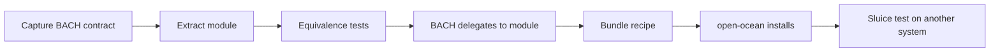

# BACH → open-ocean: extraction roadmap

*[Deutsch](BACH-EXTRAKTIONSROADMAP.md)*

- **As of:** 2026-08-08
- **Status:** executable architecture roadmap; not parity evidence
- **First work area:** Cluster 9 — system, data and operations (kernel)

## Goal and bar

open-ocean emerges by extraction from BACH, not by an independent rewrite. Every function passes
through the same sluice sequence:



A handler name is not parity. A function counts only after its operation contract, state
migration, error behaviour, rollback path, BACH reintegration and an off-development-host test
are evidenced. The original full instance stays alive: functionality flows out of BACH and then
returns through a thin adapter.

The release condition names the evidenced **113-handler runtime snapshot** from 2026-06-15. The
current source at BACH commit `5e8fe80607091378477523b2b6dc99e8c17d7d18` statically declares
**105 canonical profiles** and **13 alias rules**, of which **9 add reachable names**, producing
**114 reachable names**. The alias targets `curriculum`, `data_analysis` and `messages` do not
exist in the current profile set. This discrepancy is kept explicit:

- 113 remains the historic minimum release commitment.
- The current 114-name source surface is additive until a side-effect-free runtime dump resolves
  the drift.
- A newer name cannot silently disappear merely because the older number is retained.

The machine-readable snapshot is
[`bach-parity-baseline.v1.json`](bach-parity-baseline.v1.json). The static checker
[`../tools/audit_bach_handlers.py`](../tools/audit_bach_handlers.py) does not import or boot BACH.

## Why Cluster 9 comes first

Cluster 9 carries state, paths, backup, lifecycle, diagnostics and protection boundaries. Without
it, later domain modules may exist in isolation but cannot be installed, upgraded, verified,
rolled back or reintegrated safely. The kernel is not the largest feature group; it is the
dependency beneath all of them.

The current catalogue contains 51 modules. Cluster 9 has plausible partial carriers, but no
accepted end-to-end parity evidence yet:

| State | Count | Meaning |
|---|---:|---|
| accepted | 0 | full functional and reintegration evidence exists |
| candidate-partial | 20 | related capability exists; equivalence is not evidenced |
| gap | 9 | no plausible current catalogue carrier |
| alias | 1 | `health` follows `healthcheck`; it is not independent functionality |

“Candidate-partial” is deliberately not green. For example, `sqlite-transit-sync` provides
verified SQLite transport and snapshots, but that does not automatically satisfy BACH's query,
export, backup and restore contracts.

## Extraction guardrails

1. **Contract before code.** Capture inputs, outputs, side effects, dry-run behaviour, errors and
   state locations for every handler before extraction.
2. **Personal data stays behind.** Code, schemas and empty templates may flow; BACH databases,
   backups, logs, tokens, path values and user settings may not.
3. **One state owner.** After extraction, the module owns its state. BACH uses the public
   interface; parallel write paths are forbidden.
4. **Reintegration is part of done.** An external module without a BACH adapter is only half
   extracted.
5. **Compatibility is measurable.** Existing BACH calls and aliases remain equivalent during
   migration; deprecations need a migration and deadline.
6. **Failure is closed.** Hash, schema, permission, backup or migration failures stop the
   operation.
7. **Progress is not publication.** The repository remains private under `PRIVATE.txt` until all
   four release conditions are evidenced.

## Cluster 9 work packages

| Package | Scope | Existing candidates | Result |
|---|---|---|---|
| **K9-0 Contract and inventory** | registry, alias drift, operation surfaces, catalogue fingerprint | `system-explorer` as a later import carrier | baseline and reproducible audit; **created in this revision** |
| **K9-1 Data and continuity** | `db`, `dbsync`, `sync`, `backup`, `restore`, `snapshot` | `sqlite-transit-sync`, `system-gap-master`, `system-explorer`, planned `mac-backup` | portable data API, backup format, restore proof and BACH adapter |
| **K9-2 Observation and quality** | `status`, `healthcheck`, `logs`, `tokens`, `maintain`, `tuev`, `scan`, `watcher` | `system-explorer`, `ellmos-tests`, `project-docs-template`, `ellmos-unified-gui` | common state/event model, health probes and maintainable checks |
| **K9-3 Lifecycle and distribution** | `update`, `upgrade`, `setup`, `settings`, `session`, `shutdown`, `path`, `mount`, `dist` | `policy-registry`, private `ellmos-core`, `bundles`; installer is documentation only | transactional installer core, migration, rollback and host-neutral paths |
| **K9-4 Boundaries and operation** | `fs`, `trash`, `sandbox`, `lang`, `gui`, `help` | `system-explorer`, `lock-master`, `ellmos-unified-gui`, `project-docs-template` | filesystem policy, quarantine/trash, real isolation, i18n and help interface |
| **K9-5 BACH reintegration** | thin adapters for all 29 canonical profiles plus `health` | outputs of K9-1 through K9-4 | BACH calls external contracts and disables old internal write paths |
| **K9-6 Bundle and sluice** | kernel recipe, installer resolution, fresh installation | `bundles`, open-ocean installer | hash-pinned recipe and successful off-host test |

The labels `K9-DATA`, `K9-OBSERVE`, `K9-LIFECYCLE` and `K9-BOUNDARY` in the JSON baseline are
capability seams, not pre-decided repository names. A new repository is justified only by a
clear API and state boundary; otherwise an existing carrier is extended.

## Cluster 9 operation matrix

Operation names were read statically from `get_operations()` and current dispatch code. They are
the beginning of each contract, not its full semantics.

| Profile | Current operation surface | Current carrier finding |
|---|---|---|
| `db` | `status`, `tables`, `info`, `query`, `schema`, `count`, `export`, `insert`, `backup` | partial: `sqlite-transit-sync`, `system-explorer` |
| `dbsync` | `init`, `status`, `enable`, `disable`, `push`, `pull`, `sync`, `backup`, `cleanup` | partial: `sqlite-transit-sync` |
| `sync` | `status`, `all`, `skills`, `tools` | partial: `system-gap-master`, `sqlite-transit-sync` |
| `backup` | `create`, `list`, `info`, `status` | partial: `sqlite-transit-sync`; `mac-backup` is planned only |
| `restore` | `list`, `info`, `file`, `category` | partial: snapshot carrier exists; restore parity is open |
| `snapshot` | `create`, `load`, `list`, `delete` | partial: `sqlite-transit-sync` |
| `status` | system summary | partial: `system-explorer`, `ellmos-unified-gui` |
| `healthcheck` | `status`, `all`, `disk`, `network`, `nas`, `dns`, `ping` | **gap**; `health` is an alias only |
| `logs` | `status`, `show`, `tail`, `clear` | partial run/trace histories; no common system-log contract |
| `tokens` | `status`, `today`, `week`, `report` | partial analysis surfaces; no usage parity |
| `maintain` | scans, repair, registry/docs/JSON/skill maintenance, export and sync | partial: `system-explorer`, `project-docs-template`, `ellmos-tests` |
| `tuev` | `init`, `status`, `run`, `check`, `renew` | partial: `ellmos-tests`; workflow certificate is open |
| `scan` | `status`, `run`, `tasks`, `tools`, `dir` | partial: `system-explorer` |
| `watcher` | `status`, `start`, `stop`, `events`, `logs`, `classify` | **gap** |
| `update` | `check`, `apply`, `status`, `rollback`, `verify`, `migrations` | **gap** |
| `upgrade` | status/check plus upgrade or repair of core, hub, skills, tools, GUI and templates | **gap** |
| `setup` | preflight, user, language, secrets, MCP, hooks, n8n, ProSync, full install | **gap**; `INSTALLER-TARGET.md` is architecture only |
| `settings` | `list`, `get`, `set`, `reset`, `export`, `import`, `categories` | partial: `policy-registry` |
| `session` | `start`, `end`, `status`, `check`, `next` | **gap** |
| `shutdown` | `complete`, `quick`, `emergency` | **gap** |
| `path` | `get`, `set`, `list`, `resolve`, `validate`, `overrides`, `status` | partial: `ellmos-core` spaces/artifacts |
| `mount` | `list`, `add`, `remove`, `restore` | partial: `ellmos-core` spaces |
| `dist` | `status`, `classify`, `list`, `verify`, `snapshot`, `restore`, `release`, `install` | partial: module/bundle catalogues and recipes |
| `fs` | `status`, `scan`, `check`, `heal`, `classify` | partial: `system-explorer`; mutating repair is open |
| `trash` | `list`, `info`, `restore`, `delete`, `purge` | **gap** |
| `sandbox` | `policy`, `eval`, `run`, `shell`, `allow`, `deny`, `test` | partial: `lock-master` permissions, not process isolation |
| `lang` | status, languages, dictionary, scan, translation, import/export and report | **gap** |
| `gui` | `info`, `status`, `start`, `start-bg`, `stop` | partial: `ellmos-unified-gui` |
| `help` | `list`, `show`, `get`, `run` for topics and folders | partial: `project-docs-template` |

## Acceptance chain per handler

A profile moves to `accepted` in the JSON baseline only when all evidence exists:

1. **Contract:** every operation specifies inputs, outputs, errors, side effects, state owner and
   security boundary.
2. **Fixture parity:** old and new implementations run against the same anonymised starting
   state; results and permitted state changes match.
3. **Migration and return:** export/import and rollback are tested on a copy.
4. **BACH-IN:** the BACH handler is only an adapter to the module; a guard blocks the old parallel
   write path.
5. **Bundle:** the carrier is in the module catalogue and a hash-pinned kernel recipe. Optional
   host capabilities are choices or adapters, not hard assumptions.
6. **open-ocean:** the installer resolves, verifies, places, activates and rolls back on failure.
7. **Sluice test:** a fresh install on another system passes functional, privacy and uninstall
   probes. Local tests alone are insufficient.

## Order after the kernel

The binding order currently ends at “Cluster 9 first”. After that, dependencies are re-evaluated.
The provisional technical flow is:

1. Cluster 1 — memory and knowledge,
2. Cluster 3 — tasks, time and automation,
3. Cluster 5 — multi-agent and LLM orchestration,
4. Cluster 7 — self-extension and developer tools,
5. Cluster 4 — documents, media and content,
6. Cluster 6 — communication and the outside world,
7. Cluster 8 — cognitive control,
8. Cluster 2 — personal-life services as separate, data-sensitive packs.

Cluster 2 remains the largest open domain block, but it does not belong in the free core. Tax,
health, insurance and household data need separate privacy, legal and product decisions. A later
owner decision may reorder packs; it cannot skip the kernel gates.

## Immediate implementation steps

1. Begin K9-1 with `dbsync` and `snapshot`, because `sqlite-transit-sync` offers the narrowest
   existing state boundary.
2. Create anonymised fixtures and an operation-to-API matrix for both handlers.
3. Add missing operations to that carrier or isolate a clearly named adapter; do not build a
   second SQLite synchronisation system.
4. Prepare BACH-IN only after equivalence is green. During the current BACH hold, keep the BACH
   repository unchanged and unpushed.
5. Record the remaining kernel gaps as capability proposals; decide repository boundaries only
   after seam review.

## Baseline check

```powershell
python tools\audit_bach_handlers.py `
  --bach-root C:\path\to\bach `
  --module-catalog C:\path\to\modules.catalog.json `
  --baseline architecture\bach-parity-baseline.v1.json `
  --expect-registered 114 `
  --summary
```

A green baseline check proves only that the registry and catalogue have not drifted unnoticed.
It does not prove functional parity, an installer or the sluice test.
