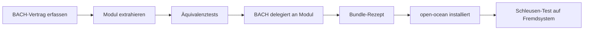

# BACH → open-ocean: Extraktionsroadmap

*[English](BACH-EXTRACTION-ROADMAP.md)*

- **Stand:** 2026-08-08
- **Status:** ausführbare Architekturroadmap; noch kein Paritätsnachweis
- **Erster Arbeitsbereich:** Cluster 9 — System, Daten und Betrieb (Kernel)

## Ziel und Messlatte

open-ocean entsteht durch Extraktion aus BACH, nicht durch einen unabhängigen Neubau. Für jede
Funktion gilt dieselbe Schleusenfolge:



Ein Handlername allein ist keine Parität. Gezählt wird erst, wenn Operationsvertrag,
Zustandsübernahme, Fehlerverhalten, Rückweg, BACH-Rückintegration und ein Test außerhalb des
Entwicklungsrechners belegt sind. Die ursprüngliche Vollinstanz bleibt dabei lebendig: Funktion
fließt aus BACH heraus und anschließend über einen dünnen Adapter wieder hinein.

Die Freigabebedingung nennt den belegten Runtime-Snapshot von **113 Handlernamen** vom
2026-06-15. Der aktuelle Quellstand am BACH-Commit
`5e8fe80607091378477523b2b6dc99e8c17d7d18` deklariert statisch **105 kanonische Profile**,
**13 Aliasregeln**, davon **9 tatsächlich namenserweiternd**, und damit **114 erreichbare Namen**.
Die drei Aliasziele `curriculum`, `data_analysis` und `messages` existieren im aktuellen
Profilbestand nicht. Diese Abweichung wird nicht schöngerechnet:

- 113 bleibt die historische Mindestzusage des Release-Gates.
- Der aktuelle 114er Quellstand ist additiv zu erfüllen, bis ein nebenwirkungsfreier
  Runtime-Dump die Differenz auflöst.
- Ein neuer Name darf nicht durch Festhalten an der älteren Zahl aus der Roadmap fallen.

Die maschinenlesbare Basis liegt in
[`bach-parity-baseline.v1.json`](bach-parity-baseline.v1.json). Der rein statische Prüfer
[`../tools/audit_bach_handlers.py`](../tools/audit_bach_handlers.py) importiert oder startet BACH
nicht.

## Warum Cluster 9 zuerst kommt

Cluster 9 trägt Zustand, Pfade, Sicherung, Lebenszyklus, Diagnose und Schutzgrenzen. Ohne diese
Schicht können spätere Fachmodule zwar einzeln existieren, aber weder sicher installiert noch
aktualisiert, geprüft, zurückgerollt oder wieder in BACH eingebaut werden. Der Kernel ist daher
nicht der größte Funktionsblock, sondern die Voraussetzung für alle weiteren Blöcke.

Der aktuelle Modulkatalog enthält 51 Module. Für Cluster 9 gibt es plausible Teilträger, aber
noch keinen einzigen akzeptierten Ende-zu-Ende-Paritätsnachweis:

| Zustand | Anzahl | Bedeutung |
|---|---:|---|
| akzeptiert | 0 | vollständige Funktions- und Reintegrationsbelege vorhanden |
| Kandidat/teilweise | 20 | verwandte Fähigkeit vorhanden, Äquivalenz noch nicht belegt |
| Lücke | 9 | kein plausibler aktueller Katalogträger |
| Alias | 1 | `health` folgt `healthcheck` und ist keine eigene Funktion |

„Kandidat/teilweise" ist bewusst keine grüne Ampel. Beispielsweise deckt
`sqlite-transit-sync` verifizierte SQLite-Übertragung und Datenbank-Snapshots, aber nicht
automatisch die gesamten BACH-Verträge für Abfrage, Export, Sicherung und Wiederherstellung.
Der gleichnamige BACH-Handler `snapshot` ist ausdrücklich als andere Domäne belegt: Er speichert
Session-ID, offene Aufgaben und Working Memory als JSON-Zeile. Der neue private Träger
`session-checkpoint` passt zu dieser Domäne, bleibt aber Kandidat/teilweise, bis BACH-Sammler,
Ausgabeübersetzung und Alt/Neu-Äquivalenz vorhanden sind.

## Leitplanken der Extraktion

1. **Operationsvertrag vor Code.** Vor der Extraktion werden Eingaben, Ausgaben, Seiteneffekte,
   Dry-Run-Verhalten, Fehlerfälle und Zustandsorte pro Handler festgehalten.
2. **Persönliche Daten bleiben zurück.** Code, Schema und leere Vorlagen dürfen fließen;
   BACH-Datenbanken, Backups, Logs, Tokens, Pfadwerte und Nutzereinstellungen nicht.
3. **Ein Zustandsbesitzer.** Nach der Extraktion besitzt das Modul seinen Zustand. BACH greift
   nur über die öffentliche Schnittstelle zu; parallele Schreibpfade sind verboten.
4. **Rückintegration gehört zur Definition of Done.** Ein externes Modul ohne BACH-Adapter ist
   erst halb extrahiert.
5. **Rückwärtskompatibilität ist messbar.** Bestehende BACH-Aufrufe und Aliasnamen bleiben
   während der Übergangszeit funktionsgleich; Abkündigungen brauchen Migration und Frist.
6. **Fehlschlag bleibt geschlossen.** Hash-, Schema-, Rechte-, Backup- oder
   Migrationsfehler stoppen die Operation. Warnen und weitermachen ist kein gültiger Modus.
7. **Keine Publikation durch Fortschritt.** Die Publikationssperre (`PRIVATE.txt`) wurde am
   2026-09-11 durch Nutzerentscheid D-20260909-003 aufgehoben; das Repository ist damit
   öffentlich — durch Entscheidung, nicht weil die vier Freigabebedingungen belegt wären.
   Die Bedingungen 2 und 3 sind weiterhin offen, und Fortschritt in dieser Roadmap bleibt
   kein Beleg dafür, dass sie erfüllt sind.

## Cluster-9-Arbeitspakete

| Paket | Umfang | Vorhandene Kandidaten | Ergebnis |
|---|---|---|---|
| **K9-0 Vertrag und Inventur** | Registry, Aliasdrift, Operationsflächen, Katalog-Fingerprint | `system-explorer` als späterer Importträger | Baseline und reproduzierbarer Audit; **in diesem Stand angelegt** |
| **K9-1 Daten und Kontinuität** | `db`, `dbsync`, `sync`, `backup`, `restore`; `snapshot` als getrennte Session-Checkpoint-Naht | `sqlite-transit-sync`, `session-checkpoint`, `system-gap-master`, `system-explorer`, geplantes `mac-backup` | portable Daten-API, Sicherungsformat, Restore-Probe, Session-Checkpoint-Träger und BACH-Adapter |
| **K9-2 Beobachtung und Qualität** | `status`, `healthcheck`, `logs`, `tokens`, `maintain`, `tuev`, `scan`, `watcher` | `system-explorer`, `ellmos-tests`, `project-docs-template`, `ellmos-unified-gui` | einheitliches Zustands-/Ereignismodell, Health-Probes und wartbare Prüfläufe |
| **K9-3 Lebenszyklus und Distribution** | `update`, `upgrade`, `setup`, `settings`, `session`, `shutdown`, `path`, `mount`, `dist` | `policy-registry`, privates `ellmos-core`, Repository `bundles`; unterstützter OCEAN-Installer-Lebenszyklus implementiert, BACH-Parität offen | Installer-Kern mit Transaktion, Migration, Rollback und hostneutralen Pfaden |
| **K9-4 Grenzen und Bedienung** | `fs`, `trash`, `sandbox`, `lang`, `gui`, `help` | `system-explorer`, `lock-master`, `ellmos-unified-gui`, `project-docs-template` | Dateisystem-Policy, Quarantäne/Papierkorb, echte Isolation, i18n- und Hilfeschnittstelle |
| **K9-5 BACH-Reintegration** | dünne Adapter für alle 29 kanonischen Profile plus `health` | neue Ausgaben aus K9-1 bis K9-4 | BACH ruft externe Verträge auf; alte interne Schreibpfade sind abgeschaltet |
| **K9-6 Bundle und Schleuse** | Kernel-Rezept, Installer-Auflösung, frische Installation | `bundles`, open-ocean-Installer | per Hash gepinntes Rezept und erfolgreicher Fremdsystem-Test |

Die Bezeichnungen `K9-DATA`, `K9-OBSERVE`, `K9-LIFECYCLE` und `K9-BOUNDARY` in der JSON-Basis
sind Fähigkeitsschnitte, keine vorweggenommenen Repository-Namen. Erst eine klare API- und
Zustandsgrenze rechtfertigt ein neues Repository; sonst wird ein vorhandener Träger erweitert.

## Operationsmatrix für Cluster 9

Die Operationsnamen wurden statisch aus `get_operations()` und dem Dispatch der aktuellen
Handler gelesen. Sie sind der Startpunkt für Verträge, nicht bereits deren vollständige Semantik.

| Profil | aktuelle Operationsfläche | heutiger Trägerbefund |
|---|---|---|
| `db` | `status`, `tables`, `info`, `query`, `schema`, `count`, `export`, `insert`, `backup` | teilweise: `sqlite-transit-sync`, `system-explorer` |
| `dbsync` | `init`, `status`, `enable`, `disable`, `push`, `pull`, `sync`, `backup`, `cleanup` | teilweise: `sqlite-transit-sync` |
| `sync` | `status`, `all`, `skills`, `tools` | teilweise: `system-gap-master`, `sqlite-transit-sync` |
| `backup` | `create`, `list`, `info`, `status` | teilweise: `sqlite-transit-sync`; `mac-backup` nur geplant |
| `restore` | `list`, `info`, `file`, `category` | teilweise: Snapshot-Träger vorhanden, Restore-Parität offen |
| `snapshot` | `create`, `load`, `list`, `delete` | teilweise: korrekter privater Träger `session-checkpoint` vorhanden; BACH-Adapter und Äquivalenz offen |
| `status` | Systemzusammenfassung | teilweise: `system-explorer`, `ellmos-unified-gui` |
| `healthcheck` | `status`, `all`, `disk`, `network`, `nas`, `dns`, `ping` | **Lücke**; `health` ist nur Alias |
| `logs` | `status`, `show`, `tail`, `clear` | teilweise: Run-/Trace-Verläufe, kein einheitlicher Systemlog-Vertrag |
| `tokens` | `status`, `today`, `week`, `report` | teilweise: Analyseflächen, keine Nutzungsparität |
| `maintain` | Scans, Reparatur, Registry-/Doku-/JSON-/Skill-Pflege, Export und Sync | teilweise: `system-explorer`, `project-docs-template`, `ellmos-tests` |
| `tuev` | `init`, `status`, `run`, `check`, `renew` | teilweise: `ellmos-tests`; Workflow-Zertifikat offen |
| `scan` | `status`, `run`, `tasks`, `tools`, `dir` | teilweise: `system-explorer` |
| `watcher` | `status`, `start`, `stop`, `events`, `logs`, `classify` | **Lücke** |
| `update` | `check`, `apply`, `status`, `rollback`, `verify`, `migrations` | **Lücke** |
| `upgrade` | Status/Prüfung sowie Upgrade oder Reparatur von Kern, Hub, Skills, Tools, GUI und Vorlagen | **Lücke** |
| `setup` | `preflight`, Nutzer, Sprache, Secrets, MCP, Hooks, n8n, ProSync, Vollinstallation | **Lücke für BACH-Parität**; OCEANs unterstützter Installer-Pfad ist implementiert |
| `settings` | `list`, `get`, `set`, `reset`, `export`, `import`, `categories` | teilweise: `policy-registry` |
| `session` | `start`, `end`, `status`, `check`, `next` | **Lücke** |
| `shutdown` | `complete`, `quick`, `emergency` | **Lücke** |
| `path` | `get`, `set`, `list`, `resolve`, `validate`, `overrides`, `status` | teilweise: `ellmos-core`-Spaces/Artefakte |
| `mount` | `list`, `add`, `remove`, `restore` | teilweise: `ellmos-core`-Spaces |
| `dist` | `status`, `classify`, `list`, `verify`, `snapshot`, `restore`, `release`, `install` | teilweise: Modul-/Bundle-Katalog und Rezepte |
| `fs` | `status`, `scan`, `check`, `heal`, `classify` | teilweise: `system-explorer`; mutierende Reparatur offen |
| `trash` | `list`, `info`, `restore`, `delete`, `purge` | **Lücke** |
| `sandbox` | `policy`, `eval`, `run`, `shell`, `allow`, `deny`, `test` | teilweise: `lock-master`-Rechte, aber keine Prozessisolation |
| `lang` | Status, Sprachen, Wörterbuch, Scan, Übersetzung, Import/Export und Bericht | **Lücke** |
| `gui` | `info`, `status`, `start`, `start-bg`, `stop` | teilweise: `ellmos-unified-gui` |
| `help` | `list`, `show`, `get`, `run` für Themen und Ordner | teilweise: `project-docs-template` |

## K9-1-Zwischenstand: `dbsync` und die `snapshot`-Naht

Der maschinenlesbare Vertrag
[`bach-k9-data-contract.v1.json`](bach-k9-data-contract.v1.json) bindet die 9 `dbsync`- und
4 `snapshot`-Operationen an die statisch geprüften BACH-Dateien. Die SQL-Fixtures unter
[`../tests/fixtures/k9_data`](../tests/fixtures/k9_data) enthalten ausschließlich synthetische
Knoten, Werte und Platzhalter. Der Prüfer
[`../tools/check_k9_data_contract.py`](../tools/check_k9_data_contract.py) importiert oder startet
BACH nicht; er prüft BACH per AST und Hash und führt nur den Träger gegen temporäre
Fixture-Datenbanken aus.

Der gepinnte Trägercommit `7648a20b11ca958e9622d2b5d8a13fd02613e92a` stellt in
`sqlite-transit-sync` konservatives `cleanup` und verifiziertes `pull_selected` bereit: Manifest,
Größe, SHA-256 und SQLite-Integrität werden vor der Auswahl geprüft, der Standard ist ein
Dry-Run im eigenen Knotenbereich, und fremde Knoten benötigen zusätzlich zur Anwendung die
ausdrückliche All-Node-Freigabe. Der ausgewählte Pull erhält BACHs Lebenszyklus „ein neuester
Fremdstand“, ohne Merge- und State-Logik in den Adapter zu kopieren. Das schließt die generische
Mechanik, aber noch nicht den BACH-Vertrag: täglicher Push-Guard, Heartbeat, Cooldown,
Textausgabe sowie `enable`/`disable` bleiben Adapteraufgaben. Ihr vollständiger
maschinenlesbarer Vertrag liegt in
[`bach-k9-dbsync-adapter.v1.json`](bach-k9-dbsync-adapter.v1.json); `init` ist durch die im
BACH-Quelltext dokumentierte veraltete Erstkopie kein zulässiges Golden Target.

`snapshot` wurde nicht in den SQLite-Träger gedrückt. Der neue private Träger
[`session-checkpoint`](session-checkpoint-capability.v1.json), gepinnt auf
`2a9ce5ec5c5c47fb07615ae7b0aa19b04ef53098`, besitzt eine getrennte lokale Ablage und akzeptiert
nur ein von der Anwendung geliefertes JSON-Objekt. Er prüft kanonische Nutzlast-Hashes, trennt
Namensräume und unterstützt einen reversiblen, standardmäßig trockenen Export/Import mit
begrenzter Datensatzanzahl und Gesamtnutzlast. Neue sensible Dateien erhalten unter POSIX nur
Eigentümerrechte; unter Windows bleibt die lokale Verzeichnis-ACL die Vertraulichkeitsgrenze. Die
anonymisierte Fixture prüft Erstellen, Laden, Auflisten, Löschen, Export, Import und die
Datensatzgrenze. Sammlung aus BACH-Tabellen, historische Textausgabe und jede
Wiederherstellungswirkung bleiben strikt beim späteren Adapter. Das Profil ist damit
Kandidat/teilweise, nicht akzeptiert.

Dieser Zwischenstand ist **kein Äquivalenznachweis**: Während des BACH-Holds lief keine alte
Implementierung gegen die Fixture, BACH delegiert noch nicht, und Migration, Rückweg, Bundle,
Installer sowie Fremdsystem-Schleuse sind offen.

## Abnahmekette je Handler

Ein Profil wechselt in der JSON-Basis erst dann auf `accepted`, wenn alle folgenden Nachweise
vorliegen:

1. **Vertrag:** Jede aktuelle Operation ist mit Eingabe, Ausgabe, Fehlern, Seiteneffekten,
   Zustandsbesitz und Sicherheitsgrenze beschrieben.
2. **Fixture-Parität:** Alte und neue Implementierung laufen gegen denselben anonymisierten
   Ausgangszustand; Ergebnisse und erlaubte Zustandsänderungen stimmen überein.
3. **Migration und Rückweg:** Export/Import sowie Rollback wurden auf einer Kopie geprüft.
4. **BACH-IN:** Der BACH-Handler ist nur noch Adapter zum Modul; ein Guard verhindert den alten
   parallelen Schreibweg.
5. **Bundle:** Der Träger steht im Modulkatalog und in einem hashgepinnten Kernel-Rezept. Optionale
   Hostfunktionen sind als Auswahl oder Adapter modelliert, nicht hart vorausgesetzt.
6. **open-ocean:** Der Installer löst, verifiziert, platziert, aktiviert und rollt bei Fehlern
   zurück.
7. **Schleusen-Test:** Eine frische Installation auf einem anderen System besteht Funktions-,
   Datenschutz- und Deinstallationsprobe. Lokale Tests allein reichen nicht.

## Reihenfolge nach dem Kernel

Die verbindliche Reihenfolge endet derzeit bei „Cluster 9 zuerst". Danach wird anhand der dann
vorhandenen Kernelabhängigkeiten neu entschieden. Die vorläufige technische Flussrichtung ist:

1. Cluster 1 — Gedächtnis und Wissen,
2. Cluster 3 — Aufgaben, Zeit und Automatisierung,
3. Cluster 5 — Multi-Agent- und LLM-Orchestrierung,
4. Cluster 7 — Selbst-Erweiterung und Dev-Tools,
5. Cluster 4 — Dokumente, Medien und Content,
6. Cluster 6 — Kommunikation und Außenwelt,
7. Cluster 8 — kognitive Steuerung,
8. Cluster 2 — persönliche Lebens-Dienste als gesonderte, datensensible Packs.

Cluster 2 bleibt der größte offene Fachblock, kommt aber nicht in den freien Kern: Steuer-,
Gesundheits-, Versicherungs- und Haushaltsdaten benötigen eigene Privacy-, Rechts- und
Produktentscheidungen. Eine spätere Nutzerentscheidung kann die Reihenfolge der Packs ändern,
nicht jedoch die Kernel-Gates überspringen.

## Unmittelbar nächste Umsetzungsschritte

1. `tools/check_k9_data_contract.py` als Pflichtgate beibehalten und bei BACH-Quellhash-,
   Operations- oder einem der beiden Trägercommit-Drifts stoppen.
2. Nach dem Hold die gepinnte dünne `dbsync`-Adapter-Spezifikation sowie BACH-Sammler und
   -Formatter für `session-checkpoint` implementieren; `init` bis zur Quellfehlerklärung getrennt
   halten.
3. Alte und neue Implementierung gegen dieselben anonymisierten Fixtures ausführen. Nur bei
   grüner Zustands-, Ausgabe- und Fehleräquivalenz BACH-IN vorbereiten.
4. Danach `db`, `backup` und `restore` innerhalb K9-1 vermessen; offene Kernel-Lücken erst nach
   derselben Grenzprüfung in Repository-Zuschnitte überführen.

## Prüfbefehl für diese Basis

```powershell
python tools\audit_bach_handlers.py `
  --bach-root C:\path\to\bach `
  --module-catalog C:\path\to\modules.catalog.json `
  --baseline architecture\bach-parity-baseline.v1.json `
  --expect-registered 114 `
  --summary
```

Ein grüner Baseline-Check beweist nur, dass sich Registry und Katalog seit der Erhebung nicht
unbemerkt verändert haben. Er beweist keine Funktionsparität, keinen Installer und keinen
Schleusen-Test.
